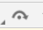

In this chapter we’ll go over how to use the Dev Tools to debug, profile and then optimize your UI. These concepts are a standard in web development and we'll focus on how to apply them to Gameface.

The `Gameface Dev Tools` look identical to the `Chrome Dev Tools`, but with a more limited functionality. To open them you can either press `F12` in the Player, or go to [http://localhost:9444/](http://localhost:9444/) in the browser of choice.

If you don’t have a running instance of the UI, you won’t be able to connect to the Dev Tools. You also won’t be able to open multiple tabs in your browser, so in case you encounter the following error, it is most likely due to the reasons mentioned above
 

## Debugging

### Inspector Tab
We'll first go over how to use the `Inspector` tab in Gameface.

Just like in Chrome, when you open the `Inspector`, you will see a list of all of the elements that are present in the UI. By selecting an element from this list, you are now able to do the following:
* Delete the element - When you select an element, you can delete it by pressing the delete button. This will remove the element from the DOM and all of its children.
* Change the CSS - When you select an element, you are able to change the styles that were applied to it in the right side of the screen: 

* Change the attributes of the html elements - You can do that by double-clicking on the attribute value:

* Change the html markup - Again, you can achieve this by double-clicking on the element tag name


You can use all of these features to debug elements or styles that don’t appear correctly in your UI.

If you are not sure what element you are selecting, you can open the Player - it will show a blue rectangle, indicating the element bounding box:


If the element has padding, it will display it as a green box:



And if it has a margin, it will show it as an orange box:


### Console Tab

The next tab you can use for debugging is the `Console`. Here you will see the output of some of the errors and warnings you get, and any logs you have added to your code. 



You can also execute JavaScript code inside the console - you can run any arbitrary JS code that is not related to your UI, or you can also run any code to modify your page. Globally available variables are also available in the console. 

If the console gets too cluttered, you can also use `CTRL + L` to clear it.

### Sources Tab

The last tool you can use to debug your code is the `Sources` tab. Inside on the left you will see all of the loaded files in your UI:



On the right side, you would be able to view the content of the file. You are not allowed to make changes inside these files, but you can use breakpoints for debugging.

A common method for debugging a problem is to insert a lot of `console.log()` statements into the code in order to inspect values as the script executes.

The `console.log()` method may get the job done, but breakpoints can get it done faster. A breakpoint lets you pause your code in the middle of its execution and examine all values at that moment in time. Breakpoints have a few advantages over the `console.log()` method:

* With `console.log()` you need to manually open the source code, find the relevant code, insert the `console.log()` statements, and then reload the page in order to see the messages in the Console. With breakpoints, you can pause on the relevant code without even knowing how the code is structured.
* In your `console.log()` statements, you need to explicitly specify each value that you want to inspect. With breakpoints, `DevTools` shows you the values of all variables at that moment in time (sometimes there might be variables affecting your code that you're not even aware of).

Adding breakpoints can be done by simply pressing the number of the line next to the code you want to debug:


If the line has object values, you can break at that specific value. 

Next, you only have to refresh your UI and the code will “break” or pause the execution at the breakpoint we created. We can now hover over the code and get the values that are set for the exact time the code is paused:


To resume the script execution you can click on the play button in the right panel:




If you’d like to go step by step through the execution of the code, you can press the button next to the resume one   and it will take you to the next line of code that should execute.

## Profiling

Now that we have covered some of the ways we can use the `Dev Tools` to debug our code, we can look into the ways to profile it and capture any performance issues that we might have.

### Performance Tab

First up is the `Performance` tab. This tab allows us to analyze runtime performance.

Here we can create recordings of our performance and then analyze them. To start a recording, press the record button `(or CTRL + E)` and in the Player, start using your UI (for example press button, trigger events, etc). Once completed, you can press the stop button and you will get a timeline of the JS code that was executed, together with information on how long it took. 



We can now use the mouse wheel to zoom in and view it in more detail:


Here we are able to see that the `Advance` takes the most time - this is the function in the backend that advances the internal timer of the View and runs all animations. If any changes have happened in the page, this call will also trigger a new layout and render on the other threads. The Advance includes all of the JS code executions, animations, hit testing of the mouse, layout recalculations caused by animations or style change from the JS, layout and DOM tree synchronization, etc.

In most cases, a long advance call indicates that there are probably long executions in the JS code. To see them in more details, you can download the profile you’ve generated by using the Save Profile button 

In Chrome, you can load the profile you have saved and you’ll observe the following JS function executions:



### Memory Tab

In addition, we can use the `Memory` tab to check the memory consumption of our Front End. It provides information about how a page is using memory. After opening the Memory tab, you are introduced with three options to investigate your UI’s memory usage: you can take a heap snapshot, start allocation instrumentation on a timeline, or begin allocation sampling.





The quickest option you have is taking a heap snapshot. Once a snapshot is loaded, you can further inspect the memory distribution of the JavaScript objects and DOM nodes (at the time when the snapshot was taken).



Now, under the name of the snapshot, we have the overall size of the JavaScript objects that can be reached.

After selecting the loaded snapshot, you can see a table with the constructors and objects deriving from them (grouped by size, distance, and the number of objects retained).

Here is a short overview of the columns in this table:

1. **Constructor**: the JavaScript function used to construct the objects.
2. **Distance**: distance from the root. The greater the distance, the longer the object takes to load and process.
3. **Objects** Count: the amount of objects created by the specified constructor.
4. **Shallow** Size: the shadow size of every object that was created via a particular constructor.
5. **Retained** Size: the greatest retained size of a set of objects.

However, this is only for the Summary view. You also have the options for the `Comparison`, `Containment` and `Statistics` views.



`Comparison` view allows you to find differences between the snapshots you have taken. You can access this option if you have taken more than one snapshot.

By default, it will compare the current snapshot to the previous one and display the detected differences in the table. However, you can select a particular snapshot you want to compare as well.


Here is a short overview of the table columns in the Comparison view:

1. .**Constructor**: the JavaScript function used to construct a set of objects.
2. **#New**: how many new objects have been created.
3. **#Deleted**: how many objects have been deleted.
4. **#Delta**: the change in the overall number of objects.
5. **Alloc**. Size: how much memory has been allocated to be used.
6. **Freed Size**: how much memory has been freed for new objects.
7. **Size Delta**: the change in the overall amount of free memory.

The other views - `Containment` and `Statistics`, will display the information from the Summary, but with color coding or charts.
