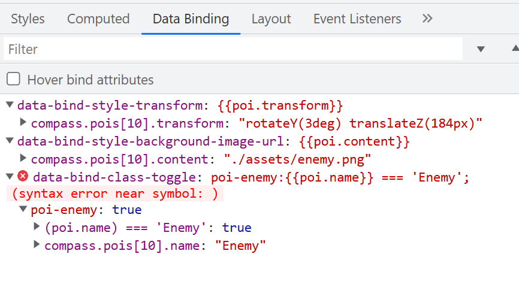
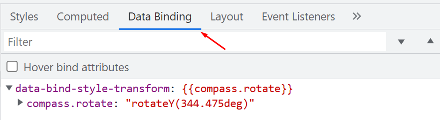

import Summary from 'coherent-docs-theme/components/Summary.astro';
import Highlight from 'coherent-docs-theme/components/Highlight.astro';
import { Steps } from '@astrojs/starlight/components';

<Summary>
Gameface extends Chrome DevTools with two proprietary panels. The <Highlight>Cohtml panel</Highlight> provides visual GPU debugging through paint and redraw flashing, surfacing which elements are wasting cycles frame-by-frame. The <Highlight>Data Binding inspector</Highlight> (available both as an Elements panel tab and as a standalone Models panel) lets you inspect every bound attribute on a selected node, trace exactly which model properties feed it, and mutate model state directly from the browser to test UI edge cases without running through game logic.
</Summary>

## The Cohtml Panel

Open the Cohtml panel from the DevTools toolbar via **More Tools (⋮) → Cohtml**. It surfaces rendering metadata and debugging toggles that the standard Chrome DevTools have no equivalent for.

### Paint Flashing and Redraw Flashing

<Highlight>Paint Flashing</Highlight> highlights regions of the viewport that the engine marks dirty and re-evaluates every frame. When an element is animating incorrectly, continuously invalidating surrounding layout, or being updated more often than expected, that region lights up on every tick.

<Highlight>Redraw Flashing</Highlight> is a related but distinct signal. It highlights elements that are being physically repainted rather than just re-evaluated. An element can be paint-flagged every frame but only redrawn when its visual output actually changes. Watching both overlays together lets you distinguish between logic overhead (evaluation) and GPU overhead (actual pixel work).

The two toggles are the fastest way to identify which UI elements are wasting GPU cycles. An ammo counter that flashes on every frame, for example, points to a data binding updating more frequently than the value actually changes.

:::tip[Isolating Individual Components]

If the entire screen appears to flash, narrow your search by hiding panels with `display: none` until the flashing stops. That isolates which subtree is causing the invalidation without needing to trace through JS.

:::

### Emit Rendering Metadata

The **Emit Rendering Metadata** toggle links specific DOM nodes to GPU draw calls. With it enabled, you can cross-reference DOM elements with their corresponding draw calls in an external GPU profiler such as RenderDoc.

This is useful when the performance profile shows a suspicious draw call in a specific frame, but the call description alone does not tell you which UI widget generated it. Rendering metadata creates that explicit connection.

---

## Data Binding Inspection: Elements Panel

Gameface adds a <Highlight>Data Binding</Highlight> tab directly to the Elements panel in DevTools. Selecting any DOM node and switching to this tab displays every data-binding attribute on that element, the full evaluation trace for each binding, and any errors encountered during parsing, compilation, or evaluation.

### Reading the Data Binding Tab

The image below shows the Data Binding tab for a selected element that has three bound attributes. Two evaluate correctly; one carries a syntax error.



Each binding entry expands to show the model path that feeds it and the current resolved value. In the example above, `data-bind-style-transform` resolves through `compass.pois[10].transform` to `"rotateY(3deg) translateZ(184px)"`. The full resolution chain is visible at a glance, which makes it straightforward to confirm whether the engine is reading from the correct model property.

The third attribute, `data-bind-class-toggle`, carries a red error badge. The evaluation trace reads `(syntax error near symbol: )`, pointing directly to a malformed expression in the attribute value. The entry also expands to show the partial evaluation: the `poi-enemy` class key resolved to `true`, and `compass.pois[10].name` resolved to `"Enemy"`, but the expression itself could not be compiled cleanly.

### Inline Error Highlighting

Data-binding attributes that contain parsing, compilation, or evaluation errors are displayed with a <Highlight>red underline</Highlight> directly in the Elements panel DOM view. You do not need to open the Data Binding tab to notice that something is wrong; the underline surfaces the issue the moment you inspect the node.

This means a quick scan of the DOM tree during debugging can expose misconfigured bindings across multiple elements before you drill into any individual one.

### Hover Bind Attributes

When **Hover bind attributes** is enabled (it is on by default and can be toggled from the Data Binding tab), hovering over any `data-bind-*` attribute in the Elements panel shows an informative popover with the binding's evaluation state. This is a fast alternative to switching to the Data Binding tab when you only need to check one or two attributes.

The second screenshot shows the tab after selecting a different element, one whose single binding resolves cleanly.



`data-bind-style-transform` resolves through `compass.rotate` to `"rotateY(344.475deg)"`. No error badge, no red underline. The structure is identical to the previous example but without the syntax fault.

### Context Menu Shortcut

Right-clicking any element in the Elements panel shows an **Open in Data Binding tab** option. This is a faster path than manually clicking the Data Binding tab after selecting an element, particularly during a debugging session where you are jumping between nodes rapidly.

---

## The Data Binding Models Panel

The <Highlight>Data Binding Models</Highlight> panel is a separate view that shows every registered data-binding model at once rather than one element at a time. Access it through the three-dot menu (⋮) in the top-right corner of the Inspector: **More Tools → Data Binding Models**.

### What the Panel Shows

The panel lists all registered models by name and expands each one to show its properties and their current values. This is the complement to the per-element Data Binding tab: instead of asking "what model feeds this element?", the Models panel lets you ask "what is the current state of this entire model?".

For a compass model with multiple POIs, for example, the panel would list every `pois[n]` entry, its `name`, `transform`, `content`, and any other registered property, all in one view.

### Editing Model Values Directly

Primitive property values can be edited directly inside the panel. Any change you enter is synchronized with the model immediately, and the UI updates in response as if the game had sent that value through the normal engine bridge.

This makes it possible to test UI edge cases without writing mock data files or running through game logic. Need to verify that the low-health pulse animation triggers at exactly 15 HP? Set `Player.health` to `15` in the Models panel directly and watch the binding respond in real time. Need to confirm the minimap hides correctly when the relevant model flag is false? Flip the flag in the panel.

:::caution[Not a Substitute for Load Tests]

Editing values in the panel sets individual properties one at a time. It does not replicate the timing, ordering, or volume of updates that the game engine produces in a real session. Use it to verify correctness of individual bindings, and keep the engine bridge for stress-testing update throughput.

:::

### Refresh Behavior and Automatic Updates

The Models panel does not refresh its display automatically after opening. Values shown reflect the state at the moment you opened the panel or last refreshed it. Two controls manage this:

- **Refresh models** manually re-fetches the full model list and all current property values.
- **Watch for model changes** toggles automatic polling. When enabled, you can configure the polling interval (the default is 2000 ms).

Automatic updates are off by default. Polling introduces overhead during debugging, and for most inspection workflows a manual refresh is sufficient. Enable watching only when you need to observe a model that changes frequently over time, such as a player position model during active movement.

### Export and Load

The panel provides two data transfer utilities:

- **Export models** dumps all registered models to a JSON file. This is useful for capturing a known-good state to compare against a later session, or for sharing reproduction data when reporting a bug.
- **Load models** imports models from a JSON file and merges them recursively into the current state. The merge is additive: missing properties are added to existing models, but existing properties are left unchanged. This is particularly useful during prototyping, when you want to pre-populate the Player with a specific model state before the engine has sent any data.

The following shows what an exported snapshot might look like for a small compass model:

```json title="compass-model-snapshot.json"
{
    "compass": {
        "rotate": "rotateY(344.475deg)",
        "pois": [
            {
                "name": "Enemy",
                "transform": "rotateY(3deg) translateZ(184px)",
                "content": "./assets/enemy.png"
            }
        ]
    }
}
```

Loading this file back into a freshly opened Player pre-populates the compass model with the captured values. Any bindings that reference `compass.rotate` or `compass.pois[n].*` resolve immediately, letting you inspect the resulting UI state without a live game session.

---
