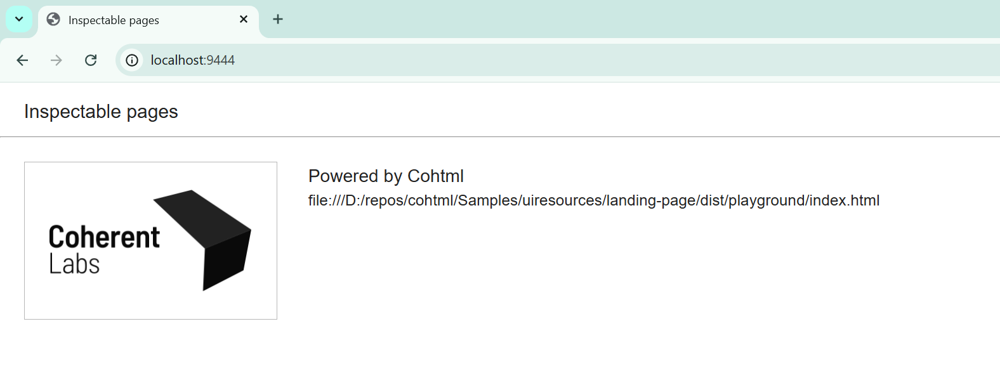
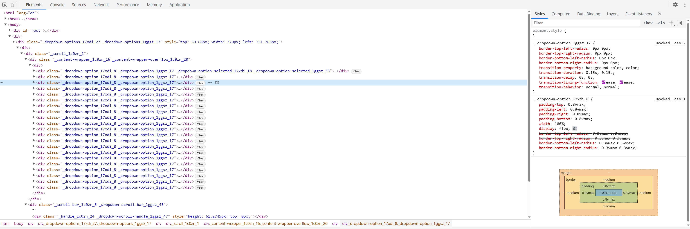
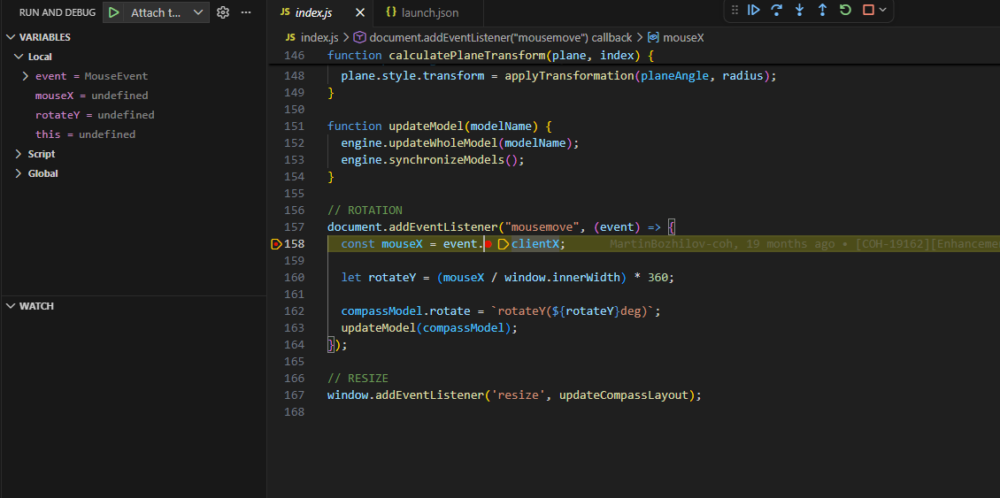

import Summary from 'coherent-docs-theme/components/Summary.astro';
import Highlight from 'coherent-docs-theme/components/Highlight.astro';
import { Steps } from '@astrojs/starlight/components';

<Summary>
Gameface's DevTools are built on Chrome's Inspector, giving you a familiar toolset for DOM inspection, JavaScript debugging, network monitoring, and performance profiling. This article covers the full panel inventory, how to connect <Highlight>Visual Studio Code</Highlight> directly to the Player so you can set breakpoints in your editor, and the mandatory <Highlight>inline source map</Highlight> workaround that the engine's custom <code>coui://</code> protocol requires.
</Summary>

## Opening DevTools

Press `F12` while the Gameface Player is running to open the DevTools Inspector. The underlying engine is Google Chrome, so the interface is identical to the browser DevTools you already use during web development.

DevTools connects remotely over HTTP. The Player listens on a configured port (the default is `9444`) once the backend has been set up correctly. On Windows, open Chrome and navigate to `localhost:9444` to see the list of available Views. Select a View to begin inspecting it.



:::note[Backend Configuration Required]

The DevTools port is configured by the engine team on the backend side. Confirm the port number with your integration engineer before connecting. If `localhost:9444` returns nothing, the DevTools feature may not be enabled in the current build.

:::

---

## Supported Panels

Once connected, DevTools opens to the full Chrome Inspector panel strip. Not every tab is fully featured; the list below separates what works reliably from what has known limitations.

### Elements

The <Highlight>Elements</Highlight> panel provides live DOM tree inspection and CSS editing. Three sidebar tabs are available:

- **Styles** displays inline and attribute styles on the selected element. Changes you type here apply immediately.
- **Computed** lists all resolved CSS values including rendered font information. Values refresh when you select a different element.
- **Data Binding** is a Gameface-specific addition covered in detail in the [Custom Inspector Tools](/polishing/debugging-profiling--testing/custom-tools) article.




### Console

The <Highlight>Console</Highlight> tab works as expected for logging, evaluating expressions, and reading engine warnings. `console.log`, `console.warn`, `console.error`, `console.time`, and `console.timeEnd` are all functional.

:::caution[Platform Limitation]

The Console and Sources panels are not supported on iOS and UWP builds. All other platforms (Windows, Android, Xbox One/Series, PlayStation 4/5, Nintendo Switch, macOS) support them.

:::

### Sources

The <Highlight>Sources</Highlight> tab lists all loaded JavaScript and CSS files and supports breakpoints and step-through debugging directly in the browser DevTools.

One known issue: when navigating between pages or dynamically reloading the same page while DevTools is connected, the Sources panel may not update its file list correctly. Refresh the browser window containing DevTools to force it to re-sync.

### Network

The <Highlight>Network</Highlight> tab logs all resource requests made by the View. A few behavioral differences from a standard browser apply:

- Requests for previously cached resources are marked `(memory cached)` with a `304` status and a `Coherent-Cached` header. Their response bodies are not exposed.
- User image responses carry a `Coherent-UserImage: true` header and their bodies are never exposed.
- All request time falls into the **Stalled** category because Gameface uses a single-state loading model.

By default, the Network panel only records requests made after it is open. If you need to capture requests from page load, the backend can be configured to use `AlwaysEnabled` network collection mode.

### Performance

The <Highlight>Performance</Highlight> tab records a timeline with Gameface-specific engine markers. These markers are covered in detail in the [Performance & Memory Profiling](/polishing/debugging-profiling--testing/performance-and-memory-profiling) article.

---

## VS Code Integration

The browser-based Sources tab works, but most developers prefer their editor for real debugging sessions. Gameface supports attaching the Visual Studio Code debugger directly to the running Player via the Chrome DevTools Protocol.

### Creating the launch.json

VS Code reads debug configurations from `.vscode/launch.json` at your project root. The configuration uses the built-in `chrome` debug type (no extension required). The following shows both workflow variants in a single file:

```json title=".vscode/launch.json"
{
    "version": "0.2.0",
    "configurations": [
        {
            // Attach to an already-running Player instance.
            // Start the game manually, then run this configuration.
            "type": "chrome",
            "request": "attach",
            "name": "Attach to Gameface Player",
            "port": 9444
        }
    ]
}
```

The `port` value must match the DevTools port configured in the backend. The `attach` configuration is the more common workflow during UI development: start the game normally, then trigger the debug session from VS Code to connect.

### Starting a Debug Session

<Steps>
1. Open the **Run and Debug** panel in VS Code (`Ctrl+Shift+D`).
2. Select your configuration from the dropdown at the top of the panel.
3. Click the green play button or press `F5`.
4. VS Code connects to the Player. The debug toolbar appears at the top of the editor.
5. Set a breakpoint by clicking the gutter to the left of any line number in your `.js` or `.ts` source file.
6. Trigger the code path in the game. VS Code pauses execution at the breakpoint and shows the call stack, local variables, and watch expressions in the sidebar.
</Steps>



---

## The Source Maps Gotcha

If you are using TypeScript or transpiling with a bundler, source maps are what allow DevTools (and VS Code) to show you the original `.ts` or pre-bundled source instead of the compiled output. The standard approach is to emit an external `.map` file alongside your bundle. That approach does not work here.

Gameface loads assets using its own <Highlight>`coui://`</Highlight> protocol. The Inspector has no way to fetch external `.map` files over `coui://`. It only understands embedded maps.

The fix is to configure your bundler to inline the source map as a data URI at the end of the compiled bundle file. The result is a larger output file, but DevTools can read the embedded map without making a separate network request.

### Vite

Vite's `build.sourcemap` option accepts `'inline'` to embed the source map directly:

```ts title="vite.config.ts"
import { defineConfig } from 'vite';

export default defineConfig({
    build: {
        sourcemap: 'inline', // Embeds the source map as a data URI in the bundle
    },
});
```

For development mode, add the same option to the `esbuild` section so that the dev server output also carries inline maps:

```ts title="vite.config.ts"
export default defineConfig({
    build: {
        sourcemap: 'inline',
    },
    esbuild: {
        sourcemap: 'inline', // Required for dev mode - coui:// cannot fetch external .map files
    },
});
```

### Webpack

Webpack uses the `devtool` field in `webpack.config.js` to control source map output. Set it to `'inline-source-map'`:

```js title="webpack.config.js"
module.exports = {
    devtool: 'inline-source-map', // Bundles the source map into the output file
    // ... rest of config
};
```

:::caution[Do Not Ship Inline Maps to Production]

Inline source maps significantly increase bundle size. They embed your full original source inside the compiled output. Switch back to `false` (no source maps) or an external strategy when building for the final game release.

:::

After rebuilding with inline maps enabled, breakpoints in `.ts` files will resolve correctly in VS Code, and the Sources panel in the browser DevTools will show the original pre-compiled source files.

---
