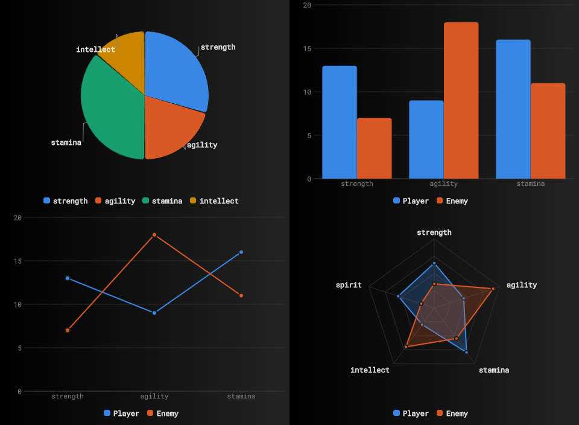

import Summary from 'coherent-docs-theme/components/Summary.astro';
import Highlight from 'coherent-docs-theme/components/Highlight.astro';
import Link from 'coherent-docs-theme/components/Link.astro';

    We ran the toolchain from this chapter against three jobs of very different shapes: one screen added to a project that already existed, a family of chart components, and a finished design turned into a complete interface.

    The results came out uneven in the same direction every time. <Highlight>Structure and behavior arrived in far better shape than visual judgment.</Highlight>

:::note[About this section]

Experiments is where we write up what we try internally. None of the three builds
below is something you can download. Two are prototypes, and the third is a screen
in a Gameface sample we intend to distribute once it is finished.

We publish these for the specifics rather than as a promise about what you will
get, since your results depend mostly on the design you hand the agent. More
entries will land here as we run them, and the next one on our list is putting the
Gameface MCP server alongside other MCP servers in the same session to see how
they behave together.

:::

## What we tried, and why

The three jobs stress different things. Adding one screen to a live project drops
the agent inside constraints somebody else set. A family of components is large
enough that early decisions bind everything built afterwards, across many separate
sessions that each start with no memory of the last. A whole interface asks
whether a visual language holds up across screens, and that last one is where we
expected the most trouble.

### A screen in an existing dashboard

Match Tactics is a positional tactics board that had to fit a fixed 2x2 tile of a
manager-game dashboard, next to a Roster screen already living there. Players get
dragged between pitch positions, a bench, and a scrolling squad list.

We picked it because the conditions were about as good as an agent ever gets. A
design system was already in place, meaning a variables file with named colors, a
radius scale, and a shared glow-border style used across the dashboard. The
neighboring screen was there to imitate. We drew a mockup ourselves and ran a
[Conductor](/building-with-ai/the-conductor-skill/) pass, so the interactions,
empty states, and squad-list size were written down and signed off before any code
existed.

The first pass gave us a working board. Twenty-five named role slots sit banded
across the pitch, eleven occupied at a time, and the rest light up as drop targets
only while you are dragging. A drop lands in the nearest slot, and dragging a
defender over an attacking position styles that slot differently from a natural
fit, so the mismatch shows before you release. The agent also worked the formation
label out from whichever positions are filled rather than storing it separately,
which was its own decision and a good one.

A second pass fixed the visual details, along with something we had not thought to
check: the new screen had broken the dashboard around it.

### A family of chart components

The Chart work covers six types (pie, donut, bar, line, area, and spider) that
share one data format, one default palette, and the same underlying code, so every
type behaves the same way when the data changes.

We picked it because it is the opposite of a single screen. The six types are not
six separate components. They sit on shared files, so a decision about how
animation works, or how hovering resolves to a data point, applies to all of them
at once and is expensive to revisit. Each session starts without the reasoning
behind the existing code, so we wanted to find out what it takes to stop an agent
reversing a settled decision without noticing. Our answer was a specification kept
in the repository at `.specs/components/chart.md`, reviewed by a person, and
updated whenever reality disagreed with it.

All six types landed across six delivery phases, each phase ending with a complete
component rather than a layer of scaffolding, and each ending with the automated
tests passing. That test suite grew from 29 checks to 52 along the way, and it is
where the discipline came from, because a phase counted as done when the tests
passed rather than when the agent said the feature worked.

:::note[Not released yet]

The Chart components are still in development for the Gameface UI library. See the
<Link href="https://gameface-ui.coherent-labs.com/components/">component library</Link>
for what is available today.

:::

### A complete interface from a design

The third test was eight screens of an RPG interface, art-directed as an
illuminated manuscript where every panel is a page of the same book: title, HUD,
character and inventory, quest journal, world map, skill tree, settings, and
bestiary.

The design came out of <Link href="https://claude.com/product/design">Claude Design</Link>
as a set of 1920x1080 artboards, with a written handoff covering colors,
typography, spacing and geometry, six recurring decorative elements, and a
specification per screen. An agent then built all eight screens as one view on the
Gameface UI boilerplate. We ran it to answer one question: does a visual language
survive across eight screens when an agent is doing the work?

It survived. A title page and a constellation skill tree have almost nothing in
common, and both still read as pages of the same book.

The boundaries matter here. Every illustration is a deliberate placeholder sized
for real art. The decorative elements are drawn by the engine at runtime rather
than authored as images, which suits a prototype and is not what we would
recommend for a shipping build. Nothing was profiled under game load or localized.

## What we took away

### The design you hand it decides the visual outcome

This was the strongest signal across all three, and the reason
[Design First](/building-with-ai/design-first/) sits where it does in this
chapter.

The RPG interface held together over eight screens because a document made the
decisions first, and because those decisions were closed rather than open. Corners
are square everywhere except circles. Exactly two kinds of shadow, with no colored
glows except gold on unlocked skill nodes. Vermilion means danger, gold means
earned, and gold never appears as decoration. Rules that specific leave nothing to
drift toward.

Match Tactics had a design system but only a mockup for the screen itself, and
that is exactly where it needed a second pass. The Chart work had no visual design
at all and did not suffer for it, since charts are geometry rather than art
direction.

### Behavior arrived in better shape than appearance

Match Tactics shows this most clearly, since it is the one we handed a mockup
rather than a finished design. Drag and drop, drop-target highlighting, and values
worked out from other values all came back reasonable on the first attempt, and
the layout, structure, and hierarchy of the mockup transferred well.

Precision was the weak spot. The center circle on the tactics pitch was sized as a
percentage of its container, so it rendered as an oval. Rows in the squad list
placed the name, the condition bar, and the percentage as three separately
positioned things instead of one row sharing a baseline. Both fixes took a minute,
and no automated check could have caught either one, because "this oval was
supposed to be a circle" is not something a tool can measure.

Budget a visual pass as a normal step and treat the first result as a
structurally correct draft.

### Tokens get used for structure and skipped for trim

The main styling in Match Tactics followed the project's design tokens. The
scrollbar arrived at its default appearance while everything around it followed
the dashboard's visual language, and when the second pass styled it, the agent
typed the color in as a raw hex value. That exact color already had a name in the
same project's token file.

An agent that treats a detail as incidental will type a value instead of using the
token for it, even with the token file sitting open in the same project. Search
for raw hex colors before you accept a screen.

### Every check the agent runs looks inward

Our most instructive failure happened outside the screen entirely.

The agent added a setting to the Match Tactics board that blocked mouse input from
reaching the dashboard underneath, so the tile could no longer be dragged or
resized. Every check it ran passed, because every check only looked at the screen
it had just built. The fix was to let input through by default and swallow it only
on the player tokens being dragged.

Automated checks all examine the thing under construction, and none of them notice
when something that used to work has stopped. Drive the surrounding application by
hand after any addition to it.

### The documents outlasted the code

We have reused two artifacts from these builds more than anything else, and both
of them are documents rather than code.

The first is a table in the Chart spec recording how the engine actually behaved
when the agent tested it directly, rather than what the documentation says. It
notes that asking how large a shape inside an SVG is returns zero, that simulated
mouse events arrive without any coordinates attached, and that the usual way of
triggering a click from code does not exist. None of that appears in any
documentation, ours included.

The second is the RPG project's table of substitutions, listing every piece of CSS
the design asked for that Gameface does not support, alongside what replaced it.
Modern color notation converted to plain RGB. Inner shadows rebuilt as an extra
element behind the frame. Repeating stripe patterns rebuilt as a single tile that
repeats. Grid layouts rebuilt as wrapping rows.

Both exist because an agent was told to verify rather than assume, and because
somebody wrote the results down where the next session would read them. Ask for
this explicitly on any piece of work large enough to span several sessions.

### An agent can be confidently wrong and stay that way

The Chart work lost most of a delivery phase to an invisible layer that collapsed
to nothing, but only in the packaged build rather than while developing. The tool
that compresses CSS for release had rewritten four separate position values into a
single shorthand that Gameface does not support. The agent blamed scrolling, then
coordinate timing, then how events were being sent, each of them plausible, and
wrote the failing test off as a problem with the test itself.

What ended it was running the tests against the packaged build instead of the
development server. No amount of further reasoning would have got there, because
the evidence did not exist in the version being tested. See
[Verifying What the Agent Builds](/building-with-ai/verifying-ai-output/) for
where this fits in the checking order.

### Give it a number, not an adjective

The Chart spec set a performance budget before the first chart existed. A **mark**
is one drawn shape in a chart, so one slice of a pie, one bar in a bar chart, or
one point on a line. The budget allowed 200 of them, warned above 500, required
the animation to update the chart once per frame no matter how many marks it
contained, and allowed measuring the chart's size only when its container actually
resizes rather than while drawing.

An agent can hold itself to figures like those. Telling it to make the component
fast gets you agreement and nothing else.

The same pattern shows up in the design rules and in the spec decisions. Closed
rules worked better than open guidance everywhere we tried them.
