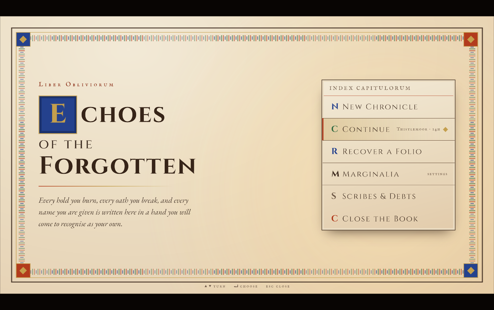
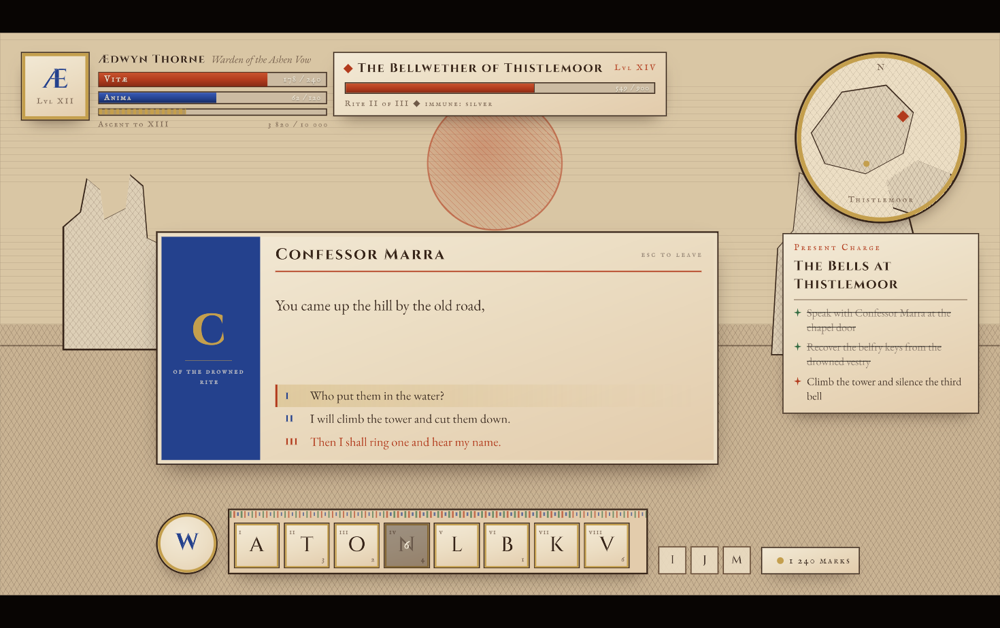
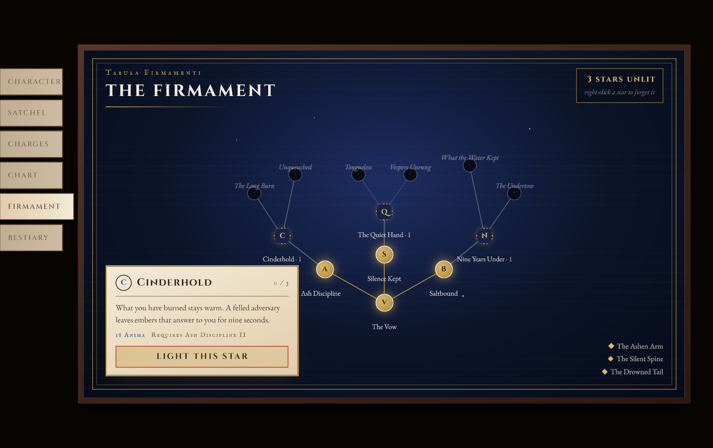

import Summary from 'coherent-docs-theme/components/Summary.astro';
import Highlight from 'coherent-docs-theme/components/Highlight.astro';
import Link from 'coherent-docs-theme/components/Link.astro';

    A complete eight-screen RPG interface - title, HUD, character and inventory, quest journal, world map, skill tree, settings and bestiary - art-directed as an illuminated manuscript, where every panel is a page of the same book.

    Designed in <Link href="https://claude.com/product/design">Claude Design</Link>, handed off as a design file plus a written token document, and implemented on the Gameface UI boilerplate by an agent. This is the case where <Highlight>the quality of the input design decided the outcome</Highlight>.

:::caution[An internal experiment]
A prototype we built to see how far the workflow goes, not a product, a sample, or
a template you can download. Every figurative image in it is a deliberate
placeholder.
:::

## The flow

Three steps, with a document between each:

1. **Design.** The interface was designed in Claude Design as a set of 1920x1080
   artboards - a visual reference showing intended look, hierarchy and states.
2. **Handoff.** A written document accompanying the design: tokens, typography,
   geometry, ornament primitives, and a per-screen specification.
3. **Implementation.** An agent built it on the Gameface UI boilerplate, as one
   view containing all eight screens.

The middle step is the one that mattered, and it is the one people skip.

## Why the handoff document did the work

The design file alone would have produced a mess, and it says so itself. The
opening section is unambiguous about what the file is:

> The file in this bundle is a **design reference created in HTML** - a prototype
> showing intended look, hierarchy, and states. It is **not production code to
> copy directly.** The task is to recreate these designs in the target project's
> actual environment, using that environment's established patterns and layout
> primitives.

Then it states fidelity per aspect, which pre-empts the three questions an agent
would otherwise answer for itself:

* **High fidelity** for layout, type, color, hierarchy and state treatment -
  recreate spacing, sizes and colors as specified.
* **Placeholder** for all figurative artwork - each hatched rectangle is a slot
  sized for real art, not a thing to reproduce.
* **Static** for interactions - the prototype implements none, so the behavior
  section is *specification, not observed behavior*.

That last line prevents a specific failure: an agent looking at a static design
and concluding the interface has no interactions.

### Tokens with rules attached

The palette is not a list of colors. Every entry has a use, and the semantic
rules are stated as enforceable:

> **Semantic rule (enforce this):** vermilion = danger or irreversible;
> ultramarine = sacred/arcane; verdigris = alive/complete; gold = earned.
> Never use gold for mere decoration on interactive elements the player has not
> unlocked.

Typography is given as roles before sizes - Cinzel for anything carved or titled,
EB Garamond for read text, IM Fell English SC for scribal labels and metrics -
with a scale and hard floors: *nothing below 14px, body never below 19px*.

Geometry is closed rather than open. **Border radius 0 everywhere except circles.**
Borders in a four-step hierarchy from 1px hairline to `3px double`. And the
shadow language limited to exactly two kinds, with *no colored glows except gold
on lit skill nodes* - the single most effective constraint in the document, because
uncontrolled glow is where generated game UI usually goes wrong.

Finally, six recurring ornaments are named and specified once - vine band,
illuminated initial, corner boss, engraved hatching, outlined engraved shape,
tally marks - so they are built once and reused rather than reinvented per screen.

## What the engine made it change

The design leans on CSS that Gameface does not implement. The implementation notes
in the repository carry a table of every substitution, which is exactly the
artifact you want out of a build like this - each workaround also commented where
it lives:

| Design asks for | Engine | What replaced it |
| --- | --- | --- |
| `oklch()` color | Not parsed | Converted to sRGB in the variables file and the runtime palette |
| `box-shadow: inset` for gilded frames and plate rings | `inset` rejected | A pseudo-element or child ring |
| `3px double` outer frames | `double` rejected | Two hairlines with a gap |
| `2px dashed` empty slots and torn pages | `dashed` rejected | Four tiled edge gradients |
| `repeating-linear-gradient` hatching | Not implemented | A one-period gradient in a tile that is an exact period of the stripe field, then repeated |
| CSS Grid for the 5x4 inventory | No grid layout | A wrapping flex row pinned to five columns |
| `border-radius: 50%` | Percentages rejected | Radius in px, half the diameter |
| Repeating conic rhumb lines | Sub-degree wedges would not resolve | 32 rotated 1px bars |
| `min()` for the canvas fit | Not implemented | Aspect ratio measured in script |

Every row is a case where the agent could have emitted correct-looking CSS that
renders as nothing. It did not, because the
[negative ruleset](/building-with-ai/grounding-the-agent/) named each of them
before the code was written.

### Two engine behaviors worth knowing regardless

Both were found while building this, and both will bite any Gameface UI that
mixes text with values:

* **Sibling text nodes each get their own line box.** `
{hp} / {hpMax}
`
  renders on **three** lines, and `white-space: nowrap` does not help. Anything
  mixing literal text with more than one expression has to be a single template
  string.
* **A `` inside a paragraph is a block-level flex item.** An emphasized
  phrase mid-sentence starts its own line. Prose with inline runs goes through an
  inline-text wrapper using the `cohinline` attribute - dialogue bodies, quest
  prose, slider labels, skill-node labels.

Typography ran into the same class of problem from a different direction: the
chosen faces have no thin space and no minus sign, so numeric readouts use a plain
space and a hyphen; and the glyphs the design calls for - stars, ticks, diamonds,
arrows, tally bars - exist in none of the three fonts and are built as `clip-path`
shapes instead.

### Input

Keyboard and gamepad go through the boilerplate's `Navigation` utility rather than
raw `keydown` listeners, for a concrete reason: **Gameface does not populate
`KeyboardEvent.key`**, and the interaction manager gives every binding a gamepad
equivalent for free. See [Spatial Navigation and Focus](/logic-and-interactions/interactions/spatial-navigation-and-focus/).

## The units decision

The design is a fixed 1920x1080 canvas. Lengths go through a helper that converts
a design pixel to `vh`, so at 16:9 or wider the canvas lands at its design size
with **no transform** - glyphs rasterize at their true size instead of being
scaled up from a 1x layer. On a narrower viewport the root component measures the
aspect ratio and scales the canvas to fit, in script, because `min()` is not
implemented.

This is the kind of decision that has to be made before the first screen. See
[Building Responsive Game UI](/layout-assets-and-styling/styling--scalability/building-responsive-game-ui/).

## What it does not prove

Being clear about the boundaries of this result:

* **Every figurative image is a placeholder.** Portraits, the effigy, item sigils,
  map landmasses, bestiary specimens - all hatched slots sized for real art,
  exactly as the handoff specified. This is a UI, not finished art.
* **The ornaments are runtime geometry, not sprites.** A shipping build would
  author them as a texture atlas and swap the generated shapes for stroked
  sprites. Generating decoration at runtime is a prototyping convenience, not a
  performance recommendation.
* **It is a prototype.** It was not profiled under game load, localized, or run
  through the accessibility passes in [Polishing](/polishing/localization--accessibility/localization/).
* **The result is a function of the input.** The reason eight screens hold together
  is a design document that made the decisions in advance. Hand the same agent
  "build me an RPG interface" and you get eight screens that do not belong to each
  other. That is the whole argument of
  [Design first](/building-with-ai/design-first/), and this build is the strongest
  evidence we have for it.

## What we took from it

* **Design, then write the handoff, then build.** The handoff document is not
  bureaucracy - it is the interface between a design tool and an agent, and it is
  where fidelity, placeholders and semantics get stated once instead of guessed
  per screen.
* **State fidelity per aspect.** "High fidelity for layout, placeholder for art,
  specification for interactions" removed three whole categories of wrong
  assumption.
* **Closed rules beat open guidance.** "Radius 0 except circles" and "two kinds of
  shadow, no colored glows" did more for coherence than any amount of review.
* **Have the agent record its substitutions.** The constraint table is the most
  reusable thing the project produced - the next Gameface UI built from a
  web-native design starts from it instead of rediscovering it.
