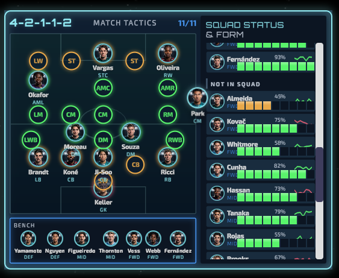

import Summary from 'coherent-docs-theme/components/Summary.astro';
import Highlight from 'coherent-docs-theme/components/Highlight.astro';
import Link from 'coherent-docs-theme/components/Link.astro';

<Summary>
    A **Match Tactics** screen added to an existing football-manager dashboard: a positional pitch with 25 role slots, drag-and-drop between pitch, bench and squad list, and a scrolling squad panel with condition and form.

    Input was a mockup plus the [Conductor skill](/building-with-ai/the-conductor-skill/). The result: <Highlight>interaction logic landed first time, the visual pass did not</Highlight>.
</Summary>

:::note[About this screen]
The dashboard it was built into is a Gameface sample still in development, which
we intend to distribute once it is complete - so the code here is real work on a
real project rather than a throwaway. What is *not* settled is the workflow: this
screen was us testing our own toolchain on it. It is written up because the
specifics are more useful than a summary would be, including the parts that
needed fixing.
:::

## The setup

The host UI is a manager-game dashboard built on the Gameface UI boilerplate - a
grid of draggable, resizable tiles, each holding a screen - and a project with its
own conventions and a review bar, not a scratch file. Match Tactics had to
live inside a fixed 2x2 tile alongside an existing Roster screen, and match a
design system that was already in place - `_variables.scss` with semantic color
tokens (`$accent`, `$interactive`, `$outline`, a four-step background ramp), a
radius scale, and a `glow-border` mixin used across the dashboard.

That is the ideal case for an agent, and worth stating plainly: **an existing
system to conform to, an existing screen to imitate, and a mockup of the target.**
Nothing here was invented from scratch.

The request went through the Conductor skill, so the agent asked its clarification
rounds - input methods, what happens on drop outside a valid target, what the
empty states look like, how many rows the squad list holds - and produced a spec
before writing anything.

## What it built



The interaction model is the interesting part, and it came out of the first
implementation essentially correct:

* **25 named role slots** laid out by percentage across a portrait pitch, banded
  into `gk` / `def` / `dm` / `mid` / `am` / `fwd`, of which eleven are occupied at
  a time. The rest light up as drop targets only while a drag is in progress.
* **Nearest-slot snapping** rather than strict hit-testing - the drop resolves to
  the closest slot center within a radius proportional to the slot size, falling
  back to the bench, falling back to nothing.

    ```tsx title="src/custom-components/Screens/MatchTactics/MatchTactics.tsx"
    const hitTest = (cx: number, cy: number): DropTarget => {
        let bestId: string | null = null;
        let bestDist = Infinity;
        let bestSize = 0;
        slotRefs.forEach((el, id) => {
            const r = el.getBoundingClientRect();
            const d = Math.hypot(cx - (r.left + r.width / 2), cy - (r.top + r.height / 2));
            if (d < bestDist) { bestDist = d; bestId = id; bestSize = Math.max(r.width, r.height); }
        });
        if (bestId && bestDist <= bestSize * 1.1) return { type: "slot", slotId: bestId };
        // ...bench, then nothing
    };
    ```

* **Positional fit feedback** - dragging a defender over an attacking slot styles
  that slot differently from a natural fit, so the mismatch is visible before the
  drop.
* **A drag ghost** positioned with a `transform` rather than by moving the token
  itself, which is also the right call for the engine.

Formation is derived from occupied bands rather than stored, so `4-2-1-1-2` in the
header is a computed value that cannot drift out of sync with the pitch. Nobody
asked for that; it is the kind of structural decision agents make well.

## What needed a second pass

Everything above worked. The screen still was not shippable, and every remaining
problem was visual or integration - the categories nothing in the toolchain
checks for you.

### The center circle was not a circle

Sized as a proportion of the pitch, so it rendered as an ellipse at the tile's
aspect ratio. The fix was an explicit square in `em`:

```scss title="MatchTactics.module.scss"
.pitch-circle {
    width: 6.5em;
    height: 6.5em;
    border-radius: 50%;
}
```

A trivial fix, and a good illustration of the failure class: the agent wrote code
that is correct in principle and wrong at the one aspect ratio that mattered. No
assertion catches "this ellipse was supposed to be a circle".

### The squad rows did not line up

Name, condition bar and percentage were laid out as three independently positioned
things instead of one row sharing a baseline. Aligning them - a fixed 64px bar,
all three on a shared midline - is the difference between a list that reads as a
table and one that reads as a pile.

### The scrollbar was left at default

The squad list uses the boilerplate's `Scroll` component, and the agent shipped it
unstyled while everything around it followed the dashboard's visual language. The
second pass gave it a `0.4rem` track and a glowing handle:

```tsx title="src/custom-components/Screens/MatchTactics/SquadList.tsx"
<Scroll.Bar style={{ width: "0.4rem", "background-color": "#0b1a2b", "border-radius": "0.3rem" }}>
    <Scroll.Handle style={{ "background-color": "#4B9FFF", "border-radius": "0.3rem",
                            "box-shadow": "0 0 0.35rem rgba(75, 159, 255, 0.6)" }} />
</Scroll.Bar>
```

Note `#4B9FFF` written as a literal - that value is `$interactive` in the project's
token file. Even with a design system present, an agent that is styling a detail
it treats as incidental will hardcode rather than reach for the token. It is worth
grepping for hex literals before you accept a screen.

There was also a diagnostic wrinkle worth knowing about: when we asked the agent
to measure the scrollbar it had produced, the first element it measured was a
different `Scroll` elsewhere on the page. Its measurement was accurate and its
conclusion was wrong, which is a good argument for reading *which node* a tool
result refers to rather than just the number.

### It broke the tile it lived in

The most instructive one. The agent put a `block` attribute on the screen's root,
which stopped pointer events reaching the dashboard grid underneath - so the tile
could no longer be dragged or resized. The screen worked; the application around
it regressed.

The correct fix is narrower than the one the agent reached for: let events through
by default, and stop propagation only on the player tokens, so dragging a player
does not drag the tile while grabbing empty pitch or the header still does.

```tsx title="src/custom-components/Screens/MatchTactics/MatchTactics.tsx"
const startDrag = (index: number, e: MouseEvent) => {
    // Keep the grid from dragging the whole tile while we move a player.
    // (Grabbing empty pitch / header space still drags the tile.)
    stopPropagation(e);
    // ...
};
```

:::caution[The agent only tests what it built]
This class of bug - the new screen is fine, the surrounding application is not -
is the one to watch for hardest when adding to an existing UI. Every check in the
toolchain is scoped to the thing under construction. Nothing looks outward at
what used to work. Drive the *host* UI by hand after any addition to it.
:::

## What we took from it

* **Interaction logic was the strong suit.** Hit-testing, drag state, derived
  formation, drop-target feedback - all first time, all reasonable. Given a
  Conductor spec that named the interactions, the agent implemented them
  faithfully.
* **Fine visual detail from a mockup was the weak suit.** The agent read layout,
  structure and hierarchy from the image well. It read exact proportions,
  alignment and the small consistency decisions much less well.
* **An existing design system helped, and was not sufficient.** Structural styling
  followed the tokens; incidental styling - the scrollbar - did not.
* **Budget for a visual pass.** Not as a sign something went wrong, but as a
  standard step. The first implementation is a structurally correct draft.

The realistic framing for this kind of task: an agent gets you a working,
well-organized screen with the hard interaction logic already solved, and hands
you a list of visual corrections you would have had to make anyway - just faster
than writing it yourself, and only if you actually make them.
