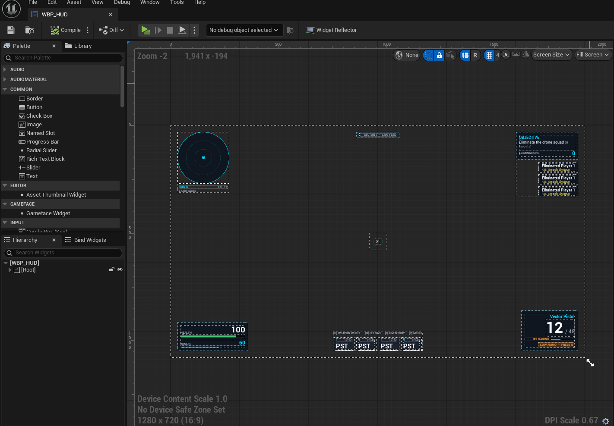
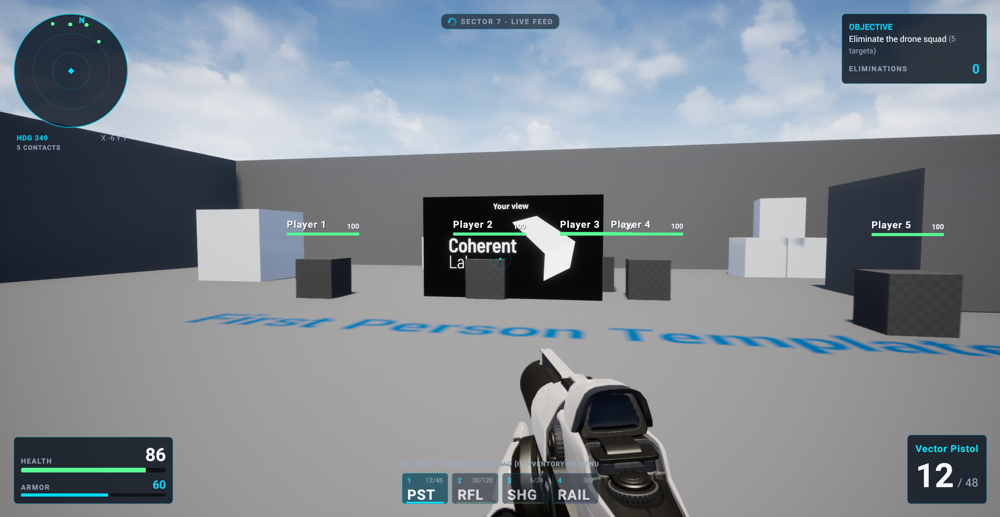
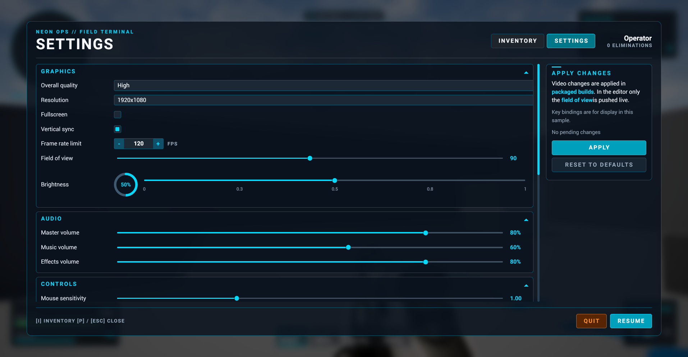
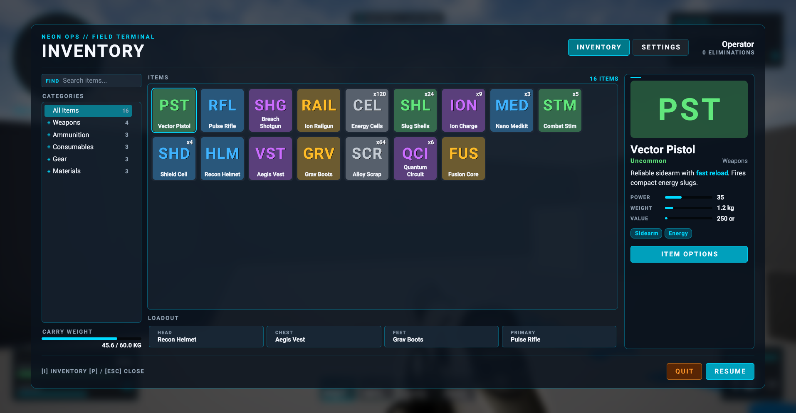

import Summary from 'coherent-docs-theme/components/Summary.astro';
import Highlight from 'coherent-docs-theme/components/Highlight.astro';
import { Steps, Tabs, TabItem } from '@astrojs/starlight/components';

<Summary>
  Unreal Engine 5.8 includes an MCP server that lets a coding agent inspect and edit a project in the Unreal Editor. Pair it with the [Gameface MCP server](/building-with-ai/gameface-mcp-server/) and the agent can work on <Highlight>both the UI and implementation tasks in a Gameface project</Highlight>: changing the Unreal project and checking the page Gameface renders.

  This guide walks through connecting the servers, the kinds of UI work they support, and how to check the result in the game.
</Summary>

:::note
The built-in Unreal MCP server is available in **Unreal Engine 5.8**. If your studio uses an earlier version, you can still use Gameface MCP to inspect the rendered UI, but you'll need another integration to let your agent inspect and edit the Unreal project. Check whether your Unreal version or studio tooling provides an MCP server before following the Unreal setup below.
:::

## What Each Server Does

The servers give the agent access to different parts of your workflow:

| | Unreal MCP | Gameface MCP |
| --- | --- | --- |
| **Runs in** | The Unreal Editor | A Node.js process that connects to the Gameface Player |
| **Lets the agent** | Inspect and edit UMG widgets, Blueprints, assets, and levels; start Play-In-Editor; read the output log | Read the Gameface console; inspect the DOM and styles; take screenshots; check layout |
| **Helps answer** | What is in the project? | What did Gameface actually render? |

With only Unreal MCP, the agent can change project files but cannot inspect the rendered Gameface page. With only Gameface MCP, it can inspect the page but cannot edit Unreal assets. With both connected, it can make a change, run the UI, and use the console and page inspection tools to find problems.

## Quick Setup

<Steps>

1. #### Enable the Unreal plugins

    In Unreal, open **Edit > Plugins**, enable **Model Context Protocol**, **Editor Toolset**, and **UMG Toolset**, then restart the editor.

2. #### Start the Unreal MCP server

    Open **Editor Preferences > Model Context Protocol**. Turn on **Auto Start Server** and **Enable Tool Search**, and keep the default address: `http://127.0.0.1:8000/mcp`.

3. #### Install the Gameface MCP server

    Follow [Setting up the MCP Server](/building-with-ai/gameface-mcp-server/) if you haven't already.

4. #### Add both servers to your agent

    Create the configuration file in the Unreal project folder, beside the `.uproject` file. Replace the example Gameface path with the path to your built `Gameface-MCP/build/index.js`.

    <Tabs>
    <TabItem label="Claude Code">

    ```json title=".mcp.json"
    {
      "mcpServers": {
        "unreal-mcp": {
          "type": "http",
          "url": "http://127.0.0.1:8000/mcp"
        },
        "gameface": {
          "command": "node",
          "args": ["/absolute/path/to/Gameface-MCP/build/index.js"]
        }
      }
    }
    ```

    </TabItem>
    <TabItem label="VS Code / Copilot">

    ```json title=".vscode/mcp.json"
    {
      "servers": {
        "unreal-mcp": {
          "type": "http",
          "url": "http://127.0.0.1:8000/mcp"
        },
        "gameface": {
          "command": "node",
          "args": ["/absolute/path/to/Gameface-MCP/build/index.js"]
        }
      }
    }
    ```

    </TabItem>
    </Tabs>

5. #### Check that it works

    Start the Unreal Editor, then ask the agent:

    > List the Unreal MCP toolsets, then launch the Gameface Player and take a screenshot.

    The agent should return a list of Unreal toolsets and an actual screenshot from the Player. If it only describes what it expects the screen to look like, the Gameface server is not connected to the Player.

</Steps>

:::note[Keep the Unreal Editor open]

The Unreal MCP server runs inside the editor and is available only while the editor is open. The server is experimental, so tool names may change between Unreal versions.

:::

## Common UI Tasks

With both servers connected, an agent can help with several parts of a Gameface UI workflow. These examples show what to ask for and what to check afterward.

### Convert a UMG screen to Gameface





To recreate a UMG screen in Gameface, the agent reads the widget tree and builds a matching page with HTML, CSS, and JavaScript.

It can keep the original UMG widget, load the Gameface page from your HUD and switch between the two versions as needed. Keeping the UMG screen gives you a reference and lets you repeat the conversion if the design changes.

For example, ask:

> Convert `WBP_HUD` into a Gameface UI and load it from the level's Gameface HUD. Keep the original UMG widget unchanged.

### Connect the page to game data

For values that change during play, such as health, ammunition, and nameplate positions, the agent can add C++ data models and bind them to the page. Gameface then updates the UI as the game state changes.

For example, ask:

> Add nameplates for the five players in the level. Bind each player's name and health from C++, and show the health bar in green, yellow, or red based on its value.

### Use Gameface UI components

For a settings screen with sliders, dropdowns, scrolling lists, or key bindings, the agent can use components from the [Gameface UI](https://github.com/CoherentLabs/Gameface-UI) library instead of building each control from scratch.

For example, ask:

> Rebuild the settings menu with Gameface UI. Keep the same C++ models and events.





### Check the result in the game

Check the work in three places, from quickest to most representative:

1. **The Gameface Player:** Check layout and basic interactions quickly.
2. **The Play-In-Editor output log:** Look for JavaScript errors and Gameface warnings from the running game.
3. **The in-game view:** Connect Gameface MCP to the inspector port shown in the editor's output log. This lets the agent inspect the page with real game data.

For example, ask:

> Start Play-In-Editor, open the settings menu, and check the log for Gameface errors.

## Tips

- **Ask for evidence.** Request a screenshot, console output, or relevant log lines rather than relying on a claim that the change works.
- **Avoid desktop capture and simulated key presses.** They act on whichever window has focus and may affect the wrong application.
- **Test the controls yourself.** The agent can check that a menu appears and its data is present, but it cannot judge whether the controls feel right during play.
