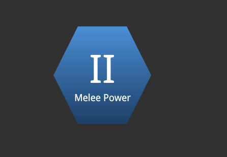
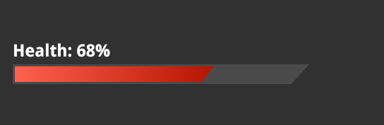
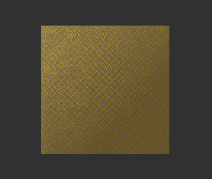
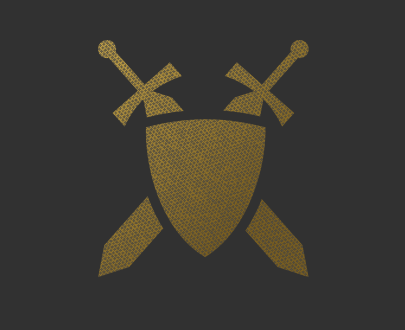
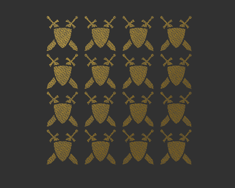

import Summary from "coherent-docs-theme/components/Summary.astro";
import Highlight from "coherent-docs-theme/components/Highlight.astro";
import borderImageGeneratorVideo from "../../../../assets/phase-3/graphics-and-shapes/border-image-generator.webm";
import nineSliceExample from "../../../../assets/phase-3/graphics-and-shapes/9-slice-example.webm";
import Link from "coherent-docs-theme/components/Link.astro";
import BeforeAfter from "coherent-docs-theme/components/BeforeAfter.astro";
import { Tabs, TabItem } from "@astrojs/starlight/components";
import clipPathRadialMenuDisabled from "../../../../assets/phase-3/graphics-and-shapes/clip-path-radial-menu-disabled.png";
import clipPathRadialMenu from "../../../../assets/phase-3/graphics-and-shapes/clip-path-radial-menu.png";
import minimapFade from "../../../../assets/phase-3/graphics-and-shapes/minimap-fade.png";
import minimapBase from "../../../../assets/phase-3/graphics-and-shapes/minimap-base.png";

<Summary>
    Game UI panels often need to resize, cut into angled silhouettes, or blend into the scene without exporting a separate transparent image for every possible size.

    This article covers three practical CSS techniques for that work: <Highlight>9-slice scaling</Highlight> with <Highlight>border-image</Highlight>, hard geometric cuts with <Highlight>clip-path</Highlight>,
    and soft blending with <Highlight>mask-image</Highlight>.

</Summary>

## Why Shape Techniques Matter in Game UI

Many game UI screens are built from panels that cannot stay at one fixed size. A tooltip grows with item stats, a dialogue box expands for localized
text, a quest card changes height depending on objectives, and HUD elements may need different proportions on ultrawide or compact layouts.

The direct asset approach is to export a separate PNG for every panel size and every shape variation. That is simple at first, but it creates three
problems:

- The asset list grows quickly as the UI gains more states and sizes.
- Designers must re-export artwork for small layout changes.
- The UI can spend memory on large transparent areas that exist only to preserve a shape.

The better approach is to separate the <Highlight>visual rule</Highlight> from the final size of the element. 9-slice scaling keeps decorative corners
intact while edges stretch. `clip-path` cuts a rectangular element into a hard geometric shape. `mask-image` uses a stencil image or gradient to
reveal, hide, or fade parts of an element with soft edges.

They give you more control over how a small number of authored assets adapt to real UI layouts.

## 9-Slice Scaling with `border-image`

9-slice scaling is used when a frame has important corners but flexible edges. Think of an item tooltip with ornate corners, a fantasy dialogue frame,
or a sci-fi panel border. The corners should not stretch, because stretching them distorts the artwork. The top, bottom, left, and right edges can
stretch because they are usually decorative strips.

<video autoplay loop muted width="50%">
    <source src={nineSliceExample} type="video/webm" />
</video>

_This example is taken from the Player's Playground example_

In CSS, you implement 9-slice scaling with <Highlight>border-image</Highlight>. You point at one frame image and tell the renderer where to cut it,
which turns the bitmap into a 3×3 grid. Each cell of that grid is painted onto the matching part of the element border:

- Four corners, which are preserved at their original aspect.
- Four edges, which stretch, repeat, or round to fill the available space.
- One center region, which can be left empty or filled depending on your needs.

Here is a minimal tooltip structure that uses a 9-slice frame:

<Tabs>
    <TabItem label="SolidJS">

    ```tsx title="ItemTooltip.tsx"
    import Block from '@components/Layout/Block/Block';
    import TextBlock from '@components/Basic/TextBlock/TextBlock';

    const ItemTooltip = () => (
        <Block class="item-tooltip">
            <TextBlock class="item-tooltip__rarity">Legendary</TextBlock>
            <h2 class="item-tooltip__title">Voidheart Scepter</h2>
            <TextBlock class="item-tooltip__type">Two-Handed Staff, Arcane</TextBlock>
        </Block>
    );
    ```

    </TabItem>
    <TabItem label="HTML">

    ```html title="nine-slice-panel.html"
    <div class="item-tooltip">
        <div class="item-tooltip__rarity">Legendary</div>
        <h2 class="item-tooltip__title">Voidheart Scepter</h2>
        <p class="item-tooltip__type">Two-Handed Staff, Arcane</p>
    </div>
    ```

    </TabItem>
</Tabs>

The tooltip frame should scale with the content inside it. The CSS below shows the complete `border-image` setup. This is what the Player's Playground
example is demonstrating when you switch frame styles and adjust the slice value:

```css title="nine-slice-panel.css" ins="border-image-source" ins="border-image-slice" ins="border-image-width" ins="border-image-repeat"
.item-tooltip {
    width: 420px;
    padding: 24px;
    background: #0d0d1a;

    border: 24px solid transparent;
    border-image-source: url("/assets/ui/fantasy-border.png");
    border-image-slice: 500;
    border-image-width: 24px;
    border-image-repeat: stretch;
}
```

### Breaking Down the Properties

The rest of this section breaks down each property, explains what it controls, and covers the practical questions that come up when tuning a 9-slice
frame for game UI.

#### `border-image-source`

This property points to the frame artwork. It accepts a `url()` to a raster image (PNG, WebP) or an SVG. In most game UI workflows this is a single
authored frame asset exported by the art team.

```css
border-image-source: url("/assets/ui/fantasy-border.png");
```

#### `border-image-slice`

This is the property that makes the 9-slice work. It defines how far inward, from each edge of the source image, the renderer should cut before
splitting the image into the nine regions. For raster images, the value is in <Highlight>source-image pixels</Highlight> (unitless). For SVG sources,
you can use percentages.

```css
/* Cut 500 source-image pixels from each side. */
border-image-slice: 500;

/* Different insets per side: top, right, bottom, left. */
border-image-slice: 64 48 64 48;
```

The slice value is not a design guess. It should match the way the frame image was authored. If the decorative corner occupies the outer 64 pixels of
the source image, the slice should be `64`. If the corner detail extends 96 pixels, use `96`. Getting this wrong either clips the corner art or
includes edge pixels in the corner region, producing visible seams.

##### The `fill` keyword

By default the center slice (the ninth region) is discarded and the element interior is controlled by `background`. Adding the `fill` keyword draws
the center slice into the element interior:

```css
border-image-slice: 64 fill;
```

This can be useful when the frame texture should continue seamlessly into the panel center. In most game UI workflows, however, the frame and the
panel background are authored separately, so you typically omit `fill` and let the `background` property handle the interior.

#### `border-image-width`

This property controls how thick the rendered border-image appears on the element. It determines the area into which the nine slices are drawn on
screen.

```css
border-image-width: 24px;
```

A common question is how `border-image-width` relates to the element's own `border` width. They serve different roles:

- The element's <Highlight>border</Highlight> (e.g. `border: 24px solid transparent`) reserves layout space. It pushes padding and content inward,
  just like any CSS border. Without this, the content sits flush against the element edge and there is no room for the frame artwork to appear.
- <Highlight>border-image-width</Highlight> tells the renderer how large the border-image drawing area should be. It can match the border width, but
  it does not have to.

When the two values match (both `24px` in the example above), the image fills exactly the space the border reserved. If `border-image-width` is larger
than the element border, the image overflows inward and may overlap padding or content. If it is smaller, the image renders thinner than the reserved
border area and a gap becomes visible. For most 9-slice panels, keeping the two values equal is the safest starting point.

```css title="width-mismatch.css"
.tooltip--safe {
    /* Both match: the image fills the layout space exactly. */
    border: 24px solid transparent;
    border-image-width: 24px;
}

.tooltip--overflow {
    /* border-image-width is larger: the frame renders thicker than the reserved space. */
    border: 16px solid transparent;
    border-image-width: 32px;
}
```

:::note[Why It Works]

Think of the element border as the "hole" in the layout, and `border-image-width` as the "canvas" the nine slices are painted onto. When the canvas
matches the hole, the frame fits cleanly. When they differ, the frame either bleeds inward or leaves empty space. If you are seeing your content
overlapping the frame or a visible gap between the frame and the content, check whether these two values are in sync.

:::

#### `border-image-outset`

`border-image-outset` pushes the rendered border image outward, beyond the element's border box, without affecting layout. The element itself does not
grow and surrounding elements do not reflow.

```css
border-image-outset: 8px;
```

This is useful when a frame has a glow, dropshadow, or decorative flourish that should extend past the panel edge. Without outset, that detail would
be clipped at the border box. With an outset of `8px`, the rendered frame extends 8 pixels outward on all sides, letting the outer detail remain
visible.

:::caution[Outset Collisions]

Be careful with outset in tight layouts. Because it does not affect the element's box model, the extended frame can overlap neighboring elements. If
you use outset, leave enough margin or gap around the panel so the overflow does not collide with adjacent UI.

:::

#### `border-image-repeat`

This property controls how the four edge strips (top, right, bottom, left) are handled when they need to fill more space than the source slice
provides. The three useful values are:

- <Highlight>stretch</Highlight> scales the edge strip to fill the available length. This is the most common choice for game UI frames because it
  produces a smooth result with any panel size.
- <Highlight>round</Highlight> tiles the edge strip, but rescales it so that a whole number of tiles fit without clipping. This works well when the
  edge art has a visible repeating pattern (chain links, rivets, runic symbols) and you want clean repetition without partial tiles.
- <Highlight>repeat</Highlight> tiles the edge strip at its natural size. If the available space is not an exact multiple of the tile, the last tile
  is clipped. This can produce visible cut-off artifacts at the panel edges, so it is rarely the right default for game UI.

```css title="repeat-comparison.css"
.tooltip--stretched {
    border-image-repeat: stretch;
}

.tooltip--rounded {
    /* Good for chain-link or rivet borders where the pattern should tile cleanly. */
    border-image-repeat: round;
}

.tooltip--tiled {
    /* Tiles at natural size; may clip the last tile if the panel is not an exact multiple. */
    border-image-repeat: repeat;
}
```

For most 9-slice panels in game UI, `stretch` is the safe default. Switch to `round` when the art team has designed an edge strip with a visible
repeating motif and clean tiling matters more than uniform scaling.

#### The Shorthand

All five properties can be combined into a single `border-image` shorthand. The syntax packs source, slice, width, outset, and repeat into one
declaration:

```css
/* source / slice / width / outset / repeat */
border-image: url("/assets/ui/fantasy-border.png") 500 / 24px / 0 stretch;
```

The shorthand is convenient once you are comfortable with the individual properties, but during development it is often easier to keep the longhand
forms so each value is easy to find and adjust independently.

### Caveats and Practical Guidelines

9-slice with `border-image` is a good fit for rectangular panels that need decorative frames and dynamic content. It lets one frame asset support many
panel sizes without re-exporting. There are a few things to keep in mind when working with it:

- **The shape is always a rectangle.** The element border, and therefore the 9-slice frame, is fundamentally rectangular. If the final silhouette
  needs angled corners, hexagons, or soft fades, combine the panel with `clip-path` or `mask-image` instead of forcing the frame artwork to handle the
  shape.
- **Keep the panel background separate from the frame.** Let `background` handle the inner fill and let `border-image` handle the edge artwork. This
  makes the frame reusable across tooltips, cards, and modal windows without coupling interior styling to the border asset.
- **Match `border-image-width` to the element border.** Unless you have a specific reason to mismatch, set both to the same value. Mismatches are one
  of the most common sources of unexpected gaps or content overlap when first setting up a 9-slice panel.
- **Watch for outset collisions.** If you use `border-image-outset` for glow or shadow overflow, add enough margin around the element so the extended
  frame does not overlap neighboring UI.

For a full production-style walkthrough, check our: <Link href="https://coherent-labs.com/blog/uitutorials/nine-slice-modal/">Nine slice modal
tutorial</Link>.

:::tip[Border-image Generator]

If you want a visual helper while tuning values, MDN provides a
[border-image generator](https://developer.mozilla.org/en-US/docs/Web/CSS/Guides/Backgrounds_and_borders/Border-image_generator) that lets you upload
your frame asset and experiment with different slice, width, and repeat values to preview the result in real time.

<video autoplay loop muted controls>
    <source src={borderImageGeneratorVideo} type="video/webm" />
</video>

:::

## Hard Cuts with `clip-path`

`clip-path` cuts the visible area of an element. The element can still be a normal `div`, `button`, or component in your layout, but only the area
inside the clipping shape is rendered. The element keeps its full rectangular box for layout purposes - click areas, padding, and flex behavior all
stay the same - while the renderer discards every pixel outside the clipping region.

This is useful for rigid, geometric UI shapes:

- Hexagonal skill tree nodes.
- Slanted health or energy bars.
- Angled sci-fi panels.
- Diamond-shaped markers.
- Pie-slice segments in radial menus.

The most common form is <Highlight>clip-path: polygon(...)</Highlight>. Each point in the polygon is written as an `x y` coordinate pair. Percentages
are relative to the element's own box, so the same shape can scale with the element. Besides `polygon()`, the property also accepts `circle()`,
`ellipse()`, and `inset()` for simpler shapes.

### Simple UI Shapes

This section covers some common simple UI shapes that can be created with `clip-path`.

#### Hexagonal Skill Nodes

Here is a basic skill node. The HTML remains simple, which keeps the component easy to wire into interaction and state logic:

<Tabs>
    <TabItem label="SolidJS">

    ```tsx title="SkillNode.tsx"
    import Button from '@components/Basic/Button/Button';

    const SkillNode = () => <Button class="skill-node" />;
    ```

    </TabItem>
    <TabItem label="HTML">

    ```html title="skill-node.html"
    <button class="skill-node skill-node--unlocked" type="button">
        <span class="skill-node__icon">II</span>
    </button>
    ```

    </TabItem>
</Tabs>

The polygon below cuts the button into a hexagon. The left and right points sit halfway down the element, while the other points create the angled top
and bottom edges:

```css title="skill-node.css" ins="clip-path"
.skill-node {
    width: 96px;
    height: 84px;
    display: flex;
    align-items: center;
    justify-content: center;
    background: linear-gradient(180deg, #2b3546 0%, #111722 100%);
    border: 0;

    /* Six points: top-left, top-right, right, bottom-right, bottom-left, left. */
    clip-path: polygon(25% 0, 75% 0, 100% 50%, 75% 100%, 25% 100%, 0 50%);
}

.skill-node--unlocked {
    background: linear-gradient(180deg, #4a8fd6 0%, #1d3f68 100%);
}
```



:::note[Why It Works]

The element still has a rectangular layout box, but the renderer only shows the pixels inside the polygon. That means you can keep normal CSS layout,
sizing, and state classes while changing only the visible shape.

:::

#### Slanted Health Bars

For HUD bars, `clip-path` is often enough to create a more authored look without adding a new image asset. The structure can be a track with a fill
inside it:

<Tabs>
    <TabItem label="SolidJS">

    ```tsx title="SlantedStatusBar.tsx"
    import Block from '@components/Layout/Block/Block';

    const SlantedStatusBar = (props: { percent: number }) => (
        <Block class="status-bar">
            <Block class="status-bar__fill" style={{ width: `${props.percent}%` }} />
        </Block>
    );
    ```

    </TabItem>
    <TabItem label="HTML">

    ```html title="slanted-bar.html"
    <div class="status-bar" aria-label="Hull integrity">
        <div class="status-bar__fill" style="width: 68%;"></div>
    </div>
    ```

    </TabItem>
</Tabs>

Both the track and the fill use the same polygon. This keeps the slanted right edge aligned as the fill changes width:

```css title="slanted-bar.css" ins="clip-path"
.status-bar {
    width: 420px;
    height: 28px;
    padding: 3px;
    background: rgba(255, 255, 255, 0.12);
    clip-path: polygon(0 0, 100% 0, 94% 100%, 0 100%);
}

.status-bar__fill {
    height: 100%;
    background: linear-gradient(90deg, #4fd6ff 0%, #1a6fff 100%);
    clip-path: polygon(0 0, 100% 0, 94% 100%, 0 100%);
}
```



### Composing Complex Shapes: Radial Menu

Simple polygons and circles are enough for individual elements, but `clip-path` becomes especially powerful when you combine it with CSS transforms to
compose larger, non-trivial shapes out of simpler pieces.

A good example is the Gameface UI **Radial Menu** component. The menu is a full circle divided into even pie-slice segments. Each segment is a
separate element that the player can hover or select independently. Building this with a single complex polygon would be fragile and difficult to
maintain. Instead, the component uses a combination of <Highlight>clipped circles</Highlight> and <Highlight>rotations</Highlight>.

The idea is straightforward: every segment starts as a full circle, clipped to a wedge shape using `clip-path`, and then rotated into its position
around the center. The result is a seamless radial layout where each segment is still an independent, interactive element.

Use the slider below to compare the radial menu with and without `clip-path` applied.  
Slide to see how the overlapping circles (unstyled) become seamlessly clipped and rotated wedge segments (styled):

<BeforeAfter
    src1={clipPathRadialMenu}
    src2={clipPathRadialMenuDisabled}
    alt1="Radial menu with clip-path - clipped and rotated segments"
    alt2="Radial menu without clip-path - overlapping circles"
/>

The technique follows a repeatable pattern. Each segment is a circular element clipped to a pie slice via `polygon()`, then rotated by an increment
based on the total number of segments. For a six-segment wheel, each slice spans 60 degrees:

```css title="radial-segment.css" ins="clip-path" ins="transform"
.radial-segment {
    position: absolute;
    width: 100%;
    height: 100%;
    border-radius: 50%;
    clip-path: polygon(50% 50%, 50% 0%, 100% 0%);
}

.radial-segment:nth-child(2) {
    transform: rotate(60deg);
}
.radial-segment:nth-child(3) {
    transform: rotate(120deg);
}
.radial-segment:nth-child(4) {
    transform: rotate(180deg);
}
.radial-segment:nth-child(5) {
    transform: rotate(240deg);
}
.radial-segment:nth-child(6) {
    transform: rotate(300deg);
}
```

:::note[Why It Works]

Each segment is still a normal element with its own hover state, click handler, and class logic. The `clip-path` only controls what the player sees,
not what the element can do. This keeps the component easy to extend - adding or removing segments means adjusting the polygon angle and the rotation
increment, not rewriting the layout.

:::

### Caveats and Practical Guidelines

`clip-path` is a strong choice for clean geometric silhouettes. It is straightforward to scale because the polygon points can use percentages, and it
works on any element type. There are a few things to keep in mind when working with it:

- **The cut is always hard.** `clip-path` creates a binary visible/invisible boundary. It does not feather, blur, erode, or support partial
  transparency. If the art direction needs soft edges, smoke-like fades, or painterly alpha detail, use `mask-image` instead.
- **Borders and box-shadows are clipped too.** The clip applies to the entire element rendering, including its borders and shadows. If the design
  requires a visible border that follows the clipped shape, you typically need a wrapper element or a layered approach where the border lives on a
  slightly larger element behind the clipped one.
- **Hit areas remain rectangular.** The element's pointer-hit area is still its full rectangular box unless you also apply a matching shape on the
  interaction side. In most game UI engines this is not an issue because interaction areas are handled separately, but it is worth verifying click and
  hover behavior on clipped elements during development.
- **Animate with matching point counts.** CSS transitions and animations work between two `clip-path` values as long as both shapes use the same
  function type and the same number of points. This is useful for reveal effects, expanding shapes, or transitioning between states.

:::tip[Clip-path Generator]

If you want a visual helper while designing polygon shapes, <Link href="https://bennettfeely.com/clippy/">Clippy</Link> lets you drag points on a live
preview and copy the resulting `clip-path` value directly into your CSS. It supports polygons, circles, ellipses, and insets.

:::

:::note[shape-rendering]

The `shape-rendering` CSS property controls the anti-aliasing behaviour applied to clipped geometry. Changing its value can visibly affect the crispness of `clip-path` edges, particularly for diagonal or curved polygon cuts. For full details on supported values and their rendering trade-offs in Gameface, refer to the <Link href="https://docs.coherent-labs.com/cpp-gameface/integration/optional_features/aaclipping/">Gameface documentation</Link>.

:::

## Soft Blending with `mask-image`

`mask-image` works like a stencil. You provide a grayscale image (or a CSS gradient), and the renderer uses its alpha channel to dictate what stays
visible. White areas in the mask show the element (100% opacity), black areas hide it (0% opacity), and gray areas partially fade it.

Unlike `clip-path`, which only cuts a binary, hard edge, `mask-image` can produce soft fades, highly detailed silhouettes, and patterned reveals. This
makes it the right tool for:

- Minimap edges that fade smoothly into the HUD background.
- Character portraits that dissolve into a panel frame.
- Worn or battle-damaged overlays applied through grunge textures.

The mask never shows up on screen itself - it only controls which parts of the element are visible and how much. The actual visuals come from the
element's own background, children, or content. This separation means the same element can look completely different just by swapping the mask.

### Shaping UI with Image Masks

The most direct use of `mask-image` is pointing it at a PNG or SVG asset. This is perfect for when you need a silhouette that is too organic or
detailed for a polygon, such as a faction emblem or a shaped portrait frame.

Let's build a faction emblem step-by-step to see how this works in practice. Our goal is to create a complex crest shape filled with a rich, metallic
texture.

#### Step 1: Create the Material (Without the Mask)

First, we define our structure: a wrapper element, and a child element that provides the visible pattern.

<Tabs>
    <TabItem label="SolidJS">

    ```tsx title="FactionEmblem.tsx"
    import MaskImage from '@components/Media/MaskImage/MaskImage';

    const FactionEmblem = () => (
        <MaskImage
            src="/assets/ui/faction-crest.png"
            fill
            class="faction-emblem"
        >
            <div class="faction-emblem__fill" />
        </MaskImage>
    );
    ```

    </TabItem>
    <TabItem label="HTML">

    ```html title="faction-emblem.html"
    <div class="faction-emblem">
        <div class="faction-emblem__fill"></div>
    </div>
    ```

    </TabItem>
</Tabs>

We will give the inner `.faction-emblem__fill` a metallic look by stacking a texture image over a gold gradient.

```css title="faction-emblem.css"
.faction-emblem {
    width: 256px;
    height: 256px;
}

.faction-emblem__fill {
    width: 100%;
    height: 100%;
    /* Stack a scratchy texture over a gold gradient */
    background-image: url("./iron-grip.png"), linear-gradient(135deg, #c9a84c 0%, #7a5e1e 70%);
}
```

At this point, if you load the UI, you will just see a hard, rectangular 256x256 square filled with gold and iron textures. It has the right material,
but the wrong shape.



#### Step 2: Apply the Stencil (With Mask)

To carve this square into an emblem, we apply the `mask-image` to the wrapper element. We will point it to an alpha-transparent image of a crest.

```css title="faction-emblem.css" ins="mask-image" ins="mask-repeat" ins="mask-size" ins="mask-position"
.faction-emblem {
    width: 256px;
    height: 256px;

    /* 1. Define the stencil shape */
    mask-image: url("./crest-mask.png");

    /* 2. Control how the stencil is applied */
    mask-repeat: no-repeat;
    mask-size: 100%;
    mask-position: center;
}
```



**What just happened?** The engine takes the `crest-mask.png` and overlays it on the 256x256 box. Wherever the mask image is fully opaque, the gold
texture inside `.faction-emblem__fill` shines through. Wherever the mask is fully transparent, the renderer clips the gold texture away entirely.

:::tip[Repeating Patterns]

Because mask positioning properties (`mask-size`, `mask-repeat`, `mask-position`) mirror standard background properties, you can drastically change
the result with just a few tweaks.

If we wanted to turn this single emblem into a repeating textured wallpaper (e.g., for a loading screen background), we could simply shrink the mask
and tell it to repeat:

```css
.faction-emblem-pattern {
    /* Shrink the stencil to 64px */
    mask-size: 64px 64px;
    /* Tile the stencil across the entire element */
    mask-repeat: repeat;
}
```



With the exact same HTML and texture fill, the element transforms from a single crest into a repeating grid of small crests!

:::

### Feathering with a Gradient Mask

You do not always need to load an external image asset. CSS gradients work perfectly as mask sources, which is incredibly useful for soft edges that
do not depend on authored art.

A minimap, for instance, can be feathered with a radial gradient that is fully visible at the center and fades out toward the edges:

<Tabs>
    <TabItem label="SolidJS">

    ```tsx title="MinimapFade.tsx"
    import MaskImage from '@components/Media/MaskImage/MaskImage';

    const MinimapFade = () => (
        <MaskImage class="minimap-container" fill>
            <div class="minimap" />
        </MaskImage>
    );
    ```

    With CSS:
    ```css title="minimap-fade.css"
    .minimap-container {
        /* Radial gradient mask stays in CSS as MaskImage renders a div */
        mask-image: radial-gradient(circle, black 60%, transparent 100%);
        mask-size: 100%;
    }
    ```

    </TabItem>
    <TabItem label="HTML">

    ```html title="minimap-fade.html"
    <div class="minimap-container">
        <div class="minimap"></div>
    </div>
    ```

    </TabItem>
</Tabs>

```css title="minimap-fade.css" ins="mask-image"
.minimap-container {
    width: 400px;
    height: 400px;
    /* Opaque center, then a controlled fade toward the edges. */
    mask-image: radial-gradient(circle at center, black 0%, black 55%, transparent 80%);
}

.minimap {
    width: 100%;
    height: 100%;
    border-radius: 50%;
    background: url("./minimap.jpg") no-repeat center center;
    background-size: cover;
}
```

**Breaking down the gradient math:** The engine generates this mask on the fly. From `0%` to `55%` from the center, the mask is solid black, meaning
the minimap is fully opaque and visible. From `55%` to `80%`, the mask transitions from black to transparent. This creates a beautifully calculated
25% "blur" zone where the minimap slowly fades into the HUD.

<BeforeAfter src1={minimapFade} src2={minimapBase} alt1="Minimap with fade" alt2="Minimap without fade" />

### Caveats and Practical Guidelines

`mask-image` is the right tool when the shape needs soft edges, detailed silhouettes, or gradual fades that `clip-path` cannot produce. Keep these
rules in mind:

- **The mask needs material to reveal:** If the masked element has no background, content, or children that produce visible pixels, the mask has
  nothing to show and the result is an empty space. Always verify your content renders _before_ debugging a broken mask.
- **Match the tool to the edge:** Use image masks for highly detailed silhouettes where the art team needs pixel-perfect control. Use CSS gradients
  for simple, geometric fades (like vignettes) to save on asset loading.
- **Watch your compositing costs:** Each masked element requires the renderer to composite the mask against the element content. A few masked HUD
  elements are perfectly fine, but stacking dozens of full-screen masks can add measurable GPU rendering overhead.

## Choosing the Right Technique

Use the shape technique that matches the visual problem:

- Use <Highlight>9-slice scaling</Highlight> when the UI is still rectangular, but the frame artwork must resize without distorting its corners.
  Tooltips, dialogue boxes, modal frames, and item cards are common fits.
- Use <Highlight>clip-path</Highlight> when the shape has a hard geometric silhouette. Hex nodes, slanted bars, diamond markers, and angled sci-fi
  panels are good examples.
- Use <Highlight>mask-image</Highlight> when the shape needs soft edges, gradual fades, or detailed silhouettes. Feathered portraits, soft minimap
  edges, worn emblems, and patterned shapes are better handled as masks.

These techniques can also be combined. A tooltip can use `border-image` for its ornate frame, a clipped header for an angled title plate, and a masked
portrait inside the content area. The important part is to keep each technique responsible for one visual job.

:::tip[Practical Rule]

Start with the simplest shape rule that satisfies the design. Use 9-slice for scalable frames, `clip-path` for hard cuts, and `mask-image` when the
shape needs soft edges or a detailed silhouette that a polygon cannot express.

:::
