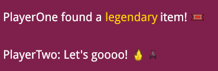

import Summary from 'coherent-docs-theme/components/Summary.astro';
import Highlight from 'coherent-docs-theme/components/Highlight.astro';
import { Tabs, TabItem } from "@astrojs/starlight/components";

<Summary>
    Classic game UI elements like Quest Logs, Chat Boxes, and Kill Feeds frequently require you to mix standard text with inline images, icons, and emojis. 

    Because Gameface uses a flex-based layout algorithm internally, combining these elements naturally leads to severely broken text wrapping. 
    This guide covers how to bypass this engine behavior using the <Highlight>`cohinline`</Highlight> attribute, how to perfectly <Highlight>align icons with text</Highlight>, 
    and how to properly <Highlight>render modern emojis</Highlight>.
</Summary>

## Inline Behavior in Gameface

Gameface handles inline elements differently than a standard web browser. 
<Highlight>Specifically, Gameface has non-standard support for inline layout.</Highlight> 
If you try to mix text and images, the Gameface flexbox layout completely fails to wrap decorated or styled text correctly.

Consider a simple line of text that contains an emphasized word:
<Tabs>
    <TabItem label="SolidJS">

    ```tsx title="RichTextExample.tsx"
    import InlineTextBlock from '@components/Basic/InlineTextBlock/InlineTextBlock';

    const RichTextExample = () => {
        return (
            <InlineTextBlock>
                This is a <span class="text--bold">simple </span>text line with an emphasized word in it.
            </InlineTextBlock>
        );
    };
    ```

    </TabItem>
    <TabItem label="HTML">

    ```html title="index.html"
    <p>
        This is a <b>simple </b>text line with an emphasized word in it.
    </p>
    ```

    </TabItem>
</Tabs>

:::note[`<b>` has no default bold styling in Gameface]
`<b>` parses correctly but Gameface returns a generic `HTMLElement` - the browser default `font-weight: bold` is not applied (HTML-072). In the examples on this page, `<b>` is used to illustrate how inline content is split into separate nodes by the layout engine; it is not a recommendation to use `<b>` for visible bold text. If you need the word to appear bold, apply `font-weight: bold` via CSS: `<span class="text--bold">simple</span>`.
:::

When Gameface's flex layout algorithm resolves this container, 
it identifies three completely distinct children: 

- the first text node ("This is a "), 
- the `<b>` element ("simple "), 
- and the final text node ("text line..."). 

Because it treats them as three separate flex boxes , when there isn't sufficient space on the row, Gameface wraps the entire box to the next line. 
This results in text wrapping awkwardly between the HTML nodes rather than naturally between the words:

<div style="border: 1px solid #222; padding: 10px; background: white; color: black; display: inline-block; line-height: 1;">
    <div>This is a <b>simple </b></div>
    <div>text line with an emphasized word in it.</div>
</div>

instead of:

<div style="border: 1px solid #222; padding: 10px; background: white; color: black; display: inline-block; line-height: 1;">
This is a <b>simple </b> text line with an emphasized
word in it.
</div>

Having very long phrases results in even worse wrapping and could lead to having decorated short phrases alone in the line:

<div style="border: 1px solid #222; padding: 10px; background: white; color: black; display: inline-block; line-height: 1;">
... end of a long phrase
<br />
<b>emphasized </b>
<br />
another long phrase ...
</div>

## Enabling Natural Wrapping with `cohinline`

To resolve this specific Gameface engine limitation, we implemented <Highlight>a custom inline layout algorithm</Highlight>. 
It allows images, icons, and styled `<span>` tags to sit perfectly inside a sentence and wrap exactly like normal words.

This algorithm can only be used inside `<p>` elements and is enabled by adding the special `cohinline` attribute.

Here is how you use `cohinline` to resolve the issuue mentioned above:

<Tabs>
    <TabItem label="SolidJS">

    ```tsx title="FixedInlineText.tsx"
    import InlineTextBlock from '@components/Basic/InlineTextBlock/InlineTextBlock';

    const FixedInlineText = () => {
        return (
            <InlineTextBlock>
                This is a <span class="text--bold">simple </span>text line with an emphasized word in it.
            </InlineTextBlock>
        );
    };
    ```

    </TabItem>
    <TabItem label="HTML">

    ```html title="index.html" ins="cohinline"
    <p cohinline>
        This is a <b>simple </b>text line with an emphasized word in it.
    </p>
    ```

    </TabItem>
</Tabs>

By placing the elements inside a `cohinline` paragraph, they are correctly inlined and the text wraps naturally.

<div style="border: 1px solid #222; padding: 10px; background: white; color: black; display: inline-block; line-height: 1;">
This is a <b>simple </b> text line with an emphasized
word in it.
</div>

:::caution[Inline Limitations]
Because `cohinline` is a highly specialized layout engine feature, it has a few strict limitations:
1. `text-align: justify` is not working (left, right, and center are supported).
2. `text-overflow: ellipsis` is not working.
3. Box decorations (like `background`, `border`, or masks) on child elements of the paragraph are not supported. You can only use box decorations on the paragraph itself.
:::
## Vertical Alignment Quirks

When mixing text and images (like inserting a controller button prompt inside a sentence), you will use the `vertical-align` CSS property. Standard values like `middle`, `text-top`, and `baseline` are all supported inside `cohinline` paragraphs.

However, `cohinline` handles vertical space differently than a web browser, which often leads to misaligned icons if you aren't expecting it.

### The Problem: Ignored Image Heights

In a standard web browser, if you drop a large 40px image into a line of smaller 24px text, the browser automatically stretches the line's height to fit the big image. 

Gameface does not do this. It calculates the height of the line based **only on the text**, completely ignoring the image size. If you tell a 40px image to align `middle` inside a tiny 24px text box, the alignment fails. The image simply overflows the box and looks awkwardly positioned.

<Tabs>
    <TabItem label="SolidJS">

    ```tsx title="InstructionBar.tsx"
    import InlineTextBlock from '@components/Basic/InlineTextBlock/InlineTextBlock';
    import Image from '@components/Media/Image/Image';

    const InstructionBar = () => {
        return (
            <InlineTextBlock class="instruction">
                Press <Image src="./assets/icons/xbox-a.png" class="btn-icon" /> to jump
            </InlineTextBlock>
        );
    };
    ```

    </TabItem>
    <TabItem label="HTML">

    ```html title="instruction-bar.html"
    <p class="instruction" cohinline>Press  to jump</p>
    ```

    </TabItem>
</Tabs>

```css title="instruction-broken.css"
/* ❌ The image will look misaligned because the paragraph is too short! */
.instruction {
    font-size: 24px;
}

.btn-icon {
    height: 40px;
    width: 40px;
    vertical-align: middle; 
}
```


### The Solution: Explicit Line Heights

To fix this, you must manually stretch the paragraph's height so the image has enough room to properly center itself. 

You do this by explicitly setting the `line-height` of the `<p>` element to match the exact height of your largest inline image. Once the line is 40px tall, `vertical-align: middle` works as expected.

```css title="instruction-fixed.css" ins="line-height: 40px;"
/* ✅ The paragraph is manually stretched, fixing the alignment */
.instruction {
    font-size: 24px;
    /* 1. Force the paragraph's line-height to match the image height */
    line-height: 40px; 
}

.btn-icon {
    height: 40px;
    width: 40px;
    /* 2. The icon now perfectly aligns to the middle of the 40px line */
    vertical-align: middle; 
}
```


## Rich Text with Emojis ✨

Global chat systems, player profiles, and clan descriptions often require emoji support to enhance the visual fidelity of the text. Since version 1.61, Gameface natively supports loading fonts that contain color emoji characters. 

### Supported Emoji Formats 🚀

Gameface specifically supports two types of emoji font encodings:
* **`COLRv0`:** The standard format used by popular fonts like *Twemoji*, *OpenMoji*, and Windows' native *Segoe UI Emoji*.
* **`COLRv1`:** A more modern format (used by fonts like *Noto Color Emoji*) that supports complex graphics features like gradients and advanced blending between parts of the glyphs. 

If a font file happens to use both `COLRv0` and `COLRv1` tables to store the same color glyph, Gameface is smart enough to prefer the higher-fidelity `COLRv1` table for rendering.

:::caution[SVG Font Warning]
Many tools author color glyphs by storing them as raw SVGs inside the font file. It is important to remember that Gameface **does not support** color glyphs stored as SVGs. If you only have an SVG-based emoji font, you can use third-party utilities like `nanoemoji` to convert it into a supported `COLRv1` format before loading it into the engine.
:::

### Implementing Emojis & Font Fallbacks 📖

When building something like a global chat box, you have no idea if a player is going to type a normal sentence, a string of emojis, or a mix of both. 

You absolutely do not want to set your primary `font-family` exclusively to an emoji font, as that would ruin your UI's standard typography. Instead, you integrate emojis seamlessly by leveraging a CSS font fallback array. 

Here is the complete picture of how to load the fonts, set up the fallback, and write the markup for a rich chat log:

```css title="emoji-chat.css"
/* 1. Load your standard UI font */
@font-face {
    font-family: 'Droid Sans';
    src: url('../fonts/DroidSans.ttf');
}

/* 2. Load your supported COLRv0 or COLRv1 emoji font */
@font-face {
    font-family: 'OpenMoji';
    src: url('../fonts/OpenMojiCOLRv0.ttf');
}

/* 3. Apply the fallback array to your text containers */
.chat-message {
    /* Standard text uses Droid Sans, missing characters fall back to EmojiTwo */
    font-family: 'Droid Sans', 'OpenMoji';
    color: white;
    font-size: 20px;
}
```

Once the fallback is set up in your CSS, adding emojis to your UI is incredibly straightforward. 
You can output them in your HTML using standard text methods, while also relying on `cohinline` to keep your inline styles and emojis wrapping perfectly:

<Tabs>
    <TabItem label="SolidJS">

    ```tsx title="ChatBox.tsx"
    import Block from '@components/Layout/Block/Block';
    import InlineTextBlock from '@components/Basic/InlineTextBlock/InlineTextBlock';

    const ChatBox = () => {
        return (
            <Block class="chat-box">
                <InlineTextBlock class="chat-message">
                    PlayerOne found a <span style={{ color: '#FFD700' }}>legendary </span>item! &#x0001F39F;
                </InlineTextBlock>
                <InlineTextBlock class="chat-message">
                    PlayerTwo: Let's goooo! 🎟️
                </InlineTextBlock>
            </Block>
        );
    };
    ```

    </TabItem>
    <TabItem label="HTML">

    ```html title="emoji-markup.html"
    <div class="chat-box">
        <p class="chat-message" cohinline>
            PlayerOne found a <span style="color:#FFD700">legendary </span>item! &#x0001F39F;
        </p>
        
        <p class="chat-message" cohinline>
            PlayerTwo: Let's goooo! 🔥⚔️
        </p>
    </div>
    ```

    </TabItem>
</Tabs>



:::note[How Gameface Handles the Fallback?]
When Gameface renders the `.chat-message` container, it evaluates the text character by character. It will first try displaying the text characters with your primary font (`Droid Sans`). 

When it encounters a Unicode emoji character (like the fire symbol 🔥) that `Droid Sans` simply does not have a glyph for, the engine doesn't break. 
It falls back to the next font in the array and checks if `OpenMoji` has the glyph. 
Because it does, only the emoji glyphs will be rendered through the `OpenMoji` font, while the rest of the sentence remains styled in `Droid Sans`.
:::
