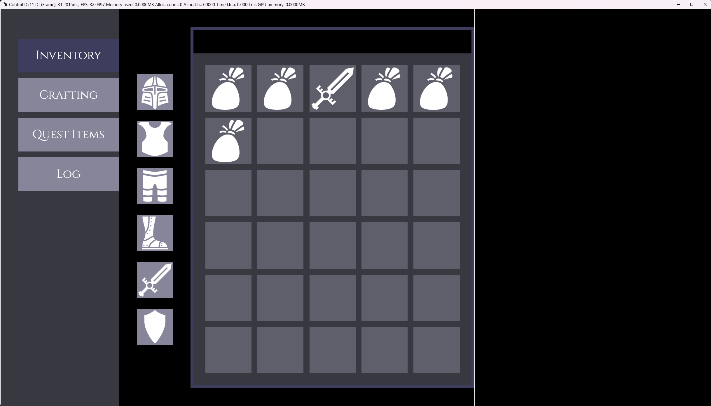

import Summary from 'coherent-docs-theme/components/Summary.astro';
import Highlight from 'coherent-docs-theme/components/Highlight.astro';
import Link from 'coherent-docs-theme/components/Link.astro';
import { Steps, FileTree } from '@astrojs/starlight/components';
import leftColumnPreviewVideo from '../../../../assets/phase-2/the-prototyping-workflow/inventory-left-column-preview.webm'

<Summary>
    In Part 1 of this walkthrough, we will establish the structural foundation of the inventory prototype. 
    
    <Steps>
        1. We will begin by configuring the project's global styles to ensure the UI scales correctly across different resolutions. 
    
        2. Next, we will cover how to manage and load custom assets like fonts and SVG icons. 
    
        3. Finally, we will use Gameface UI's layout components to divide the screen into our three core columns and generate the inventory grid.
    </Steps>
</Summary>

## Project Initialization

Before building the layout, we need to set up the global styles for our view. This includes basic resets and establishing a responsive scaling logic for our units.

### The Global CSS Reset

Just like in the browser, Gameface keeps some default styles on elements like `body`, and `h1` or other heading tags. 
To ensure a consistent starting point, we apply a global CSS reset that removes default margins, paddings, and sets some rules for our project.

The best place to do such resets is in the `index.css` file which is the style root for our `inventory` view.

Put the following code in `src/views/inventory/index.css`:

```css title='index.css'
h1,h2,h3,h4,h5,h6 {
  margin: 0;
}

body {
  width: 100vw;
  height: 100vh;
  margin: 0;
  background-color: black;
  color: white;
}
```

Adding the `width: 100vw` and `height: 100vh` rules to the body ensures that our view will take up the entire screen space in the Player, regardless of the resolution.

:::tip
Doing the resets in the `index.css` files allows for easy overrides for specific elements if needed, avoiding specificity issues down the line.
:::

#### Adding border for visual debugging (optional)

To help us visualize the layout as we build it, we can add a class that will add a temporary border to all elements.

```css title='index.css'
.test-border {
  border: 1px solid white;
}
```

During development, you can add the `test-border` class to any element to see its exact dimensions and how it fits within the layout. 
This is especially useful for debugging spacing and alignment issues.

### Responsive UI Scaling

When building game UI, hardcoding static pixel values (like `font-size: 16px` or `width: 300px`) creates scaling issues. 
A UI designed at 1080p will appear incorrectly proportioned—massive on a 720p display and tiny on a 4K display.

To resolve this for our prototype, we will tie the root font-size of the document to the <Highlight>Viewport Height (vh)</Highlight>. 
By doing this, any element sized using <Highlight>rem</Highlight> units will scale proportionally to the screen's resolution.

Assuming our reference wireframe was designed at a standard 1920x1080 resolution, and we want our base `1rem` to equal `16px` at that resolution, we calculate the viewport height percentage:
`(16px / 1080px) * 100 = 1.4814vh`.

Add this rule to the top of your index.css:

```css title='index.css'
html {
  font-size: 1.4814vh;
}
```

With this rule applied, using `rem` for `margins`, `paddings`, and dimensions ensures the layout scales predictably. 

For example, an element with `width: 2rem` will render at exactly <Highlight>32px on a 1080p screen, but will dynamically scale up on a 1440p or 4K screen</Highlight>, while still
maintaining its relative proportion to the height of the window.

:::caution
While this pure vh scaling method is highly effective for rapid prototyping and ensuring immediate multi-resolution support, 
it is not a flawless solution for final production. 
Extreme aspect ratios (like ultrawide monitors) often require additional logic, to prevent the UI from scaling out of bounds. 
We will explore these advanced scaling techniques later in the optimization section of the guide.
:::

## Managing Assets

Gameface UI utilizes Vite's asset pipeline to handle static resources like fonts and images. Managing these files properly ensures they are bundled correctly and optimized for the engine.

### Adding Custom Fonts

For this prototype, we are using a custom font called "Cinzel" for our headers to match the RPG aesthetic. 

Adding a custom font in Gameface UI is straightforward. You simply place the `ttf` font files in your `src/assets/` directory and reference them in your CSS using the
<Highlight>`@font-face`</Highlight> CSS rule and <Highlight>a relative path</Highlight>.

For a better file structure, we recommend creating a `fonts` subfolder inside `src/assets/` and placing the `Cinzel-Regular.ttf` file there.

<FileTree>

- src
    - assets
        - fonts
        - Cinzel-Regular.ttf
    - components
        - ...
    - views 
        - ...

</FileTree>

Once you have added the assets, add the following snippet to the top of your `src/views/inventory/index.css`:

```css title='index.css'
@font-face {
    font-family: 'Cinzel';
    /* Use a relative path so Vite processes the asset during the build */
    src: url('../../assets/fonts/Cinzel-Regular.ttf') format('truetype');
    font-weight: normal;
    font-style: normal;
}
```

:::tip[Using the font]
Now that the font is loaded, you can use it in your project like this:
```css
.some-element {
    font-family: 'Cinzel', serif;
}
```
:::

### Organizing and Using Icons

Rather than manually writing standard `` tags or inline SVGs for every item in our inventory, Gameface UI includes an optimized `<Icon />` component. 

This component will suggest and display any SVG or PNG file located inside the `src/assets/icons/` directory.

In the starter assets for this walkthrough, we have included a few sample icons (like `sword.svg` and `shield.svg`) that we will use for our inventory items. 

Create a new `inventory` folder inside `src/assets/icons/` and place the icons there:

<FileTree>
- src
    - assets
        -fonts
            - Cinzel-Regular.ttf
        - icons
            - inventory
                - sword.svg
                - shield.svg
                - ...
    - components
        - ...
    - views 
        - ...
</FileTree>

Once the files are in the folder, you can import the `<Icon />` component into your JSX file and call them dynamically using dot notation based on the folder structure and file name:

```tsx title='Inventory.tsx'
import { Icon } from "@components/Media/Icon/Icon";

// Renders the 'sword.svg' file located in src/assets/icons/inventory/icons/
<Icon.inventory.sword />
```

:::tip
If you want to learn more about how the `Icon` component generates types or handles different image formats, you can refer to the dedicated 
<Link href="https://gameface-ui.coherent-labs.com/components/media/icon/">`<Icon />`</Link> component documentation.
:::

## Building the Core Layout

With our assets ready and global styles defined, we can construct the macro-level skeleton of the inventory screen. 
We will build this up step-by-step, starting from the outermost containers down to the specific UI components.

### Declaring modular stylesheet and SCSS variables

Before writing the JSX, we should set up the styles for the inventory view. Apart from the global styles in `index.css`, we will also create a modular stylesheet for the inventory layout.
This will ensure that our styles are scoped to this view and do not interfere with other parts of the project.

Create a new file named `Inventory.module.scss` in your view folder. Then, open your main component file (`Inventory.tsx`) and import the styles so they are ready to use:

```tsx title='Inventory.tsx'
import styles from './Inventory.module.scss';
```

#### Setting up variables

One final thing we can do before diving into the prototype is to declare some SCSS variables. 
This will help us reuse code throughout our project and significantly speed up the styling process.

We will declare variables for:

- The global spacing between elements, which we will use as a baseline to calculate specific padding and margins.
- The custom font that our headers will use.
- The main color palette of this prototype.

Inside the `Inventory.module.scss` file you just created, add the following code:

```scss title="Inventory.module.scss"
$global-spacing: 3rem;
$font-cinzel: 'Cinzel', serif;
$primaryColor: #868599;
$secondaryColor: #3e3d5d;
$background-soft-solid: #383940;
```

Now we are ready to start building the inventory prototype.

### The Master Container and Columns

In Gameface UI, we use the `<Row>` and `<Column>` layout components to quickly set up a twelve column layout structure. 
These `Column` components are perfect for blocking out a view into distinct sections. 

To use them, simply import the `Column` component and append the number of columns you want it to span out of the 12-column grid (e.g., `<Column.Two>`, `<Column.Four>`, up to `<Column.Twelve>` for a full span).

For our inventory screen, we will create a three-column layout wrapped in a master `<Row>` component:

1. A left navigation column (`<Column.Two>`)
2. A middle equipment and grid column (`<Column.Six>`)
3. A right item inspector column (`<Column.Four>`)

```tsx title='Inventory.tsx'
import Row from "@components/Layout/Row/Row";
import Column from "@components/Layout/Column/Column";
import styles from './Inventory.module.scss';

const Inventory = () => {
    return (
        <Row style={{height: '100%'}}>
            <Column.Two></Column.Two>
            <Column.Six></Column.Six>
            <Column.Four></Column.Four>
        </Row>
    )
};

export default Inventory;
```

:::tip[Visualizing the layout]
You can add the `.test-border` class we created earlier directly to the `Column` components to see the layout structure visually as you build it out.

```tsx title='Inventory.tsx' ins="class="test-border""
<Row style={{height: '100%'}}>
    <Column.Two class="test-border"></Column.Two>
    <Column.Six class="test-border"></Column.Six>
    <Column.Four class="test-border"></Column.Four>
</Row>
```
:::

### Setting up routes (Tabs)

Before we populate the columns with content, we need to set up the routing. 
By design, our left column will serve as persistent navigation for different menu categories (like Inventory, Crafting, Quest Items, etc.), 
while the middle and right columns will change based on the active tab.

To set up simple routing in Gameface UI, we use the `<Tabs>` component as a master wrapper for our view, and `<Tab>` components to define the specific content for each route.

<Steps>

1. First, import and wrap your entire layout with the `<Tabs>` component. This will enable routing functionality for all child `Tab` components.

    ```diff lang="tsx" title='Inventory.tsx'
    +import Tabs from "@components/Navigation/Tabs/Tabs";

    const Inventory = () => {
        return (
    +        <Tabs default="inventory">
                <Row style={{height: '100%'}}>
                    <Column.Two></Column.Two>
                    <Column.Six></Column.Six>
                    <Column.Four></Column.Four>
                </Row>
    +       </Tabs>
        )
    };

    export default Inventory;
    ```

    The `default` prop determines which route is active when the view first loads.

2. Next, we add the `<Tab>` component to define our inventory route. We wrap our middle and right columns inside it so they only render when the "inventory" location is active.

    ```diff lang="tsx" title='Inventory.tsx'
    +import Tab from "@components/Navigation/Tab/Tab";

    const Inventory = () => {
        return (
            <Tabs default="inventory">
                <Row style={{height: '100%'}}>
                    <Column.Two></Column.Two>
    +                <Tab location="inventory">
                        <Column.Six></Column.Six>
                        <Column.Four></Column.Four>
    +                </Tab>
                </Row>
        </Tabs>
        )
    };

    export default Inventory;
    ```

3. That's it! 

    The routing is now set up. You can add additional `Tab` components below this one for other routes (like "crafting" or "log"), and they will automatically be handled by the master `Tabs` component.

</Steps>

To actually trigger these route changes, we need to add clickable links inside our left column. For this, we will use the `TabLink` component.

### Adding the Navigation (Left Column)

To create the navigation, we will populate the `<Column.Two>` component with `TabLink` components. We will use a `<Flex>` container to stack these links vertically.

#### 1. Defining the Styles

Before adding the components, open your `Inventory.module.scss` file and add the styles for the sidebar and the tab links.

```scss title="Inventory.module.scss"
.sidebar {
    padding-top: calc(2rem + $global-spacing);
    flex-grow: 1;
    background-color: $background-soft-solid;
}

.tab-link {
    font-family: $font-cinzel;
    width: 85%;
    padding: 1.5rem 0;
    text-align: center;
    font-size: 2rem;
    background-color: $primaryColor;

    &-current {
        background-color: $secondaryColor;
        color: white;
    }
}
```

:::note[Using CSS Modules]
When using CSS Modules in JSX, you access your classes as properties of the `styles` object. 
- For standard class names, use dot notation: `class={styles.sidebar}`
- For class names containing hyphens, use bracket notation: `class={styles['tab-link']}`
:::

#### 2. Building the Layout

Now, return to `Inventory.tsx`. Import the `Flex` and `TabLink` components at the top of your file:

```tsx title="Inventory.tsx"
import Flex from "@components/Layout/Flex/Flex";
import TabLink from "@components/Layout/TabLink/TabLink";
```

Next, nest the `<Flex>` component inside `<Column.Two>`, and populate it with four `<TabLink>` components corresponding to our intended routes:

```diff lang="tsx" title="Inventory.tsx"
<Column.Two class="test-border">
+   <Flex class={styles.sidebar} direction="column" gap="1rem" align-items="end">
+       <TabLink activeClass={styles['tab-link-current']} class={styles['tab-link']} location="inventory">Inventory</TabLink>
+       <TabLink activeClass={styles['tab-link-current']} class={styles['tab-link']} location="crafting">Crafting</TabLink>
+       <TabLink activeClass={styles['tab-link-current']} class={styles['tab-link']} location="quest-items">Quest Items</TabLink>
+       <TabLink activeClass={styles['tab-link-current']} class={styles['tab-link']} location="log">Log</TabLink>
+   </Flex>
</Column.Two>
```

The final result is a vertical column of four links, that are aligned to the horizontal end of the their wrapper and have `1rem` gap between them.

#### 3. Understanding `activeClass`

You will notice that the `<TabLink>` components have an additional prop called `activeClass`. 

The `<TabLink>` component automatically tracks the routing state managed by the parent `<Tabs>` component. 
When the current route matches the `location` prop of the link, it dynamically applies whatever CSS class you provided to the `activeClass` prop. 

#### Result

If you have followed the tutorial so far, you should see this displayed in your Player!

<video autoplay loop muted>
  <source src={leftColumnPreviewVideo} type="video/webm" />
</video>

### Structuring the Center Panel

The middle section (`<Column.Six>`) acts as the core of our inventory view. 
We will split this column horizontally into two distinct areas: a vertical stack of equipped items on the left, and a large inventory grid on the right. 

To achieve this, we will place a master `<Flex direction="row">` container inside our column, and nest two child `<Flex direction="column">` containers inside of it.

#### 1. The Equipped Items Column

Our goal for the left side of this panel is to create a vertical stack of six equipment slots that is pushed down from the top and evenly distributed within a restricted height.

Open `Inventory.tsx`, import the `<Icon>` component at the top, and then build out the JSX structure. 

```diff lang="tsx" title="Inventory.tsx"
+import { Icon } from "@components/Media/Icon/Icon";

// ...

<Column.Six class="test-border">
+   <Flex direction="row" class={styles['main-panel']}>

+       {/* Equipped Items Stack */}
+       <Flex direction="column" align-items="center" justify-content="space-between" gap="1.375rem" class={styles['equipped-items-wrapper']} >
+           <div class={styles['equipped-item']}><Icon.inventory.helmet fill /></div>
+           <div class={styles['equipped-item']}><Icon.inventory.breastPlate fill /></div>
+           <div class={styles['equipped-item']}><Icon.inventory.pants fill /></div>
+           <div class={styles['equipped-item']}><Icon.inventory.boots fill /></div>
+           <div class={styles['equipped-item']}><Icon.inventory.sword fill /></div>
+           <div class={styles['equipped-item']}><Icon.inventory.shield fill /></div>
+       </Flex>

+   </Flex>
</Column.Six>
```

:::note[Icon fill property]
Notice the use of the `fill` prop on the `<Icon>` components? This is a built-in property that tells the icon image to span the full width & height of its container.
:::

To make this JSX layout behave correctly, open `Inventory.module.scss` and add the styling logic.

```scss title="Inventory.module.scss"
.main-panel {
    padding: $global-spacing 0;
    flex: 1; /* Forces the panel to take up all available height in the column */
}

.equipped {
    &-items-wrapper {
        margin: 0 $global-spacing;
        margin-top: calc(5rem + $global-spacing); // 8rem total
        height: 75%; /* Restricting height so space-between can distribute the items */
    }

    &-item {
        width: 6.15rem;
        height: 6.15rem;
        background-color: $primaryColor;
    }
}
```

By restricting the height to 75%, our `<Flex>` component's `space-between` rule will evenly distribute the items within that specific space.

#### 2. Generating the Inventory Grid

For the right side of the panel, we want the actual inventory grid to claim all the remaining horizontal space and automatically generate a 5x6 slot layout.

Return to `Inventory.tsx` and import the `<Grid>` component. When using the `<Grid>` component, we simply pass the exact dimensions we want (`cols={5}` and `rows={6}`). 

To populate those specific slots, we use the `<Grid.Tile>` component. `<Grid.Tile>` allows you to specify exactly what content renders at a specific row and column coordinate.

Add this code right below the Equipped Items `Flex` block you just created:

```diff lang="tsx" title="Inventory.tsx"
+import Grid from "@components/Layout/Grid/Grid";

// ...

<Column.Six class="test-border">
    <Flex direction="row" class={styles['main-panel']}>
        
        {/* Equipped Items Stack */}
        <Flex direction="column" align-items="center" justify-content="space-between" gap="1.375rem" class={styles['equipped-items-wrapper']} >
            {/* ... items ... */}
        </Flex>

+       {/* Grid Wrapper */}
+       <Flex direction="column" class={styles['grid-wrapper']}>
  
+           {/* Empty header for interactive options (Dropdowns, etc.) added in Part 2 */}
+           <Flex class={styles['grid-options']} justify-content="space-between" align-items='center'></Flex>

+           {/* The 5x6 Inventory Grid */}
+           <Grid 
+               cols={5} 
+               rows={6} 
+               gap='1rem' 
+               class={`${styles.grid}`} 
+               column-class={styles['grid-cell']}
+           >
+               {/* Populating specific coordinate slots with items */}
+               <Grid.Tile row={1} col={1}><Icon.inventory.bag fill /></Grid.Tile>
+               <Grid.Tile row={1} col={2}><Icon.inventory.bag fill /></Grid.Tile>
+               <Grid.Tile row={1} col={3}><Icon.inventory.sword fill /></Grid.Tile>
+               <Grid.Tile row={1} col={4}><Icon.inventory.bag fill /></Grid.Tile>
+               <Grid.Tile row={1} col={5}><Icon.inventory.bag fill /></Grid.Tile>
+               <Grid.Tile row={2} col={1}><Icon.inventory.bag fill /></Grid.Tile>
+           </Grid>

+       </Flex>

    </Flex>
</Column.Six>
```

Additionally, we use the `column-class` prop of the grid to apply a `grid-cell` class to each grid cell. 

Finally, define the borders and colors for the grid area in `Inventory.module.scss`. 

```scss title="Inventory.module.scss"
.grid {
    width: 100%;
    flex-grow: 1;
    padding: 2rem;
    color: white;
    background-color: $background-soft-solid;

    &-wrapper {
        flex-grow: 1; /* Pushes the grid to fill the remaining horizontal space */
        border: 0.5rem solid $secondaryColor;
    }

    &-options {
        padding: 2rem;
        width: 100%;
    }

    &-cell {
        background-color: rgba($primaryColor, 0.5);
    }
}
```

:::note[Filling the container]
Notice how we use `flex-grow: 1` on the wrapper and the grid itself? This is the flexbox rule that pushes the grid and the wrappper element to fill the rest of the available empty space.
:::

#### Result

If you have followed the tutorial so far, you should see this displayed in your Player!



### The Item Inspector (Right Column)

To finish our layout skeleton, we will add a simple placeholder to our right column (`<Column.Four>`). 
In the next part of this series, we will transform this empty space into a detailed Item Inspector UI using Gameface UI's "basic" components such as: inputs, progress bars, and buttons.

Open `Inventory.module.scss` and add a quick wrapper style:

```scss title="Inventory.module.scss"
.item {
    &-container {
        padding: $global-spacing;
    }

    &-wrapper {
        border: 0.5rem solid $secondaryColor;
        flex-grow: 1;
        font-size: 1.375rem;
    }
}
```

Then, add the wrapper to your `<Column.Four>` in `Inventory.tsx`:

```diff lang="tsx" title="Inventory.tsx"
- <Column.Four class="test-border"></Column.Four>
+ <Column.Four class={styles['item-container']}>
+     <div class={styles['item-wrapper']}>
+         Item Inspector (Coming Soon)
+     </div>
+ </Column.Four>
```

And with that, the core layout for our inventory screen is complete!

## Wrapping Up

Congratulations! You have successfully built the core structural layout for your inventory screen. 
You have set up a responsive grid, implemented modular SCSS, configured basic routing, and learned how to dynamically load SVG assets.

In **Part 2** of this guide, we will breathe life into this skeleton by introducing Gameface UI's rich UI components. 
We will populate the central panel with Dropdowns and Checkboxes, and build out the detailed Item Inspector panel using Progress Bars, Number Inputs, and Toggle Buttons to complete our visual prototype.