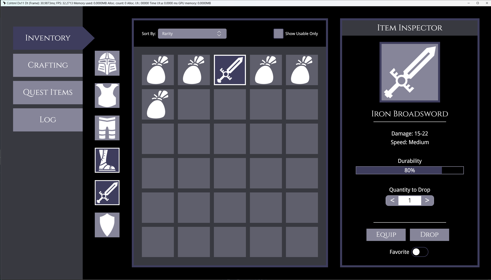

import Summary from '../../../../components/Summary.astro';
import Highlight from '../../../../components/Highlight.astro';
import Link from '../../../../components/Link.astro';
import { Steps, FileTree } from '@astrojs/starlight/components';
import gridImage from "../../../../assets/phase-2/the-prototyping-workflow/grid-finished-preview.png"
import itemInspectorOne from "../../../../assets/phase-2/the-prototyping-workflow/item-inspector-1.png"
import itemInspectorTwo from "../../../../assets/phase-2/the-prototyping-workflow/item-inspector-2.png"
import itemInspectorThree from "../../../../assets/phase-2/the-prototyping-workflow/item-inspector-3.png"

<Summary>
    In Part 2 of this walkthrough, we will transform our layout skeleton into a rich, interactive visual prototype using Gameface UI's built-in basic components.
    
    <Steps>
        1. First, we will populate the center grid options using the `<Dropdown>` and `<Checkbox>` components.
        2. Next, we will fully build out the right-side Item Inspector using inputs, progress bars, and buttons.
        3. Finally, we will polish the prototype by adding active visual states to our navigation links.
    </Steps>
</Summary>

## Integrating Complex UI Components

Before we write any code, let's talk about how Gameface UI components are structured. 
They use a **compound component** pattern, meaning complex elements are broken down into their individual parts. 

Instead of passing a massive list of props to a single monolithic tag (e.g., `<Dropdown color="red" label="Sort" />`), 
we compose the UI using smaller, targeted sub-components like `<Dropdown.Trigger>` and `<Dropdown.Placeholder>`. 

This philosophy gives you granular control over the layout and styling of every individual piece without fighting the boilerplate.

### Populating the Grid Options

In Part 1, we left an empty `<Flex>` container with the class `grid-options` above our inventory grid. 
Our goal here is to add interactive controls so the player can sort their items and filter for usable gear.

Open `Inventory.tsx` and import the required components at the top of your file:

```tsx title="Inventory.tsx"
import Dropdown from "@components/Basic/Dropdown/Dropdown";
import Checkbox from "@components/Basic/Checkbox/Checkbox";
```

Now, let's populate the `.grid-options` container.

```diff lang="tsx" title="Inventory.tsx"
{/* Grid Wrapper */}
<Flex direction="column" class={styles['grid-wrapper']}>
    
-   {/* Empty header for interactive options */}
-   <Flex class={styles['grid-options']} justify-content="space-between" align-items='center'></Flex>
+   {/* Grid Sorting & Filtering Options */}
+   <Flex class={styles['grid-options']} justify-content="space-between" align-items='center'>
       
+       <Flex direction="row" gap="0.5rem" align-items="center">
+           <div>Sort By:</div>
+           <Dropdown>
+               {/* We can inject custom classes directly onto the sub-components */}
+               <Dropdown.Trigger class={styles['grid-options-dropdown-trigger']} />
+               <Dropdown.Placeholder style={{color: 'white'}}>Rarity</Dropdown.Placeholder>
+               <Dropdown.Icon class={styles['grid-options-dropdown-icon']} />
+           </Dropdown>
+       </Flex>

+       <Checkbox>
+           <Checkbox.Control class={styles['grid-options-checkbox']} />
+           {/* Using the built-in label simplifies formatting */}
+           <Checkbox.Label>Show Usable Only</Checkbox.Label>
+       </Checkbox>

+   </Flex>

    {/* The 5x6 Inventory Grid */}
    <Grid cols={5} rows={6} gap='1rem' class={`${styles.grid}`} column-class={styles['grid-cell']}>
        {/* ... Grid Tiles ... */}
    </Grid>

</Flex>
```

:::note
Notice how using the built-in `<Checkbox.Label>` instead of creating our own text `<div>` 
simplifies the process—it handles the alignment and spacing out-of-the-box.
:::

To make these components match the aesthetic of our prototype, apply our custom dimensions and colors. Open `Inventory.module.scss` 
and nest the following targeted styles inside your existing `.grid-options` class:

```scss title="Inventory.module.scss"
.grid {
    // ... existing grid styles ...

    &-options {
        padding: 2rem;
        width: 100%;

        // Targeting the specific Dropdown sub-components we declared
        &-dropdown-trigger {
            width: 17rem;
            height: 2.5rem;
            background-color: $primaryColor;
        }

        // Targeting the default svg in the dropdown icon
        &-dropdown-icon path {
            stroke: $disabledTextColor;
            transition: stroke .15s ease;
        }

        // Targeting the Checkbox control box
        &-checkbox {
            width: 2.5rem;
            height: 2.5rem;
        }
    }
}
```

#### Results

With these changes your inventory grid should be looking like this:


### Building the Item Inspector

Now we will transform the right column (`<Column.Four>`) from a simple placeholder into a fully fleshed-out item details panel. 

This is where a component library really shines. Instead of spending hours writing custom logic for sliders, input fields, and toggle states, we can use Gameface UI's pre-built interactive components to rapidly assemble our prototype. 

First, import the necessary UI and layout components at the top of `Inventory.tsx`:

```tsx title="Inventory.tsx"
import Progress from "@components/Feedback/Progress/Progress";
import NumberInput from "@components/Basic/Input/NumberInput/NumberInput";
import Button from "@components/Basic/Button/Button";
import ToggleButton from "@components/Basic/ToggleButton/ToggleButton";
import Relative from "@components/Layout/Relative/Relative";
import Absolute from "@components/Layout/Absolute/Absolute";
```

We will cover this column in three distinct parts: the item identity, the item stats, and the interactive controls.

#### Part 1: Item Identity and Wrapper

Our first goal is to set up the main `<Flex>` wrapper for the panel, add the inspector header, and display the item's image and name. 

Replace the placeholder inside your `<Column.Four>` with this new structure:

```tsx title="Inventory.tsx"
<Column.Four class={styles['item-container']}>
    <Flex class={styles['item-wrapper']} direction="column" align-items="center" gap={'1.5rem'}>
        
        {/* Header & Item Icon */}
        <h2 class={styles['item-inspector-label']}>Item Inspector</h2>
        <div class={styles['item-image']}>
            <Icon.inventory.sword fill />
        </div>

        {/* Item Name */}
        <Flex direction="column" align-items="center" gap="0.5rem">
            <h3 class={styles['item-name']}>Iron Broadsword</h3>
            <div class={styles.separator}></div>
        </Flex>

        {/* We will add stats and controls here next */}

    </Flex>
</Column.Four>
```

Next, open `Inventory.module.scss` and add the specific classes required to style this upper section. We use our predefined `$font-cinzel` variable to give the headers that classic RPG aesthetic.

```scss title="Inventory.module.scss"
.item {
    &-container {
        padding: $global-spacing;
    }

    &-wrapper {
        border: 0.5rem solid $secondaryColor;
        flex-grow: 1;
        font-size: 1.375rem;
    }

    &-inspector-label {
        width: 100%; 
        padding: 0.5rem;
        margin: 0;
        background-color: $background-soft-solid;
        text-align: center;
        font-family: $font-cinzel;
    }

    &-image {
        width: 15rem;
        height: 15rem;
        background-color: $primaryColor;
        border: 0.5rem solid $secondaryColor;
    }

    &-name {
        font-family: $font-cinzel;
        color: white;
        font-size: 2rem;
    }
}

.separator {
    width: 18rem;
    height: 0.1rem;
    background-color: white;
}
```

##### Result

So far your item inspector panel should be looking like this:


#### Part 2: Stats and Durability

Our next goal is to display the weapon's stats and its current durability. 

A common challenge in UI design is overlaying text onto a progress bar. 
Instead of polluting your CSS files with arbitrary class names and wrapper elements just to handle basic positioning, 

Gameface UI makes this structural relationship explicit with the help of the `<Relative>` and `<Absolute>` layout components. 

Add this code inside your `.item-wrapper` flex container, right below the item name separator:

```tsx title="Inventory.tsx" ins="<Relative " ins="<Absolute center>"
{/* Basic Stats */}
<Flex direction="column" align-items="center" gap="0.5rem" >
    <div>Damage: 15-22</div>
    <div>Speed: Medium</div>
</Flex>

{/* Durability Bar with Absolute Text Overlay */}
<Flex direction="column" align-items="center" gap="0.5rem" style={{width: '80%', margin: "1rem 0"}}>
    <div>Durability</div>
    <Relative style={{width: '100%', height: '2rem'}}>
        <Progress.Bar progress={80} style={{width: '100%', height: '100%'}} />
        <Absolute center>80%</Absolute>
    </Relative>
</Flex>
```

:::note[Absolute's center property]
The `<Absolute>` component includes a highly convenient `center` prop. 

By wrapping the `<Progress.Bar>` in a `<Relative>` container, we can use `<Absolute center>` to perfectly align the "80%" text right over the middle of the bar without writing a single line of custom CSS math!
:::

##### Result

After these changes the item inspector panel should be looking like this:


#### Part 3: Interactive Controls

Finally, we need to add the final piece of components.

Here we see the compound component pattern shine again with the `<NumberInput>`. Because it is split into `DecreaseControl`, `IncreaseControl`, and `Input` pieces, 
we can easily inject inline styles (like `fontSize: '2rem'`) on the exact element we need them. 

We also drop in the standard `<Button>` and `<ToggleButton>` components to round out "Item inspector" panel.

Add this final block of code directly below the Durability section:

```tsx title="Inventory.tsx"
{/* Compound Number Input */}
<Flex direction="column" align-items="center" gap="0.5rem">
    <div>Quantity to Drop</div>
    <NumberInput value={1} style={{width: '12rem'}}>
        <NumberInput.DecreaseControl position="before" style={{width: '3rem', height: '3rem', fontSize: '2rem'}}>{'<'}</NumberInput.DecreaseControl>
        <NumberInput.IncreaseControl style={{width: '3rem', height: '3rem', fontSize: '2rem'}}>{'>'}</NumberInput.IncreaseControl>
        <NumberInput.Input style={{textAlign: 'center', fontSize: '1.5rem' }} />
    </NumberInput>
</Flex>

<div class={styles.separator} style={{marginTop: '2rem'}}></div>

{/* Action Buttons */}
<Flex gap="1rem">
    <Button class={styles['item-button']}>Equip</Button>
    <Button class={styles['item-button']}>Drop</Button>
</Flex>

{/* Toggle Button */}
<ToggleButton>
    <ToggleButton.LabelLeft>
        <div style={{marginRight: '0.5rem'}}>Favorite</div>
    </ToggleButton.LabelLeft>
</ToggleButton>
```

To finish off the inspector, add this single rule to your `Inventory.module.scss` to style the buttons:

```scss title="Inventory.module.scss"
.item {
    // ... previous item styles ...

    &-button {
        font-family: $font-cinzel;
        color: white;
        font-size: 2rem;
    }
}
```

##### Results

With that the final column of our prototype has been finished! The final result:


## Adding Visual Feedback to Elements

A prototype isn't complete until it *feels* interactive. We need to add visual cues so the player knows which navigation tab they are currently viewing, as well as which inventory items are currently selected.

#### The Navigation Arrow

In Part 1, we passed `activeClass={styles['tab-link-current']}` to our Inventory `<TabLink>`. The Gameface UI component automatically applies this class when the current route matches the link. Now, let's actually write that CSS to give it a cool, active indicator arrow. 

We will use an `::after` pseudo-element and a CSS `clip-path` to draw the arrow dynamically. Open `Inventory.module.scss` and add this to your sidebar styles:

```diff lang="scss" title="Inventory.module.scss"
.tab-link {
    // ... existing tab-link styles ...

    &-current {
        background-color: $secondaryColor;
        color: white;
+        position: relative;
        
        /* Adds the active indicator arrow pointing to the content */
+        &::after {
+            content: '';
+            position: absolute;
+            top: 0;
+            bottom: 0;
+            right: -3rem;
+            width: 3rem;
+            z-index: -1;
+            background-color: $secondaryColor;
+            clip-path: polygon(0 0, 0 100%, 100% 50%);
+        }
    }
}
```

#### The Inventory Slots (Using Mixins)

Next, we need to create an <Highlight>"active"</Highlight> state for our inventory slots so the player knows exactly which item they have selected. 

Because the styles for the active states of both the `equipped items` and the `grid items` are almost identical, we can leverage <Highlight>SCSS `@mixin`</Highlight>.

Think of a `mixin` as a reusable function for your CSS. Instead of copying and pasting the same block of styles across different classes, you define the rules once in a `mixin` and `@include` 
them wherever needed. You can even pass arguments to them to handle minor variations!

Add this mixin at the top of your `Inventory.module.scss` file, right below your variables. 

```scss title="Inventory.module.scss"
// Define the mixin to handle active slot borders and backgrounds
@mixin active-slot($border-width) {
    border: $border-width solid white;
    background-color: $secondaryColor;
}
```

We will pass `$border-width` as an argument so we can slightly adjust the thickness depending on where the item is located.

Now, scroll down and use the `@include` directive to apply this mixin to our equipped items and grid tiles:

```diff lang="scss" title="Inventory.module.scss"
.equipped {
    // ... existing equipped styles ...

    &-item {
        width: 6.15rem;
        height: 6.15rem;
        background-color: $primaryColor;

        // Apply the mixin with a 0.20rem border
+        &-active {
+            @include active-slot(0.20rem);
+        }
    }
}

.grid {
    // ... existing grid styles ...

    &-cell {
        background-color: rgba($primaryColor, 0.5);
    }

    // Apply the mixin with a slightly thicker 0.25rem border
+    &-item-active {
+        @include active-slot(0.25rem);
+    }
}
```

#### Simulating the Active State

Finally, let's hardcode these active classes onto a couple of items in `Inventory.tsx` so we can see the visual feedback in our prototype. 

Let's make the <Highlight>sword and boots</Highlight> slots in the equipped items panel and the <Highlight>sword item</Highlight> in the grid look "selected."

```tsx lang="tsx" title="Inventory.tsx" ins="${styles['equipped-item-active']}" ins="class={styles['grid-item-active']}"
{/*  Equipped Items */}
<Flex direction="column" align-items="center" justify-content="space-between" gap="1.375rem" class={styles['equipped-items-wrapper']} >
    <div class={styles['equipped-item']}><Icon.inventory.helmet fill /></div>
    <div class={styles['equipped-item']}><Icon.inventory.breastPlate fill /></div>
    <div class={styles['equipped-item']}><Icon.inventory.pants fill /></div>
    {/* Apply the active class to the sword & boots */}
    <div class={`${styles['equipped-item']} ${styles['equipped-item-active']}`}><Icon.inventory.boots fill /></div>
    <div class={`${styles['equipped-item']} ${styles['equipped-item-active']}`}><Icon.inventory.sword fill /></div>
    <div class={styles['equipped-item']}><Icon.inventory.shield fill /></div>
</Flex>

// ... further down ...

{/* Inside the Grid */}
<Grid.Tile row={1} col={1}><Icon.inventory.bag fill /></Grid.Tile>
<Grid.Tile row={1} col={2}><Icon.inventory.bag fill /></Grid.Tile>
{/* Apply the active class to the sword in the grid */}
<Grid.Tile row={1} col={3} class={styles['grid-item-active']}><Icon.inventory.sword fill /></Grid.Tile>
<Grid.Tile row={1} col={4}><Icon.inventory.bag fill /></Grid.Tile>
```

## Final Result

With these final touches our prototype is now finished!



---

## Wrapping Up

Congratulations! You have successfully built a rich, visual prototype from the ground up. 

Throughout this two-part series, you've learned how to:
* **Wire up layouts** using structural components like `<Row>`, `<Column>`, and `<Grid>`.
* **Compose interactive UI** using Gameface UI's compound components like `<Dropdown>` and `<NumberInput>`.
* **Position elements** using spatial components like `<Flex>`, `<Relative>` and `<Absolute center>`.
* **Polish visual feedback** using CSS Modules and SCSS `@mixin`s.