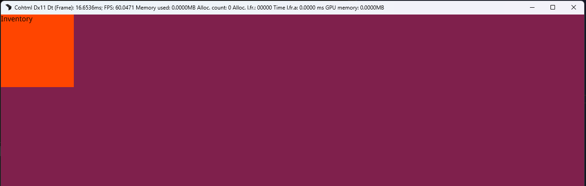

import Summary from 'coherent-docs-theme/components/Summary.astro';
import Highlight from 'coherent-docs-theme/components/Highlight.astro';
import Link from 'coherent-docs-theme/components/Link.astro';
import { FileTree, Steps, Code } from '@astrojs/starlight/components';
import menuPreviewVideo from '../../../assets/phase-2/prototyping-and-developing/gameface-ui-menu-preview.webm'
import hmrPreview from '../../../assets/phase-2/prototyping-and-developing/HMR-preview.webm'

<Summary>
    <Link href="https://gameface-ui.coherent-labs.com/">Gameface UI</Link> is an official boilerplate powered by <Highlight>Vite and SolidJS</Highlight>, pre-configured with a comprehensive library of game-ready components.
    
    This guide covers how to install the boilerplate, preview the pre-built UI views, understand the project structure, and create your first custom view using the component library.
</Summary>

## Getting Started

If you followed Option B in the previous ["Setting up the Gameface Stack"](../recommended-tech-stack/setting-up-the-gameface-stack/#option-b-the-gameface-ui-project) article, 
you likely already have this installed and can skip to the [next section](#understanding-the-project-structure)! 

If you are starting fresh, you can download a clean copy of the boilerplate using `degit`. Open your terminal and run:

```bash
npx degit CoherentLabs/gameface-ui-boilerplate my-game-ui
cd my-game-ui
npm install
```

This will create a new folder called `my-game-ui` with the boilerplate code, install all dependencies, and get you ready to start developing your game UI.

### Previewing the Pre-built Menu

The boilerplate comes with a fully functioning `menu` view right out of the box so you can immediately see Gameface UI in action.

<Steps>

1. **Start the Dev Server:** In your terminal, type the following command to start the Vite development server:
    ```bash
    npm run dev
    ```
    Your server is now running at `http://localhost:3000/menu/`.

2. **Run the server in the player:** Locate the `Player.bat` file included in your Gameface package. Open the file in a text editor,
    scroll down until you see a similar command:
    
    ```bat 
    start "Player" /d "%wd%" "..\Player\Player.exe" --player
    ```

    and add the following parameter to the end of the line:

    <Code 
        code={`start "Player" /d "%wd%" "..\Player\Player.exe" --player "--url=http://localhost:3000/menu"`}
        lang="bat"
        ins={' "--url=http://localhost:3000/menu/"'}
     />

3. "Launch the Player:" Launch the `Player.bat` file and you should see a fully interactive menu screen rendered perfectly inside the game engine!
    
</Steps>

<video autoplay loop muted>
  <source src={menuPreviewVideo} type="video/webm" />
</video>

:::tip
This Menu UI is built entirely using the Gameface UI boilerplate and its component library. 
:::

## Understanding the project structure

To understand how that menu was built, we need to look at the project's folder structure. Gameface UI enforces a specific architecture to keep your project modular and easy to navigate.

- **`/src/assets`**: This directory is designated for all UI assets used in the development process. This folder can include files such as `.png`, `.svg`, fonts, and other resources.
- **`/src/components`**: All of our pre-made components live here!. 
This folder is organized into subfolders based on component types. Each component is a standalone block of UI that can be easily imported and reused across different views.
    - <Highlight>Basic:</Highlight> Includes components like buttons, checkboxes, and sliders.
    - <Highlight>Complex:</Highlight> Contains more intricate components that combine multiple basic components, such as: color picker, carousel, radial menu and others.
    - <Highlight>Feedback:</Highlight> Here are the components that provide feedback to the users: modal, progress bars, toast and others.
    - <Highlight>Layout:</Highlight> Contains components for structuring your UI, such as grids, columns, rows and other structural containers that help with quick prototyping.
    - <Highlight>Media:</Highlight> Houses components for displaying images, icons and other media types.
    - <Highlight>Utility:</Highlight> Includes helper components that don't fit into the other categories but are still essential for building your UI, such as: `Navigation`. 
    Which is our component for establishing a keyboard and gamepad navigation and interactions.

        :::tip[Checkout the full component library!]
        You can see the full list of available components in the  [Gameface UI documentation](https://gameface-ui.coherent-labs.com/components/).
        :::

- **`/src/custom-components`**: This directory is reserved for components created during UI development. We recommend placing <Highlight>all of your custom components</Highlight> in this folder.
- **`/src/views`**: Gameface UI views are standalone HTML pages paired with their respective CSS & JavaScript files.
- **`/tests`**: This is the place where you can write your end to end tests for your views.
- **`package.json`**: Handles project dependencies and defines scripts for running various commands. (You don't need to worry about it yet).
- **`tsconfig.json`**: Specifies TypeScript rules and settings for the project (You don't need to worry about it yet).
- **`vite.config.mts`**: Configures the Vite build tool, setting options and plugins to optimize and transform the source code for Gameface during the build process.

### Structure overview

<FileTree>

- src
  - assets
    - icons/
  - components
    - Basic/
    - Complex/
    - Feedback/
    - Layout/
    - Media/
    - Utility/
    - ...
  - custom-components/
  - views
    - hud
      - index.html
      - index.css
      - index.tsx
      - Hud.tsx
      - Hud.module.css
    - menu
      - index.html
      - index.css
      - index.tsx
      - Menu.tsx
      - Menu.module.css
- tests/
- package.json
- tsconfig.json
- vite.config.mts

</FileTree>

## Creating Your First View

Let's put this structure into practice by creating a brand new "Inventory" view and dropping in a pre-built component. 

<Steps>

1. #### **Create the View Folder**
    Inside `/src/views`, create a new folder called `inventory`. 
    
2. #### **Create the View Files**
    Following the Gameface UI standard, you need to create four files inside this new folder:
    - `index.html`: This is the entry HTML file for the view. It should contain a root div where your UI will be rendered.
    ```html title="src/views/inventory/index.html"
    <!DOCTYPE html>
    <html lang="en">
        <head>
        </head>
        <body>
            <div id="root"></div>
            <script src="./index.tsx" type="module"></script>
        </body>
    </html>

    ```
    - `index.css`: This file will contain any global styles for your view. This is a good place to set up any style resets or constant styles that will be used across multiple components in the view.
     
    ```css title="src/views/inventory/index.css"
    body {
        width: 100vw;
        height: 100vh;
        margin: 0;
    }
    ```
    - `index.tsx`: This is the entry Typescript file where you will set up the rendering logic for your view.
    ```tsx title="src/views/inventory/index.tsx"
    import { render } from 'solid-js/web';
    import Inventory from './Inventory';
    import './index.css';

    const root = document.getElementById('root');

    render(() => <Inventory />, root!);
    ```
    :::caution
    This is a mandatory setup for every SolidJS entry point. Feel free to copy and paste this into any new view you create! Replace the `Inventory` import with the name of your view's main component.
    :::

    - `Inventory.tsx`: The entry component of your view. This is where you will build the main structure of your view and import any components you want to use.
    ```tsx title="src/views/inventory/Inventory.tsx"
    const Inventory = () => {
        return <div style={{width: '10rem', height: '10rem', 'background-color': 'orangered'}}>Inventory</div>;
    };

    export default Inventory;
    ```

3. #### **Test the View**
    Make sure your dev server is running (`npm run dev`), then open your Gameface Player and change the URL to your new view:
    <Code 
        code={`start "Player" /d "%wd%" "..\Player\Player.exe" --player "--url=http://localhost:3000/inventory"`}
        lang="bat"
        ins={'inventory'}
     />

    You should see a bright orange square with the word "Inventory" rendered in the Player!

    

4. #### Drop in some components
    Now let's populate the empty view with some real components from the library. Open `Inventory.tsx` and import some of our pre-built components. We will use the `ToggleButton`, `Checkbox` and `Slider` basic components
    and the `Flex` layout component to quickly structure them in a column with gaps.

    ```diff lang="tsx" title="src/views/inventory/Inventory.tsx" ins="50rem"
    +import Checkbox from "@components/Basic/Checkbox/Checkbox";
    +import Slider from "@components/Basic/Slider/Slider";
    +import ToggleButton from "@components/Basic/ToggleButton/ToggleButton";
    +import Flex from "@components/Layout/Flex/Flex";

    const Inventory = () => {
        return <div style={{width: '50rem', height: '10rem', 'background-color': 'orangered'}}>
    +       <Flex gap="1rem" direction="column">
    +           <ToggleButton>
    +               <ToggleButton.LabelLeft>Off</ToggleButton.LabelLeft>
    +               <ToggleButton.LabelRight>On</ToggleButton.LabelRight>
    +           </ToggleButton>
    +           <Checkbox value="fullscreen" >Fullscreen Mode</Checkbox>
    +           <Checkbox value="motion blur" checked>Motion Blur</Checkbox>
    +           <Slider min={0} max={100} value={35} step={1} />
    +       </Flex>
        </div>;
    };

    export default Inventory;
    ```

    Save the file and check the Player again. You should see the components preview in the Player!

</Steps>

## Gameface UI features

The Gameface UI project comes pre-configured with a lot of features to make your development experience as smooth as possible. Here are just a few of them:

### Hot Module Replacement (HMR)

Every time you save a file, the Player will instantly update with your changes without needing a manual refresh. 
This allows for a super fast development iteration cycle, where you can see the impact of your code changes in real-time.

<video autoplay loop muted>
  <source src={hmrPreview} type="video/webm" />
</video>

### Alias imports

To make your imports cleaner and more intuitive, Gameface UI comes with pre-configured alias imports for the most commonly used folders. 
You can import components, assets, and custom components using simple aliases instead of long relative paths.

| Folder                     | Alias              |
|----------------------------|--------------------|
| `/src/assets/`             | `@assets`         |
| `/src/components/`         | `@components`     |
| `/src/custom-components/`  | `@custom-components` |

Consider the following folder structure:

<FileTree>

- src
  - assets
    - logo.png
  - components
    - Layout
      - Block
        - Block.tsx
    - ...
  - custom-components
    - MyComponent
      - MyComponent.tsx
  - views
    - hud
      - Hud.tsx
    - ...
  - ...

</FileTree>

To import `logo.png`, `Block.tsx`, and `MyComponent.tsx` in `Hud.tsx`, you can write:

```jsx title="/src/views/hud/Hud.tsx" ins="@assets" ins="@components" ins="@custom-components"
import Block from '@components/Layout/Block/Block';
import MyComponent from '@custom-components/MyComponent/MyComponent';
import Logo from '@assets/logo.png';

const Hud = () => {
  return (
    <Block>
      
      <MyComponent />
    </Block>
  );
};
```

:::tip[Alias benefits]
Alias imports enhance code readability and maintainability by replacing lengthy relative paths like
 `../../../assets/logo.png` with shorter, more intuitive paths such as `@assets/logo.png`. This simplifies navigation and minimizes errors during refactoring.
:::

### Deep tools integration 

Because Gameface UI is built on top of Vite and SolidJS, you can take advantage of the rich ecosystem of tools and plugins available for these technologies.

We have also integrated some of our own tools and libraries directly into the boilerplate:

- <Link href='https://frontend-tools.coherent-labs.com/e2e/getting-started/'>The Gameface E2E</Link> testing library, which allows you to write end-to-end tests for your views using a simple and intuitive API.
- <Link href="https://frontend-tools.coherent-labs.com/interaction-manager/getting-started/">The Interaction Manager library</Link>, which provides a powerful system for handling user navigation and input in your UI.
- <Link href="./">The Vite Gameface style transformer</Link>, a Vite plugin that transforms your inline styles to reusable CSS classes at build time to ensure optimal performance in Gameface.

## Next Steps

This is just scratching the surface of what Gameface UI can do. We will be exploring more of its features and capabilities in the upcoming articles, 
including how to prototype quickly and create custom components.

If you are ready to finalize your setup, move on to the [Workflow Planning](../workflow-planning/) article, where we will discuss version control and IDE configuration.