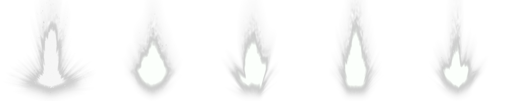

import Summary from "coherent-docs-theme/components/Summary.astro";
import Highlight from "coherent-docs-theme/components/Highlight.astro";
import Video from "coherent-docs-theme/components/Video.astro";
import spriteSheetFlameVideo from "../../../../assets/phase-3/animations/spritesheet-flame.webm";
import spriteSheetFlameVariationsVideo from "../../../../assets/phase-3/animations/spritesheet-flame-variants.webm";
import complexSpriteSheetAnimationVariantsVideo from "../../../../assets/phase-3/animations/complex-spritesheets-animation-variants.webm";
import spiralEffectStrip from "../../../../assets/phase-3/animations/spiral-effect-strip.png";
import spiralStep1AnchorVideo from "../../../../assets/phase-3/animations/complex-spritesheets-animation-1.webm";
import spiralStep2AmbientGlowVideo from "../../../../assets/phase-3/animations/complex-spritesheets-animation-2.webm";
import spiralStep3MainSpiralVideo from "../../../../assets/phase-3/animations/complex-spritesheets-animation-3.webm";
import spiralStep4SecondarySpiralVideo from "../../../../assets/phase-3/animations/complex-spritesheets-animation-4.webm";
import complexSpriteSheetAnimationVideo from "../../../../assets/phase-3/animations/complex-spritesheets-animation-5.webm";

<Summary>
    Complex visual effects like particle swirls, explosions, and 3D item rotations are too intricate for real-time CSS or SVG to produce efficiently
    in Gameface. This article explains how to animate pre-rendered frame sequences using <Highlight>sprite sheets</Highlight> and the CSS
    <Highlight>`steps()` timing function</Highlight>, how to <Highlight>scale sprite animations</Highlight> across resolutions, how to{" "}
    <Highlight>choose the right duration</Highlight>, and closes with a full teardown of a complex sprite sheet animation.
</Summary>

## When to Reach for Sprite Sheets

CSS transitions, keyframe animations, and SVG motion cover most UI animation needs. They work well for slides, fades, rotations, and vector shape
morphing because Gameface computes every intermediate frame at runtime. But some effects like swirling particle vortexes, volumetric glows, or
hand-drawn frame sequences are too visually complex to describe with `CSS properties` or `SVG paths`.

A sprite sheet sidesteps this by having the artist (or a rendering tool) produce every frame offline as a regular image. The frames are packed into a
single strip, and CSS plays them back by shifting the visible area one frame at a time. The engine never computes the visual. It only renders the next
pre-baked frame.

Consider this approach when:

1. **The effect cannot be built from CSS transforms or SVG.** No combination of `rotate`, `scale`, `opacity`, or path animation can replicate a
   swirling vortex of particles or a 3D item rotation.
2. **Visual fidelity matters more than runtime flexibility.** A sprite sheet plays back exactly what the artist produced, with no interpolation
   artifacts or rendering variance.
3. **You need predictable GPU cost.** A sprite sheet is a single texture sample per frame, regardless of the visual complexity baked into it. Compare
   that to a particle system built from dozens of animated DOM elements, each requiring layout, paint, and compositing.

The trade-off is <Highlight>texture memory</Highlight>. Every frame lives in GPU memory as part of the sheet, and scaling beyond the native resolution
introduces blurriness. For effects that need to scale freely or have unlimited color variants at zero asset cost, SVG or CSS-based animation remains
the better fit.

## How Sprite Sheet Animation Works

A sprite sheet packs every frame of an animation into a single image, typically a horizontal strip. Instead of loading one image per frame, Gameface
loads the strip once. A CSS animation then shifts the visible window across the strip so that only one frame shows at a time.

Four things work together to produce the playback:

1. **A container element** sized to exactly one frame of the strip.
2. **The sprite sheet** applied via `background-image` (or `mask-image`).
3. **A `@keyframes` rule** that moves the image position from the first frame to the last.
4. **The `steps()` timing function**, which creates discrete jumps instead of smooth interpolation.

### The `steps()` Timing Function

Most CSS timing functions (`ease`, `linear`, `ease-in-out`) smoothly interpolate between values. `steps(n)` does the opposite: it divides the
animation timeline into exactly `n` equal slices and jumps instantly from one to the next.

For a 5-frame sprite sheet, `steps(5)` means the engine makes exactly 5 discrete jumps over the animation duration. Each jump advances the visible
window to the next frame, with no in-between positions. The result is a hard cut between frames, which is exactly what frame-by-frame playback
requires.

## Two Approaches for Sprite Sheet Animations

A sprite strip can drive the animation through either `background-image` or `mask-image`. Both use the same `steps()` mechanic, but they differ in
what the strip represents and how much control you get over the final appearance.

### Full-Color Sprites with `background-image`

The most straightforward technique applies the strip as `background-image` and shifts `background-position` through the frames. The sprite sheet
carries the final visual as the artist intended.

The following example uses a 5-frame fire effect. Each frame is 128 by 128 pixels, so the full strip is 640 by 128 pixels:



```css title="explosion-sprite.css" ins={3,4} ins="steps(5)" ins="background-position"
.explosion {
    width: 128px;
    height: 128px;
    background-image: url(./explosion-strip.png);
    background-size: 640px 128px;
    background-repeat: no-repeat;
    animation: explode 0.5s steps(5) infinite;
}

@keyframes explode {
    from {
        background-position: 0px 0px;
    }
    to {
        background-position: -640px 0px;
    }
}
```

The container shows exactly one 128px frame at a time. The animation shifts `background-position` leftward by the full strip width (640px) over 5
steps. Each step jumps 128px, revealing the next frame.

The animation looks like this:

<video autoplay loop muted width="30%">
    <source src={spriteSheetFlameVideo} type="video/webm" />
</video>

:::note[Why the Position Is Negative]

Moving `background-position` to `-640px` pulls the strip to the left relative to the container, which visually advances through the frames from left
to right. Think of the strip as a film reel sliding behind a fixed window.

:::

This approach works well when the sprite sheet already contains the final colors, gradients, and glow. The downside is that changing the color of the
effect requires the artist to produce an entirely new strip.

### Recolorable Sprites with `mask-image`

The `mask-image` variant flips the relationship between shape and color. Instead of the sprite sheet carrying the finished visual, it carries only

<Highlight>silhouette frames</Highlight> that define which pixels are visible. The actual color comes from `background-color` on the same element.

Using the same fire strip as a mask instead of a background turns the flame shapes into a transparency stencil. The opaque regions of each frame let
the `background-color` shine through, and transparent regions stay hidden:

```css title="explosion-mask.css" ins="mask" ins="background-color"
.explosion {
    width: 128px;
    height: 128px;
    background-color: #ea6d14;
    mask-image: url(./explosion-strip.png);
    mask-size: 640px 128px;
    mask-repeat: no-repeat;
    animation: explode 0.5s steps(5) infinite;
}

@keyframes explode {
    from {
        mask-position: 0px 0px;
    }
    to {
        mask-position: -640px 0px;
    }
}
```

The mechanic is identical: the same `steps()` jump, the same position shift. But the animated property is `mask-position` instead of
`background-position`, and the strip determines transparency rather than color. This unlocks several practical benefits:

- **Recolorable effects.** Change `background-color` and the entire animation changes color without touching the strip.
- **CSS custom property theming.** Wire the color into a `--variable` and swap palettes from JavaScript or a parent class.
- **Smaller file sizes.** Mask sprites only need alpha information, so they compress well and often weigh less than full-color equivalents.
- **Layer composition.** Stack multiple mask-animated layers with different colors on top of each other to build rich, multi-toned effects from simple
  single-channel assets.

A single strip can produce fire, ice, and poison variants by changing nothing but the background color:

```css title="explosion-variants.css"
.fire {
    background-color: #ea6d14;
}
.ice {
    background-color: #5aadcf;
}
.poison {
    background-color: #6dbf4a;
}
```

<video autoplay loop muted width="70%">
    <source src={spriteSheetFlameVariationsVideo} type="video/webm" />
</video>

:::note[`background-image` vs. `mask-image`: when to use each]

Use **`background-image`** when the sprite sheet carries the finished visual and no recoloring is needed. Full-color explosions, pre-rendered 3D item
rotations, and hand-painted frame sequences are good candidates.

Use **`mask-image`** when the effect needs to be recolorable, themeable, or composed from multiple layers with independent colors. Ability glows,
status-effect indicators, rarity-tier VFX, and elemental auras all benefit from this approach.

:::

## Scaling for Different Resolutions

Game UI needs to look correct across a range of resolutions, from 1080p to 4K and beyond. Sprite sheet animations need some extra consideration here
because, unlike vector-based CSS or SVG animations, they are raster images with a fixed native resolution.

### Percentage-Based Sizing

The examples above used fixed pixel values for both the container and the `background-size`. This locks the effect to a single pixel size. For a
responsive sprite animation, use relative units for the container and percentage-based `background-size`:

```css title="explosion-scalable.css"
.explosion {
    width: 10vmin;
    aspect-ratio: 1 / 1;
    background-image: url(./explosion-strip.png);
    background-size: 500% 100%;
    background-repeat: no-repeat;
    animation: explode 0.5s steps(4) infinite;
}

@keyframes explode {
    from {
        background-position: 0% 0%;
    }
    to {
        background-position: 100% 0%;
    }
}
```

- `10vmin` sizes the container relative to the smaller viewport dimension, so the effect scales proportionally with the screen.
- `aspect-ratio: 1 / 1` keeps the element square regardless of the computed width.
- `background-size: 500% 100%` stretches the strip to five times the container width (5frames = 500%).
- The percentage-based `background-position` shift from `0%` to `100%` handles the rest.

:::caution[`steps()` count differs with percentage-based positioning]

When using pixel values, you go from `0px` to the full negative strip width and set `steps()` to the **number of frames** (e.g. `steps(5)` for 5
frames).

When using percentage values, `background-position: 100%` aligns the right edge of the image with the right edge of the container rather than pushing
it further. This means the 5 frame positions land at 0%, 25%, 50%, 75%, and 100%, which is **4 intervals**, so you need `steps(4)` instead of
`steps(5)`.

**The general rule is:** pixel-based uses `steps(N)`, percentage-based uses `steps(N - 1)`, where N is the frame count.

:::

The same technique works for `mask-image` sprite sheets as well.

### Handling Upscaled Assets

When a sprite sheet is displayed larger than its native resolution, the engine scales the texture and the result can look blurry. You have two options
depending on the art style:

**For pixel art and stylized low-res sprites**, set `image-rendering: pixelated` on the container. That switches scaling to nearest-neighbor, which
preserves the sharp, blocky pixel edges instead of blurring them:

```css title="pixel-art-sprite.css"
.pixel-effect {
    image-rendering: pixelated;
}
```

**For high-fidelity effects**, `pixelated` would make them look jagged. In this case, you should produce the sprite sheet at a higher native
resolution. A strip rendered at 256px or 512px per frame will hold up at 4K even if the display size varies. The file size increases, but the visual
stays sharp.

:::tip[Match the Strip Resolution to Your Maximum Target]

A good rule of thumb is to render your sprite sheet at the largest size you expect it to appear on screen. If the effect will be at most 200px wide at
4K, a 256px-per-frame strip gives you clean downscaling at lower resolutions and avoids visible blur at the high end.

:::

## Choosing the Right Animation Duration

The `animation-duration` property controls how fast the sprite sheet cycles through its frames. Picking the right duration is a matter of dividing the
number of frames by the framerate you want the animation to play at:

> **duration = frames / target framerate**

A 5-frame strip playing at 10 frames per second: `5 / 10 = 0.5s`. A 15-frame strip playing at 24 frames per second: `15 / 24 = 0.625s`. A 15-frame
strip playing at 15 frames per second: `15 / 15 = 1s`.

The target framerate is a creative choice that depends on the effect:

- **Fast, snappy effects** (hit impacts, button presses, small bursts) benefit from higher rates (15 to 30 fps) so the motion feels responsive.
- **Ambient loops** (idle glows, background particles, swirling auras) often work well at lower rates (8 to 15 fps) because the slower pace feels more
  natural for continuous motion.
- **Stylized or hand-drawn effects** sometimes look best at intentionally low rates (6 to 12 fps) to preserve the frame-by-frame character that smooth
  interpolation would destroy.

If the animation loops (`infinite`), the total cycle time also matters for feel. A 0.3-second loop feels rapid and energetic, while a 2-second loop
feels calm and ambient. Adjust the frame count or the target rate to land on a cycle time that fits the context.

:::note[No Need to Match the Game's Rendering Framerate]

The sprite animation framerate is **independent** of the game's rendering framerate. A 15-fps sprite animation will look the same whether the game
runs at 30, 60, or 144 fps. Gameface simply <Highlight>holds each sprite frame</Highlight> for the appropriate portion of the animation duration.

:::

## Breaking Down a Layered VFX

In this section, we will break down a complex sprite sheet animation into its individual layers and explain how they work together.

<video autoplay loop muted>
    <source src={complexSpriteSheetAnimationVideo} type="video/webm" />
</video>

This ability-slot VFX is built from five flat `<div>` elements stacked on top of each other. Each one is just a mask combined with a flat color, so
the GPU only sees about five texture samples per frame and the whole effect stays fully recolorable through CSS variables.

### The HTML Skeleton

Five divs, all absolutely positioned inside a 300 by 300 container:

```html title="spiral-effect.html"
<div class="green container">
    <div class="spiral spiral-3"></div>
    <div class="spiral spiral-2"></div>
    <div class="spiral"></div>
    <div class="background">
        <div class="cross"></div>
    </div>
    <div class="particles"></div>
</div>
```

The `.green` class on the wrapper carries the entire color palette as CSS custom properties.

```css title="spiral-palettes.css"
.green {
    --color: #83e597;
    --secondaryColor: #5a9ba6;
    --ternaryColor: #d8fadf;
    --gradientColor: #b2faf5;
}
```

DOM order determines the z-stack: `.spiral-3` sits at the back, `.particles` on top, with the background and cross icon anchored in the middle.

Three of those layers (`.spiral`, `.spiral-2`, `.particles`) are driven by sprite strips. All three use the same 15-frame layout at 300px per frame
(4500 by 300 pixels total). The remaining two layers (`.spiral-3` and the background/cross) use static images instead.

### Step 1: The Anchor

We start with the ability-slot icon, a dark square background with a cross-shaped icon on top. The background is a plain static image.

The cross uses an SVG mask filled with a striped gradient that scrolls vertically, producing a subtle scanning-line effect.

```css title="step-1-anchor.css"
.container {
    position: relative;
    width: 300px;
    height: 300px;
}

.background {
    position: absolute;
    width: 100%;
    height: 100%;
    background-image: url(./item-background.png);
    background-position: center;
    background-repeat: no-repeat;
    background-size: contain;
}

.cross {
    position: absolute;
    width: 100%;
    height: 100%;
    mask-image: url(./cross.svg);
    mask-repeat: no-repeat;
    mask-position: center;
    background-image: linear-gradient(to bottom, var(--color), var(--color) 50%, var(--gradientColor) 50%, var(--gradientColor));
    background-size: 100% 8px;
    animation: backgroundAnimation 20s linear infinite;
}

@keyframes backgroundAnimation {
    from {
        background-position: 0% 0%;
    }
    to {
        background-position: 0% 100%;
    }
}
```

<video autoplay loop muted>
    <source src={spiralStep1AnchorVideo} type="video/webm" />
</video>

:::tip[Not everything needs to be a sprite sheet]

Some effects can't be achieved with CSS only, which is always the preferred approach. This is a good example of that.

The two-color gradient on the cross is set to `background-size: 100% 8px`, which tiles it vertically into 4px-tall stripes. The `backgroundAnimation`
keyframe slowly scrolls those stripes upward through the cross-shaped SVG mask, giving the icon a calm scanning-line texture without any sprite work.

:::

### Step 2: Ambient Glow

Behind the cross we slip in a slowly rotating jagged silhouette. This layer is **not** a sprite sheet — it's a single static silhouette image, rotated
continuously. Its job is to add a soft, organic pulse of motion beneath everything else.

```css title="step-2-ambient-glow.css"
.spiral-3 {
    position: absolute;
    background-color: var(--ternaryColor);
    mask-image: url(./spiral-effect-3.png);
    animation: rotate 1.2s infinite linear;
}

@keyframes rotate {
    from {
        transform: rotate(0deg);
    }
    to {
        transform: rotate(360deg);
    }
}
```

`linear` timing keeps the rotation speed constant, and the irregular silhouette edge creates organic motion as it spins. The result is a quiet ambient
layer that the louder sprite animations will sit on top of.

<video autoplay loop muted>
    <source src={spiralStep2AmbientGlowVideo} type="video/webm" />
</video>

### Step 3: Main Spiral

Now we add the first sprite-sheet layer, `.spiral`. This is where the `steps()` and `mask-position` mechanics from earlier in this article finally
come into play in context.

Here is the spiral effect strip that we will use for this layer.

<div style="background-color: white;">
    
</div>

```css title="step-3-main-spiral.css"
.spiral {
    position: absolute;
    background-color: var(--color);
    mask-image: url(./spiral-effect.png);
    mask-repeat: no-repeat;
    animation: spriteAnimation 0.8s steps(15) infinite;
}

@keyframes spriteAnimation {
    from {
        mask-position: 0px 0px;
    }
    to {
        mask-position: -4500px 0px;
    }
}
```

The `-4500px` end position is 15 frames multiplied by the 300px frame width, and `steps(15)` makes the playback advance in exactly 15 discrete jumps —
one per frame. This same keyframe will be reused by another sprite layer in the next step.

<video autoplay loop muted>
    <source src={spiralStep3MainSpiralVideo} type="video/webm" />
</video>

### Step 4: Secondary Spiral

A second sprite-animated spiral with a different mask and a cooler color. It inherits everything from `.spiral`, so we only need to override the two
things that actually change:

```css title="step-4-secondary-spiral.css"
.spiral-2 {
    background-color: var(--secondaryColor);
    mask-image: url(./spiral-effect-2.png);
}
```

Because `.spiral-2` shares the same `spriteAnimation` keyframes and timing as `.spiral`, both spirals play in sync. The visual overlap between two
independently shaped spirals creates depth that neither could produce on its own.

<video autoplay loop muted>
    <source src={spiralStep4SecondarySpiralVideo} type="video/webm" />
</video>

### Step 5: Particles

The final layer on top — a sprite strip of glowing particles drifting over everything else.

```css title="step-5-particles.css"
.particles {
    position: absolute;
    width: 100%;
    height: 100%;
    background-color: var(--gradientColor);
    mask-image: url(./particles.png);
    mask-repeat: no-repeat;
    animation: spriteAnimation 1s steps(15) infinite;
}
```

Notice the duration is `1s` instead of the spirals' `0.8s`. That tiny mismatch keeps the layers from feeling mechanically locked together and gives
the particles their own rhythm.

With this layer in place, the effect is complete:

<video autoplay loop muted>
    <source src={complexSpriteSheetAnimationVideo} type="video/webm" />
</video>

### Recoloring with Palette Classes

The whole effect is wired through four CSS custom properties defined on the container. Every animated layer pulls its color from one of them, which
means swapping the palette class on the wrapper recolors every layer at once. The inner DOM doesn't change at all:

```css title="spiral-palettes.css" ins=".red" ins=".blue"
.green {
    --color: #83e597;
    --secondaryColor: #5a9ba6;
    --ternaryColor: #d8fadf;
    --gradientColor: #b2faf5;
}

.red {
    --color: #e58383;
    --secondaryColor: #a65a5a;
    --ternaryColor: #fad8d8;
    --gradientColor: #fab2b2;
}

.blue {
    --color: #8397e5;
    --secondaryColor: #5a6da6;
    --ternaryColor: #d8dffa;
    --gradientColor: #b2c0fa;
}
```

```html title="spiral-variants.html"
<div class="green container">...</div>
<div class="red container">...</div>
<div class="blue container">...</div>
```

<video autoplay loop muted>
    <source src={complexSpriteSheetAnimationVariantsVideo} type="video/webm" />
</video>

:::tip[The Core Advantage]

No new sprite sheets, no new keyframes, no duplicated CSS rules. This is the core advantage of the `mask-image` approach: the same set of assets can
serve every rarity tier, element type, or faction color in your game.

:::

## Next Steps

Continue to [Lottie Animations: Setup, Usage, and Gotchas](/phase-3-layout-assets-and-styling/animations/lottie/) to learn when designer-authored
vector animations exported from After Effects are a better fit than sprite sheets for complex motion graphics.
