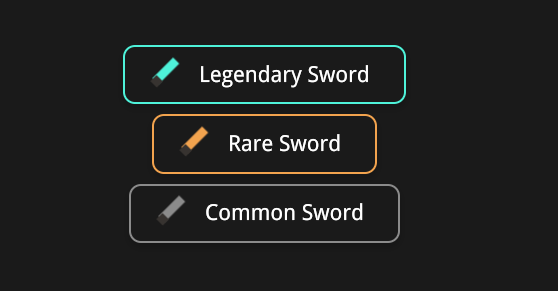

import Summary from 'coherent-docs-theme/components/Summary.astro';
import Highlight from 'coherent-docs-theme/components/Highlight.astro';
import Link from 'coherent-docs-theme/components/Link.astro';

<Summary>
    Image assets in Gameface should be selected based on the shape of the artwork and the amount of runtime control the UI needs.

    Use <Highlight>SVGs</Highlight> for simple scalable graphics, such as icons, logos, dividers, and HUD frames. Use <Highlight>raster images</Highlight>, such as PNGs, for detailed painted artwork, portraits, screenshots, and textures where vector path evaluation would add unnecessary work.
</Summary>

## The Asset Format Problem 

In a browser prototype, it is common to pick an image format based mainly on visual quality and file size. In a gameface UI, that decision also affects how much work the UI layer performs during layout, rendering, and invalidation.

SVGs and raster images solve different problems:

* **SVGs** describe shapes mathematically. They stay sharp at different sizes because the renderer draws paths, fills, and strokes at the requested scale.
* **Raster images** store a fixed grid of pixels. They are better for detailed artwork because the expensive visual detail is already baked into the image file.

The important distinction is that SVG detail is evaluated by the UI renderer, while raster detail is decoded into pixels and then drawn as an image. A simple SVG icon is usually cheap and flexible. A complex SVG illustration with many paths, filters, gradients, or nested groups can become more expensive than a PNG that already contains the same final pixels.

## Choosing Between SVGs and Raster Images 

Use SVGs for artwork that is <Highlight>mostly geometric</Highlight>: Icons, flat logos, simple button borders, arrows, separators, and HUD outlines usually benefit from SVG because they scale cleanly across different resolutions and aspect ratios.

Use raster images for artwork that is <Highlight>visually dense</Highlight>: Character portraits, item illustrations, painted backgrounds, screenshots, and textured panels usually belong in PNG, JPEG, or another raster format. 
These assets contain color variation and detail that would require many vector paths to reproduce.

```html title="asset-format-example.html"
<div class="inventory-card">
    <!-- Raster image: high-detail painted artwork -->
    

    <!-- SVG image: simple scalable UI symbol -->
    
</div>
```

:::note[The Tradeoffs]
SVGs are easier to scale and recolor, but the renderer still has to process their vector structure. Raster images are less flexible at runtime, but detailed art is usually cheaper to render as a pre-baked pixel image than as a large collection of SVG paths.
:::

### Practical Format Rules 

For most Gameface UI work, the format decision can be made with a few direct rules:

* Use **SVG** for icons, simple logos, flat badges, line art, corner decorations, borders, and scalable HUD shapes. And when you need to manipulate the asset at runtime.
* Use **PNG** for transparent high-fidelity UI art, painted panels, portraits, item art, and alpha-heavy textures.
* Use **JPEG** only when the asset does not need transparency and compression artifacts are acceptable, such as some large background images (although the use case is very rare).

:::caution[SVG Usage Gotcha]
Avoid converting complex painted art into SVG only to make it scalable. If the SVG contains many paths, the visual flexibility may not justify the rendering cost
:::

## Working with SVG Assets: External vs. Inline

When using SVGs in Gameface or modern web UIs, you should decide **how** to load them based on your use case. There are two primary strategies for SVG assets: **external SVGs** and **inline SVGs**. Understanding when to use each will help you balance performance, maintainability, and flexibility.

### When to Use External SVGs

If your SVG does **not** need to be manipulated at runtime (for example, recolored or animated by the UI), keep it **external**. This approach minimizes DOM complexity and keeps your structure clean. There are two common external SVG patterns:

#### `` element

Use when the SVG is meaningful to the content or needs to participate in layout like an image. For example, as a button with an Xbox A glyph icon.

```html title="external-svg-img.html"
<button class="nav-button">
    
    <span class="nav-button__label">Select</span>
</button>
```

```css title="external-svg-img.css"
.nav-button {
    display: flex;
    align-items: center;
    gap: 10px;
    height: 56px;
    padding: 0 18px;
}

.nav-button__icon {
    width: 24px;
    height: 24px;
}
```

#### CSS `background-image`

Use when the SVG is purely decorative and part of the component's styles. For example, a panel frame with a border.

```html title="external-svg-background.html"
<div class="quest-panel">
    <h2>Active Quest</h2>
    <p>Reach the old watchtower before nightfall.</p>
</div>
```

```css title="external-svg-background.css"
.quest-panel {
    width: 520px;
    padding: 32px;
    background-image: url("/assets/ui/panel-frame.svg");
    background-repeat: no-repeat;
    background-size: 100% 100%;
}
```

:::tip[Performance]
External SVGs keep the DOM small and focused. For example, a menu with 20 icons should use `` or `background-image` — not 20 inline SVGs, each with a heavy node tree.
:::

### When to Use Inline SVGs

Use **inline SVG** (putting `<svg>` markup directly in your HTML) only if you need fine-grained control over the SVG's internal structure at runtime. This is essential for:

- Per-part styling (e.g., recoloring specific paths or elements)
- State-based visuals (e.g., changing only one element within the SVG)
- Adding JavaScript logic to specific parts of the SVG

**Example:** Inline SVG button group where only the blade color changes based on item rarity.

```html title="inline-svg.html" ins="--legendary" ins="--rare"
<div class="container">
  <!-- Legendary rarity item -->
  <button class="weapon-button weapon-button--legendary">
    <svg class="weapon-button__icon" viewBox="0 0 64 64" aria-hidden="true">
      <!-- Blade path gets legendary color by CSS -->
      <path class="weapon-button__blade weapon-button__blade--legendary" d="M48 4 L58 14 L25 47 L15 37 Z" />
      <!-- Guard is always the same -->
      <path class="weapon-button__guard" d="M12 42 L22 32 L32 42 L22 52 Z" />
    </svg>
    <span>Legendary Sword</span>
  </button>
  
  <!-- Rare rarity item -->
  <button class="weapon-button weapon-button--rare">
    <svg class="weapon-button__icon" viewBox="0 0 64 64" aria-hidden="true">
      <!-- Blade path gets rare color by CSS -->
      <path class="weapon-button__blade weapon-button__blade--rare" d="M48 4 L58 14 L25 47 L15 37 Z" />
      <path class="weapon-button__guard" d="M12 42 L22 32 L32 42 L22 52 Z" />
    </svg>
    <span>Rare Sword</span>
  </button>
  
  <!-- Common (no extra rarity class) -->
  <button class="weapon-button">
    <svg class="weapon-button__icon" viewBox="0 0 64 64" aria-hidden="true">
      <!-- Blade path uses default common color from CSS -->
      <path class="weapon-button__blade" d="M48 4 L58 14 L25 47 L15 37 Z" />
      <path class="weapon-button__guard" d="M12 42 L22 32 L32 42 L22 52 Z" />
    </svg>
    <span>Common Sword</span>
  </button>
</div>
```

```css title="inline-svg.css"
/* Common blade color */
.weapon-button__blade {
  fill: #8b8b8b;
}

/* Legendary blade color - overrides base */
.weapon-button__blade--legendary {
  fill: #4ef2d9;
}

/* Rare blade color - overrides base */
.weapon-button__blade--rare {
  fill: #f2a34e;
}
```



:::caution[DOM Cost]
Every SVG shape and group adds nodes to your DOM. Inline SVG is best reserved for dynamic, interactive, or variant-heavy icons—not for large numbers of identical decorative UI elements.
:::

### Comparing Approaches

The following table summarizes when to use each SVG loading method:

| Approach                | Best For                              | Main Benefit               | Main Cost                        |
|-------------------------|---------------------------------------|----------------------------|----------------------------------|
| ``    | Static, meaningful icons              | Small DOM, simple layout   | Can't style SVG internals        |
| CSS `background-image`  | Decorative frames & separators        | Keeps decoration in CSS    | Not semantic, not accessible     |
| Inline SVG              | Dynamic or stateful vector elements   | Rich runtime control       | Adds nodes & complexity to DOM   |

:::tip[Guideline]
Default to external SVGs for static graphics, and only inline SVGs when you specifically need to access or manipulate their internal parts via CSS or JavaScript.
:::

## Gameface SVG Support

Gameface supports SVGs in the most common frontend scenarios:

* Inline in the DOM.
* As a CSS `background-image`.
* As the source of an `` element.
* As a border through `border-image-source`.

The supported feature set is a subset of SVG 2.0. Standard CSS styling and CSS animations are supported for SVG elements, but not every browser SVG feature is available. Notable limitations include unsupported SVG scripting and interactivity, no SMIL animation, no `<foreignObject>`, no SVG multimedia, no `pattern` paint server support, and only basic SVG text support.

Here is a practical example of markup that should be avoided in Gameface because it relies on unsupported SVG features:

```html title="unsupported-svg-example.svg" del="script" del="foreignObject" del="animate"
<svg viewBox="0 0 240 120" xmlns="http://www.w3.org/2000/svg">
    <!-- Unsupported: SVG scripting/interactivity -->
    <script>
        console.log("SVG script execution");
    </script>

    <!-- Unsupported: foreignObject -->
    <foreignObject x="10" y="10" width="220" height="100">
        <div xmlns="http://www.w3.org/1999/xhtml">Embedded HTML in SVG</div>
    </foreignObject>

    <!-- Unsupported: SMIL animation -->
    <circle cx="60" cy="60" r="24" fill="#4ecdc4">
        <animate attributeName="r" from="10" to="28" dur="0.8s" repeatCount="indefinite" />
    </circle>
</svg>
```

Before relying on a less common SVG element or attribute, check the <Link href="https://docs.coherent-labs.com/cpp-gameface/content_development/supported_features_tables/svgsupport/">official Gameface SVG support table</Link>. This is especially important when importing SVGs exported from design tools, because those files can include metadata, masks, clip paths, text nodes, grouped effects, or unsupported paint features that are not visible at first glance.

:::tip[Asset Export Checklist]
Before committing SVG assets, open the exported file and remove unnecessary metadata, hidden layers, editor-specific attributes, and unused groups. Cleaner SVGs are easier to inspect, cheaper to parse, and less likely to depend on unsupported SVG features.
:::

## Recommended Workflow

Instead of treating this as a single checklist, make the decision in three short passes: asset type, loading mode, then compatibility validation.

### Pass 1: Identify the Asset Type

Start by asking what visual problem the asset solves:

* If it is high-detail artwork (portraits, painted panels, item art), use a raster format.
* If it is geometric UI structure (icons, borders, separators, symbols), use SVG.

### Pass 2: Pick the Loading Mode

Once the asset is SVG, decide how it enters the DOM:

* Use external loading (`` or CSS `background-image`) for static visuals.
* Use inline SVG only when you must target internal nodes (for example per-path color states, stroke progression, or viewBox-driven effects).

### Pass 3: Validate Engine Compatibility

Before integrating exported SVGs from design tools:

* Open the SVG and remove editor metadata, hidden groups, and unused nodes.
* Check for unsupported features (for example `<foreignObject>`, SMIL tags, scripting blocks).
* Cross-check uncommon elements and attributes against the official support table.

## Next Steps

With the basic image format and loading strategy in place, continue to [SVG UI Tricks: ViewBox, Strokes, and Fills](/phase-3-layout-assets-and-styling/graphics--shapes/svg-ui-tricks/) to see when inline SVGs become useful for dynamic UI states, minimaps, and vector progress indicators.