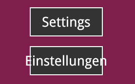

import Summary from 'coherent-docs-theme/components/Summary.astro';
import Highlight from 'coherent-docs-theme/components/Highlight.astro';

<Summary>
    Localized UI strings vary significantly in character count, frequently causing translated text to overflow fixed container boundaries. 

    This guide details the practical implementation of the <Highlight>`coh-font-fit-mode`</Highlight> CSS property to automatically scale text within constrained bounds. 
    It also covers the engine's layout calculation performance and the structural CSS requirements for rendering <Highlight>Right-to-Left (RTL)</Highlight> and complex text languages.
</Summary>

## The Localization Challenge

When building menus or HUDs, text elements are usually placed inside fixed-size containers. 
While a primary language might fit these constraints, localization introduces unpredictable string lengths. 

For example, a main menu button designed to hold the English word "Settings" will overflow its container when swapped to the German translation 
"Einstellungen" or the Russian translation "Настройки". 
To maintain UI structure without creating custom layouts for every language, the text must dynamically scale its font size to fit the available space.

```html title="overflow.html"
<div class="menu-button">
    <span class="button-text">Settings</span>
</div>
<div class="menu-button">
    <span class="button-text">Einstellungen</span>
</div>
```

```css title="overflow.css"
.menu-button {
    width: 150px;
    height: 60px;
    background-color: #333;
    border: 2px solid #fff;
    /* Center the text */
    display: flex;
    justify-content: center;
    align-items: center;
}

.button-text {
    font-size: 28px;
    color: white;
}
```



## Enabling Auto-Scaling Text

Gameface supports a custom CSS property called `coh-font-fit-mode`. This property instructs the layout engine to alter the font size of the text to fit within its parent container.

The `coh-font-fit-mode` property accepts three values:
* `none`: The default behavior. No changes to the font size occur.
* `fit`: The text font size will grow or shrink to fill the parent container.
* `shrink`: The text will only reduce its size if it cannot fit in the container bounds. It will not grow larger than the defined `font-size`.

### Shrinking The Text

Here is how we can fix the overflowing text issue by applying `coh-font-fit-mode: fit` to the `.button-text` element:

```css title="localized-button.css" ins="coh-font-fit-mode: shrink;"
.button-text {
    /* 1. Have a defined font size */
    font-size: 28px;
    /* 2. Instruct the engine to shrink the text if it exceeds the box */
    coh-font-fit-mode: shrink;
}
```


### Fitting The Text

If the UI looks too inconsistent with some languages having smaller text than others, you can use `coh-font-fit-mode: fit` instead. 
This will allow the text to grow as well as shrink, ensuring that **it always fills the container as much as possible.**

```css title="localized-button-fit.css" ins="coh-font-fit-mode: fit;"
.button-text {
    /* 1. Have a defined font size */
    font-size: 28px;
    /* 2. Instruct the engine to shrink the text if it exceeds box */
    coh-font-fit-mode: fit;
}
```


:::tip[Add Padding]
The `coh-font-fit-mode` property will only adjust the font size to fit the text within the container's content box.
Which will ensure that the UI doesn't look "broken" but it also means that the text can look squished. 

To allow it to breathe more, consider adding some padding to the text element that is going to be auto-scaled. 
This padding will be taken into the calculations during the fitting process, ensuring that the text doesn't touch the edges of the container and remains visually balanced.

```css title="localized-button.css" ins="padding: 5px 10px;"
.button-text {
    font-size: 28px;
    coh-font-fit-mode: fit;
    padding: 5px 10px; /* Adds both horizontal & vertical padding to prevent text from touching container edges */
}
```


:::

### Defining Size Boundaries

When using auto-scaling text, you must define constraints to prevent the text from becoming illegible or scaling infinitely. 
Gameface provides `coh-font-fit-min-size` and `coh-font-fit-max-size` to enforce these boundaries.

* **`coh-font-fit-min-size`**: Sets the lower limit for the text size. The default value is **6px**. The fitting algorithm enforces a hard minimum of **6px**; any value set below this **will be clamped to 6px**.
* **`coh-font-fit-max-size`**: Sets the upper limit when using the `fit` mode. The default value is **128px**.

:::caution[Engine Warnings and Precedence]
If `coh-font-fit-max-size` is not explicitly declared in your CSS and the engine utilizes the default **128px** value during a `fit` calculation, 
Gameface will output a warning message to the console. To avoid this, explicitly set the `coh-font-fit-max-size` value.

Additionally, if `coh-font-fit-max-size` is set to a value lower than `coh-font-fit-min-size`, the minimum size takes precedence and the text will render at the minimum size.
:::

### The Shorthand Property

You can declare the mode, minimum size, and maximum size simultaneously using the `coh-font-fit` shorthand property.

```css title="boundaries.css"
.button-text {
    /* mode | min-size | max-size */
    coh-font-fit: fit 18px 32px;
}
```

This way we can ensure that the text always comfortably fits within the container without becoming too small to read or excessively large.


### Performance Considerations

The font fitting process calculates the required text size by adjusting the font size <Highlight>step-by-step</Highlight>, starting from the element's defined `font-size`.

Because the algorithm operates linearly, the performance cost correlates directly with the **numerical gap between the starting `font-size` and the final calculated size**. 
If an element defaults to `16px` but the container requires a `72px` fit, the engine must perform numerous layout iterations to find the correct size.

**Actionable Rule:** Always explicitly define a base `font-size` on the element that is as close to the expected final rendering size as possible. This minimizes the iterations required by the engine's calculation loop.

```css title="optimized-fit.css" ins="font-size: 24px;"
.button-text {
    coh-font-fit-mode: shrink;
    coh-font-fit-min-size: 14px;
    
    /* Providing a starting point near the expected final size minimizes calculation overhead */
    font-size: 24px; 
}
```

## Handling Complex Text and Right-to-Left (RTL) Languages

Gameface classifies languages that render right-to-left (such as Arabic, Hebrew, Urdu, or Farsi) or require contextual symbol alterations as <Highlight>complex text</Highlight>. 

The engine automatically scans text for complex characters and natively handles the text shaping, cursive joining, and conversion from Unicode data to the appropriate screen glyphs. 
Implementing complex text incurs a slight performance cost that must be factored into UI design.

### Manual Layout Reversal

While Gameface handles the internal text shaping automatically, it **does not** automatically mirror CSS layout properties or UI structures. The developer is entirely responsible for reversing the layout to accommodate RTL reading patterns.

Relying solely on the engine is insufficient for structural UI inversion. 
To build a localized component, you must manually apply directional CSS properties, such as <Highlight>`text-align: right`</Highlight>, and utilize properties like <Highlight>`flex-direction: row-reverse`</Highlight>
 to flip the visual order of elements.

```html title="rtl-layout.html"
<body>
    <div class="quest-log">
        <div class="icon"></div>
        <p class="text">Return to the village elder.</p>
    </div>

    <div class="quest-log rtl-layout">
        <div class="icon"></div>
        <p class="text">عُد إلى شيخ القرية.</p>
    </div>
</body>
```

```css title="rtl-layout.css" ins="flex-direction: row-reverse;" ins="text-align: right;"
.quest-log {
    display: flex;
    width: 400px;
    /* Standard English Layout */
    flex-direction: row; 
    text-align: left
}

/* RTL Layout: Reverses the element order and text alignment */
.rtl-layout {
    flex-direction: row-reverse; 
    text-align: right;
}
```

### Interactive Text Limitations

Gameface reliably translates complex Unicode data into drawn shapes on the screen. However, it has limited support for calculating the reverse operation: determining exactly which Unicode data character corresponds to a specific clicked pixel on the screen.

In simple left-to-right text, one character data point typically equals one discrete visual block. In complex text, multiple data characters frequently combine or merge to form a single connected visual shape. Because of this merging, if a player clicks on a connected Arabic word, the engine struggles to calculate the exact underlying data index they interacted with.

This mechanical limitation directly impacts interactive UI elements:
* **Caret Placement:** When a player clicks inside an `<input>` or `<textarea>` field containing complex text, the blinking cursor (caret) may snap to an inaccurate position.
* **Text Selection:** Dragging the mouse to highlight complex text may result in visual misalignment or select an unexpected grouping of characters.
* **DOM APIs:** Executing the `caretPositionFromPoint` JavaScript API on complex text containers will yield unreliable coordinate results.

:::danger[Interactive Text Warning]
Due to these constraints, developers should exercise caution when implementing complex text within highly interactive input fields.
:::

## Next Steps

With text and typography configuration complete, proceed to the [Image Assets: SVGs vs. Rasters](/phase-3-layout-assets-and-styling/graphics--shapes/image-assets/) article to begin the tutorial on rendering graphics and UI shapes in Gameface.