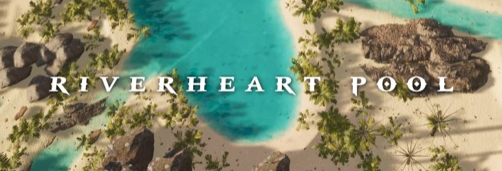
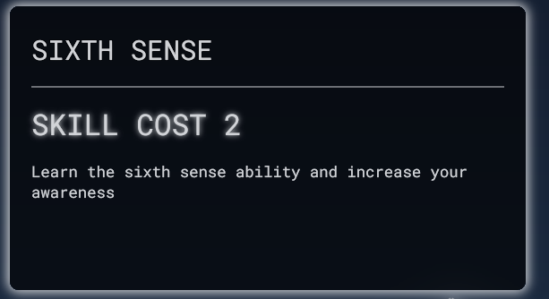

import Summary from 'coherent-docs-theme/components/Summary.astro';
import Highlight from 'coherent-docs-theme/components/Highlight.astro';

<Summary>
    Getting your custom fonts into Gameface is straightforward, but the engine handles global scopes and fallbacks differently than a standard web browser. 

    This guide explores the global persistence of fonts across different views, explains how to architect reliable font fallbacks, 
    and demonstrates how to build high-contrast text effects to ensure HUD readability against complex 3D environments.
</Summary>

## Loading Custom Fonts (The Global Scope)

Just like standard web development, the recommended way to load and use custom fonts in Gameface is through the CSS `@font-face` declaration. Gameface supports standard TrueType (`.ttf`) and OpenType (`.otf`) fonts, along with their collection formats (`.ttc`, `.otc`).

Exactly as you would in a standard browser, you must explicitly define separate `@font-face` blocks for different font weights and styles so the engine knows how to properly map them.

```css title="fonts.css"
/* 1. Registering a standard TrueType font for headings */
@font-face {
    font-family: 'SciFi-Header';
    src: url('../fonts/SciFi-Header.ttf');
}

/* 2. Registering an OpenType font for body text */
@font-face {
    font-family: 'Roboto';
    src: url('../fonts/Roboto-Regular.otf');
    font-weight: normal;
}

/* 3. Registering the Bold variant explicitly */
@font-face {
    font-family: 'Roboto';
    src: url('../fonts/Roboto-Bold.otf');
    font-weight: bold;
}
```

### The Gameface Difference: Global Persistence

In a standard web browser, fonts are scoped to the specific page you are currently viewing. If you navigate to a new HTML page, the browser unloads the old fonts and parses the new ones. 

Gameface behaves entirely differently. A major difference from the HTML Standard is that <Highlight>fonts are global</Highlight> to the whole system and not unloaded after changing views. 

If you load `SciFi-Header` in your Main Menu view, it stays in memory and can be used immediately in your in-game HUD view without being re-downloaded or re-parsed. 
Gameface keeps the fonts  <Highlight>alive</Highlight> because it is common behavior in games to use the same fonts across multiple pages, avoiding the performance hit of reloading the same asset.

:::caution[Overwriting Fonts]
Because fonts are globally persistent, registered fonts are kept loaded and cannot be overwritten. 
Subsequent `@font-face` declarations that match the exact same font description of a previously registered font will <Highlight>simply be ignored</Highlight>. 

:::note[Font Description]
Note that the "font description" includes the weight and style. If you load `Roboto` (`font-weight: normal`) in View 1, and `Roboto` (`font-weight: bold`) in View 2, 
Gameface correctly registers both as distinct variations. It only ignores the declaration if you try to register the exact same family and weight twice.
:::

## Understanding Font Fallbacks

In game UI, especially when dealing with player names or global chat, a user might type a character (like a specific Kanji or an Emoji) that doesn't exist in your primary font. 

Gameface supports standard CSS per-character font fallbacks. You can specify a list of fonts, and the engine will seamlessly substitute missing characters with the next available font in the list.

```css title="fallbacks.css"
.chat-message {
    /* If Roboto is missing a character, Gameface checks Noto Sans CJK, then an Emoji font */
    font-family: 'Roboto', 'Noto Sans CJK', 'EmojiFont';
}
```

### Engine-Specific Fallback Rules

While CSS handles the basics, Gameface has a few strict rules regarding how it matches those fallback fonts:
* **Style Fallbacks are Unsupported:** Gameface won't automatically match fonts with the same family name but different styles (like Italic or Oblique). These must be specified explicitly.
* **Generic Families:** Gameface recognizes standard generic keywords (`serif`, `sans-serif`, `monospace`), but it maps them to a specific custom font defined by your engineering team via the C++ `cohtml::SystemSettings::GenericFontFamilyNameFont` option.
* **The Last Resort:** If all CSS fallbacks fail, Gameface embeds a minimal "last resort" font that renders standard ASCII characters and displays a square symbol for missing Unicode characters.

### Global Fallbacks via C++

If you are displaying third-party content (like an RSS feed or cross-platform player profiles) and do not have total control over the CSS, Gameface provides a powerful native override. 

Your engineering team can use the C++ API `cohtml::View::SetAdditionalFontFallbacks` to specify global fallback font families. This acts as an invisible safety net, automatically appending these native fallbacks to the very end of any `font-family` list defined in your CSS.

## Styling High-Contrast HUD Text

A common challenge in game UI is ensuring that white text remains readable when the camera pans over a bright 3D environment. 

To solve this, we can utilize the CSS `text-shadow` property. 
Because Gameface's layout engine handles these standard properties natively, you can create complex text effects without writing custom shaders. 

Here are three essential text styling techniques for game UIs:

### 1. The Heavy Drop Shadow
Great for general HUD elements, menus, and subtitles. A simple offset shadow detaches the text from the 3D world behind it.

An example of a heavy drop shadow that creates a strong contrast against bright 3D background:

```html title="drop-shadow.html"
<div class="map-marker">Riverheart Pool</div>
```

```css title="drop-shadow.css"
.map-marker {
    color: white;
    /* offset-x | offset-y | blur-radius | color */
    text-shadow: 1px 1px 10px black;
}
```



### 2. The Crisp Outline
Great for player names and floating combat text. To create a solid stroke in Gameface, we apply four hard, zero-blur shadows in every diagonal direction.

It helps to think of a `text-shadow` with a 0 blur radius not as a fuzzy shadow, but as a razor-sharp "stamp" or clone of your text. 
By separating multiple shadows with commas, we are stamping four black copies directly behind the original white text.

We push one copy 1 pixel to the top-left (-1px -1px), 
one to the top-right (1px -1px), 
one to the bottom-left (-1px 1px), 
and one to the bottom-right (1px 1px). 
Because they sit perfectly behind the white text, their inner edges are hidden, while their outer edges merge together to form a seamless 1px border!

```html title="crisp-outline.html"
<div class="hud-player crisp-outline">Player One</div>
```

```css title="crisp-outline.css"
.crisp-outline {
    color: white; /* The actual text sits on top */
    text-shadow: 
        -1px -1px 0 #000, /* Copy 1: Top-Left */
         1px -1px 0 #000, /* Copy 2: Top-Right */
        -1px  1px 0 #000, /* Copy 3: Bottom-Left */
         1px  1px 0 #000; /* Copy 4: Bottom-Right */
}
```


### 3. The Neon Glow
Great for critical warnings, sci-fi themes, or active states. A zero-offset shadow with a massive blur radius creates a seamless glowing effect around the text.

An example of a neon glow effect in a sci-fi skill tree UI that blends perfectly with the other glowing elements:

```html title="neon-glow.html"
<div class="skill-cost">Skill cost 2</div>
```

```css title="neon-glow.css"
.glowing-text {
    color: white;
    text-shadow: 0px 0px 1vh;
}
```




:::tip[Performance Note]
While `text-shadow` is highly optimized, stacking dozens of heavy blur radius shadows on massive blocks of text can impact rendering times. For paragraph text (like lore books or quest descriptions), stick to solid backgrounds instead of heavy text shadows. Reserve complex shadows and outlines for critical, short-form HUD information.
:::

## Next Steps

Now that you know how to load custom fonts, secure them with fallbacks, and style basic text safely, we can move on to more complex text rendering scenarios. 
Proceed to the [Building Rich Text: Inline Layouts & Emojis](/phase-3-layout-assets-and-styling/texts--fonts/building-rich-text/) article to learn how to mix icons, 
dynamic button prompts, and localized text within a single flowing sentence.