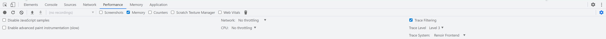
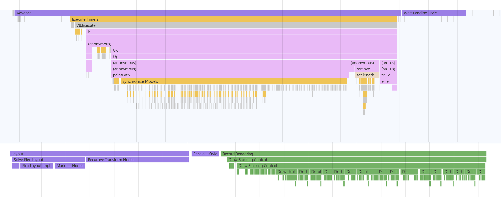
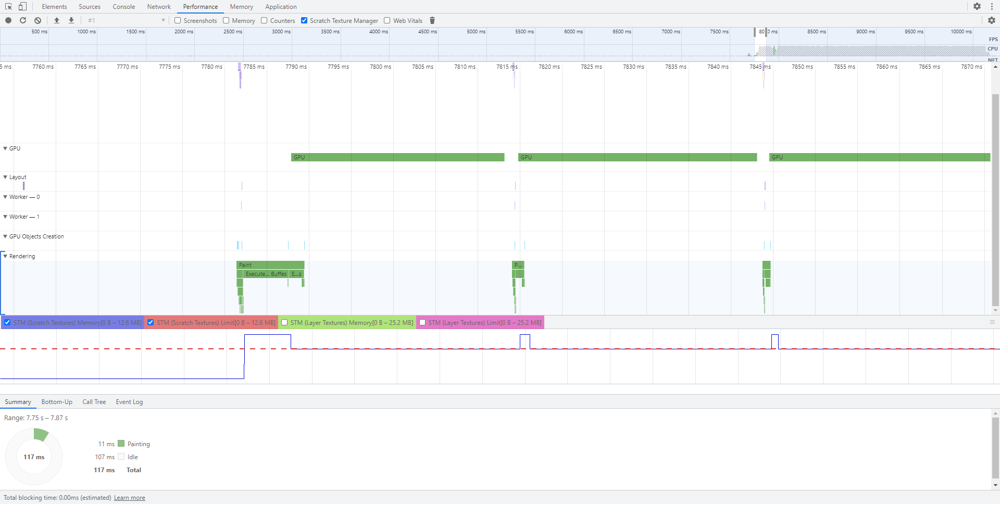

import Summary from 'coherent-docs-theme/components/Summary.astro';
import Highlight from 'coherent-docs-theme/components/Highlight.astro';

Gameface integrates deeply with Chrome's Performance tab, emitting engine-specific trace markers for every stage of the rendering pipeline. This article walks through recording a trace, reading the <Highlight>Advance</Highlight>, <Highlight>Layout</Highlight>, <Highlight>Displaying</Highlight>, and <Highlight>Paint</Highlight> marker groups, using the DOM-highlight feature to connect GPU draw calls to specific elements, and interpreting the <Highlight>Counters</Highlight>, <Highlight>Memory</Highlight>, and <Highlight>Scratch Texture Manager</Highlight> charts to detect texture thrashing.

## Recording a Trace

Open the Performance tab in DevTools and click the **Record** button to start capturing. Interact with the UI in the Player, then click **Stop**. The timeline renders automatically.

### Selective Tracing: Trace Levels and Systems

Generating all markers for all systems simultaneously has a performance cost. More markers means less accurate timing numbers, and at very high verbosity on some platforms you risk out-of-memory crashes when running the Player. Before starting a recording, open the **advanced recording options** by clicking the cog icon in the Performance tab toolbar. The Gameface-specific controls are in the rightmost section.

Two controls matter:

- **Trace Level** selects verbosity. <Highlight>L1</Highlight> emits only high-level markers and gives the most accurate timing since the overhead is minimal. <Highlight>L3</Highlight> emits individual node-level markers (useful for identifying exactly which DOM node causes a spike) but adds enough overhead that the timing numbers are slightly inflated. Start at L1 to find the big bottleneck, then switch to L3 on the specific system where it lives.
- **Trace System** limits tracing to one pipeline stage at a time: `Advance`, `Layout`, `Displaying`, `Painting`, `RenoirFrontend`, or `RenoirBackend`. Focusing on one system avoids the noise of unrelated stages. Use `All` only when you do not yet know where the problem is.

:::tip[General Profiling Rules]

Inspect the **Summary** panel below the timeline after selecting a marker. Many Gameface markers carry metadata (node counts, paths to DOM elements) that does not appear in the timeline bar itself. Also check that you are not doing L3 tracing of all systems simultaneously — that combination can produce hundreds of megabytes of trace data.

:::

---

## The Advance Phase

<Highlight>Advance</Highlight> is the top-level marker encompassing everything that runs on the main thread each frame. It is usually the biggest single contributor to main-thread time. The sub-markers inside it tell you where that time is being spent.

### Execute Timers

<Highlight>Execute Timers</Highlight> covers all JavaScript execution for the frame: event handlers, `setTimeout`/`setInterval` callbacks, and `requestAnimationFrame` callbacks. If this marker is large, the bottleneck is in JavaScript logic, not in the engine's rendering pipeline. Check for heavy per-frame DOM queries, large loops, or synchronous operations that could be batched or deferred.

### Iterate Tick Animations

<Highlight>Iterate Tick Animations</Highlight> covers all active CSS animations for the frame. Its metadata shows the number of currently animated elements. The cost is proportional to both the number of animated elements and the number of properties being animated per element. If this marker grows as a scene becomes more active, reduce the number of simultaneously running animations or reduce the number of animated properties on each element.

### Recalculate Styles

<Highlight>Recalculate Styles</Highlight> runs after JS and animations have mutated the DOM. It resolves new CSS values for every affected node. The marker's metadata shows how many nodes required style resolution. Even changing a single property on a node submits that node for style resolution, so minimizing how many nodes change each frame directly reduces this marker.

At <Highlight>L3</Highlight> tracing of the Advance system, a <Highlight>Resolve Node Styles</Highlight> sub-marker appears for each individual node being resolved. Hovering it highlights that node in the viewport; the Summary panel below shows its DOM path, and clicking the path navigates to it in the Elements tab. This is the fastest way to identify which specific nodes are forcing style re-resolution every frame.

---

## The Layout Phase

The <Highlight>Layout</Highlight> phase runs on a worker thread after Advance and resolves the position and size of every DOM node. The key distinction here is which of the two layout markers appears.

### SolveFlexLayout vs UpdateNodeTransforms

| Marker | What triggered it | Cost |
|---|---|---|
| `SolveFlexLayout` | A "layout property" changed: `width`, `height`, `margin`, `padding`, `top`, `bottom`, flex properties, etc. | Heavy — full Yoga solve for the affected subtree |
| `UpdateNodeTransforms` | Only `transform` properties changed | Light — recalculates bounding boxes only, skips Yoga |

If `SolveFlexLayout` appears in frames that should only be animating a position (a moving HUD element, a sliding panel), the animation is mutating a layout property instead of `transform`. Replacing `margin-left` or `left` with `transform: translateX()` converts that frame from a heavy full solve to a cheap transform update.

The <Highlight>Update Layout Nodes</Highlight> marker metadata shows the count of nodes with changed layout properties. A large number here is a signal to audit which elements are mutating box-model properties every frame.

### SynchronizeLayoutToMain

<Highlight>SynchronizeLayoutToMain</Highlight> appears in the Advance of the frame *after* a layout-heavy frame. Because the layout thread and main thread synchronize once per frame, the results of frame N's layout are only published to JavaScript in frame N+1. If a previous frame had many layout changes, this sync marker grows in the following frame. Consecutive `SolveFlexLayout` spikes followed by `SynchronizeLayoutToMain` spikes in the next frame are a pattern worth investigating.

---

## Displaying and Painting

### Record Rendering

After layout, <Highlight>Record Rendering</Highlight> iterates the DOM tree and records graphics commands for every element that intersects a dirty region (a region where something changed and needs repainting). The size of this marker is directly tied to how many elements are in the dirty region and how complex they are to describe.

At <Highlight>L3</Highlight> tracing of the Displaying system, <Highlight>Draw Stacking Context</Highlight> markers appear for every element that establishes a stacking context. Hovering one highlights the corresponding DOM node in the viewport. The Summary panel shows its path. This makes it straightforward to identify which elements are the most expensive to record.

Elements that create a stacking context require additional rendering work. The CSS properties that force a stacking context include `opacity` (with a value below 1), `filter`, `backdrop-filter`, `isolation: isolate`, `mix-blend-mode` (non-normal), and `mask-image`. Minimizing their use on frequently-updated elements keeps `Record Rendering` fast.

### Batch Commands and Process Layer

Inside the <Highlight>Paint</Highlight> marker, <Highlight>Batch Commands</Highlight> decides which draw commands can share a single draw call (reducing GPU state changes), and <Highlight>Process Layer</Highlight> generates the actual backend rendering commands for each layer.

Every `Batch Commands` and `Process Layer` marker is linked to the DOM element responsible for it. Hovering either marker type physically highlights that element in the Player viewport. Clicking it and reading the **Node** field in the Summary panel below gives you the exact element, and clicking the link navigates to it in the Elements tab.

This hover-to-highlight feature is the fastest way to answer "which DOM element is costing the most render time?" during a GPU-heavy investigation. Layers are created whenever a node uses `opacity`, `filter`, `backdrop-filter`, or similar effects. Each additional layer requires extra GPU textures and render target switches.

---

## Tracking Texture Thrashing

GPU textures and buffers are expensive to create and destroy. Renoir reuses them through internal caches. When the cache capacity is too small for the page's current demands, resources are created at the start of a frame and destroyed at the end, then re-created the next frame. This is texture thrashing and it shows up as a visible performance sink.

### Object Creation Markers

Enable the <Highlight>Counters</Highlight> checkbox in the Performance tab recording options to surface texture and buffer lifecycle markers in the timeline:

- `Texture Create` / `Texture Destroy`
- `VB Create` / `VB Destroy` (vertex buffers)
- `IB Create` / `IB Destroy` (index buffers)

Each event carries metadata including the **Type** field, visible in the Summary panel. The texture types relevant to performance:

| Type | What it represents |
|---|---|
| `ScratchTexture` | Temporary textures for intermediate blur/filter results |
| `LayerTexture` | Textures for rendering element layers (opacity, filter, blend mode) |
| `ImageTexture` | GPU textures for images referenced in HTML/CSS |
| `SurfaceTexture` | Auxiliary textures for SVGs and shadow shapes |
| `GlyphAtlas` | Texture atlases for rendered text glyphs |

If `ScratchTexture Create` and `Texture Destroy` events alternate every frame at the same point in the timeline, the scratch texture cache capacity is being exceeded on that frame and textures are being recreated instead of reused. Cross-reference the `Texture Create` event with the surrounding `Process Layer` markers to identify which DOM node is responsible: the `Process Layer` that contains the texture creation belongs to the element forcing that layer.

`ImageTexture` events appearing every few frames can indicate that images are being repeatedly decoded and uploaded rather than staying resident in the GPU cache.

### Memory Counters

Enable the <Highlight>Memory</Highlight> checkbox to display CPU and GPU memory usage charts below the timeline.

- <Highlight>Frame memory</Highlight> is the transient memory Renoir allocates each frame and wipes at the end. Its value tells you how much per-frame working memory the UI requires.
- <Highlight>GPU memory</Highlight> is the estimated total GPU memory held by all Renoir resources. Large spikes followed by drops are a signal that resources are being allocated and then immediately freed, confirming thrashing.

### Scratch Texture Manager Charts

Enable the <Highlight>Scratch Texture Manager</Highlight> checkbox for a more precise view of the texture cache state. This panel renders four charts:

| Chart | What it shows |
|---|---|
| STM (Scratch textures) Memory | Current GPU memory used for scratch textures |
| STM (Scratch textures) Limit | Cache capacity limit for scratch textures |
| STM (Layer textures) Memory | Current GPU memory used for layer textures |
| STM (Layer textures) Limit | Cache capacity limit for layer textures |

The <Highlight>dashed lines</Highlight> show cache capacity limits. The <Highlight>solid lines</Highlight> show current usage. When a solid line crosses above its dashed counterpart, the Scratch Texture Manager discards textures at the end of that frame. If you consistently see the solid line crossing the dashed line every frame, the cache limit is set too low for the complexity of the UI.

Inspect the charts for only one texture type at a time; displaying all four at once makes the panel difficult to read. Toggle which charts are visible using the checkboxes above the panel.

When the charts confirm that cache pressure is the cause of thrashing, the cache size can be adjusted through the **Rendering Caches** section of the Cohtml panel (accessible via **More Tools → Cohtml** in the DevTools toolbar).

---

## Screenshot Capture

Enable the <Highlight>Screenshots</Highlight> checkbox before recording to capture the UI texture after every frame. The screenshots are embedded in the recorded session and appear as thumbnails across the top of the timeline. This is useful when debugging a visual glitch that only occurs in specific circumstances: record a session that reproduces the issue, then scrub the thumbnails to find the exact frame where the visual state breaks.

Screenshot data is not included in a session recorded without the checkbox enabled, so there is no size penalty for recordings made without it.

---

## Next Steps

With the performance pipeline understood from marker to DOM node, the next article in this section focuses on the Cohtml panel's visual debugging tools: Paint Flashing and Redraw Flashing for spotting GPU overdraw, and the Emit Rendering Metadata toggle that links draw calls to specific elements in external GPU profilers.
