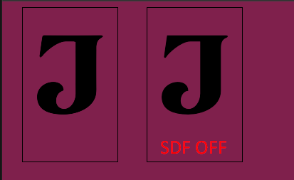

import Summary from 'coherent-docs-theme/components/Summary.astro';
import Highlight from 'coherent-docs-theme/components/Highlight.astro';

<Summary>
Gameface renders text through a heuristic system that switches between <Highlight>SDF glyph rendering</Highlight>, <Highlight>raster glyph rendering</Highlight>, and <Highlight>path tessellation</Highlight> depending on font size. Understanding which mode is active, and when to override it, is the key to fixing visual artifacts and avoiding per-frame character calculation costs.
</Summary>

## How Gameface Renders Text

Before diving into fixes, it helps to know what mode Gameface is using at any given font size. The engine does not use a single text rendering path. It chooses between three strategies:

| Font size | Rendering mode | Key behavior |
|---|---|---|
| Any size (default) | SDF glyph rendering | Glyphs baked at 32px, 52px, or 72px; upscaled via distance field math |
| Any size (opt-in) | Raster glyph rendering | Glyphs CPU-rasterized at the exact pixel size; separate glyph per size |
| Above 256px | Path tessellation | Glyph outlines tessellated as geometry; regenerated every frame |

### SDF Rendering and Size Tiers

Most text in Gameface uses <Highlight>Signed Distance Field (SDF)</Highlight> rendering. The engine bakes each glyph at one of three fixed sizes, then uses distance field math to scale it at render time without regenerating glyph data. This is the fast path and the reason you can animate `font-size` without triggering expensive glyph uploads every frame.

The three tiers and their built-in spread values are:

| Tier | Generation size | Spread (10% of size) |
|---|---|---|
| Small | 32 px | 4 px |
| Medium | 52 px | 6 px |
| Large | 72 px | 8 px |

The engine automatically picks the closest larger tier for a given font size. A 20px label is rendered using the 32px glyph, scaled down. A 60px heading uses the 72px glyph. The spread value controls how wide the distance field is, which directly determines how sharp or soft the edges appear when scaling.

---

## Fixing "Melted" Custom Fonts

SDF rendering is a great default for most fonts, but it has a known weakness with highly decorative or stylistically intricate glyphs. When a font has fine serifs, tight ink traps, or complex stroke interactions at small scales, the SDF approximation smooths those details into rounded blobs. The font looks "melted" or mushy rather than sharp.

This is not a bug. It is a deliberate trade-off: the 10% spread means the distance field bleeds into adjacent fine details in glyphs that were designed with very tight tolerances.

The fix is to disable SDF rendering for that specific font and use raster glyphs instead. Add `coh-font-sdf: off` inside the `@font-face` rule for the affected font:

```css title="fonts.css"
@font-face {
  font-family: 'OrnateTitleFont';
  src: url('OrnateTitleFont.ttf');
  coh-font-sdf: off; /* forces CPU rasterization at exact pixel sizes */
}
```

With raster rendering active, Gameface generates one glyph per character per pixel size. A heading rendered at 24px and a subheading at 18px each get their own glyph entry. The rendering is pixel-accurate, and fine details survive.

{/* 📸 SCREENSHOT NEEDED — image-1.png
    Show: A side-by-side comparison of the same decorative or serif font rendered in two modes.
    LEFT half: SDF rendering (default) — the font corners should look slightly rounded, fine
    details like thin serifs or ink traps appear blurred or smoothed.
    RIGHT half: Raster rendering (coh-font-sdf: off) — the same text at the same size showing
    crisp, pixel-perfect edges and full glyph detail.
    Ideally use a font with notable fine details (thin serifs, ornate initials, or tight letterforms).
    This is the most useful illustration in this article — the SDF rounding effect is the exact
    visual artifact readers need to recognize in their own project. */}


The cost is real. Raster glyphs occupy more GPU texture memory because each size requires its own entry in the glyph atlas. A font used at five different sizes generates five times the atlas footprint compared to SDF, which covers all sizes from a single baked glyph. Reserve `coh-font-sdf: off` for fonts where the visual quality loss is genuinely noticeable, typically display fonts, logos, and title cards rather than body copy.

:::tip[When SDF Works Fine]

SDF rendering produces excellent results for clean sans-serif and simple serif fonts used at body copy sizes (14px to 24px). The rounding artifacts only become obvious on fonts with fine detail at small sizes or fonts intentionally designed with sharp, hairline geometry. If the font looks fine in the Player at its intended size, leave SDF enabled.

:::

---

## Large Scale Text: Path Tessellation Above 256px

When a DOM element renders text above <Highlight>256px</Highlight>, Gameface stops using glyph atlases entirely and switches to <Highlight>path tessellation</Highlight>. Each glyph outline is tessellated as geometric path data and drawn directly as 2D geometry, which preserves perfectly sharp edges at extreme sizes.

The problem is that path-tessellated glyphs are not cached. The geometry is regenerated from scratch every frame. For a large animated title that changes size, this means the tessellation cost hits every single frame during the transition.

If the visual accuracy of giant text is not a priority for a particular element (a large background watermark or a score counter displayed at huge size for readability), disable path tessellation with `text-rendering: optimizeSpeed`:

```css title="hud.css"
/* Applied to an element where extreme-size text is purely functional,
   not a showcase of glyph quality. */
.score-display {
  font-size: 320px;
  text-rendering: optimizeSpeed; /* skips path tessellation, uses SDF or raster instead */
}
```

With `optimizeSpeed` active, the element falls back to standard SDF rendering regardless of font size. The geometry stops being regenerated every frame, but glyphs above 72px will be upscaled past their native generation size, which can produce visible softness at extreme sizes.

:::note[The Right Trade-off]

Path tessellation exists because 300px+ text at SDF quality would visibly degrade. `text-rendering: optimizeSpeed` makes sense when the text element is reading-functional but not decorative, or when the size is transient (an animation that briefly passes through 256px). For large static display text that is a visual centrepiece, keep path tessellation on and accept the per-frame cost.

:::

---

## Expensive Text CSS Gotchas

Several standard web CSS text properties trigger character-by-character measurement work inside Gameface's text engine. These properties are not broken, but they should not be used indiscriminately on elements that update frequently or contain long strings.

### `text-overflow: ellipsis` and `overflow-wrap: anywhere`

Both properties require the engine to step through the string character by character to find the precise overflow point. For a static label this cost is paid once at layout time. For a string that updates every frame (a live counter, a chat message, a scrolling notification) the calculation runs again on every update.

The pattern to avoid is combining frequent data-binding updates with overflow clipping:

```html
<!-- This label updates every frame from a data binding -->
<div class="damage-ticker" data-bind-value="model.lastDamageValue"></div>
```

```css title="hud.css"
/* Each value update triggers a per-character overflow calculation */
.damage-ticker {
  white-space: nowrap;
  overflow: hidden;
  text-overflow: ellipsis; /* expensive if the text content changes every frame */
}
```

For frequently-updated elements, the better approach is to constrain the value on the JavaScript or model side before it reaches the DOM, so the text never overflows in the first place. If clipping is still needed, `overflow: hidden` without `text-overflow: ellipsis` clips at the container boundary without the per-character traversal.

`overflow-wrap: anywhere` has similar costs because it must identify all valid break opportunities across every character in the string, not just at word boundaries.

### `text-align: justify`

Justified text is significantly slower than `left`, `right`, or `center` alignment. The justification algorithm calculates inter-word spacing iteratively to fill each line to the container width, and it does so after the initial line-break pass. This is two traversals instead of one.

For game UIs, justified text is rarely necessary. The alignment difference is subtle on short lines and on narrow containers (health bars, inventory labels, dialogue boxes) there is often only one word per line, making justification meaningless. Use `text-align: left` or `text-align: center` everywhere the design allows it.

```css title="hud.css"
/* Avoid in game UIs */
.dialogue-text {
  text-align: justify; /* double traversal per layout change */
}

/* Prefer */
.dialogue-text {
  text-align: left; /* single pass, no inter-word spacing calculation */
}
```

The cost of `text-align: justify` is paid each time the text container changes width or the text content updates. In a responsive or animated UI where container widths shift, this means the double traversal runs on every layout frame.

---

## Quick Reference

| Symptom | Cause | Fix |
|---|---|---|
| Font corners look rounded or mushy | SDF rendering averaging out fine glyph detail | Add `coh-font-sdf: off` to `@font-face` |
| Frame spikes on large text elements | Path tessellation regenerating glyph geometry every frame | Add `text-rendering: optimizeSpeed` if quality is not critical |
| Layout slowdowns on data-bound labels | `text-overflow: ellipsis` or `overflow-wrap: anywhere` running per-character on every update | Clamp the value before it reaches the DOM, or use `overflow: hidden` alone |
| Consistent text layout slowdowns | `text-align: justify` running two traversals per layout | Switch to `text-align: left` or `text-align: center` |

---

## Next Steps

With text rendering optimized and layout performance measured, the final articles in this phase cover accessibility testing and preparing the UI for localization, where font choices and text containers meet a different set of constraints.
