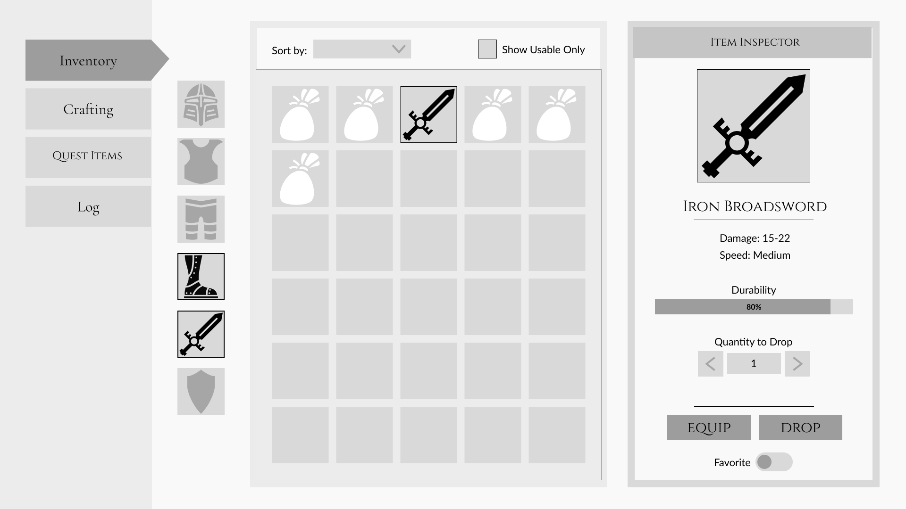

import Summary from 'coherent-docs-theme/components/Summary.astro';
import Highlight from 'coherent-docs-theme/components/Highlight.astro';
import Link from 'coherent-docs-theme/components/Link.astro';

    In this section, we will walk through the process of building a simple inventory screen for an RPG game using Gameface UI. 
    
    This walkthrough covers the core layout and component principles of Gameface UI, showing you how to leverage the boilerplate to move fast without manually writing complex CSS and HTML for every box on the screen. 
    
    We believe the true power of Gameface UI lies in its ability to facilitate rapid prototyping and quickly test design layouts. For that reason, we are diving into a hands-on build rather than providing a dry explanation of the features.

:::note[Prerequisites]
Before continuing, ensure you have the Gameface UI boilerplate installed and a new `inventory` view running in your Player. 

If you need to set up your environment, return to the [Prototyping and Developing](../../prototyping-and-developing/#creating-your-first-view) article.
:::

## What We Will Build

For this walkthrough, we will build a simple <Highlight>inventory screen for an RPG game</Highlight>. The screen will consist of three main panels:
1. A left navigation panel with tabs for different menu categories.
2. A center panel displaying a grid of item slots.
3. A right panel showing detailed information about the selected item, including its name, description, and stats.

We will prototype the wireframe below:

## Core Concepts We Will Cover

Instead of manually writing complex CSS and HTML for every box on the screen, this walkthrough will show you how to leverage the boilerplate to move quickly from design to implementation. 

Throughout this process, you will learn how to:

* **Structure Scalable Layouts:** Use Gameface UI's <Highlight>Layout</Highlight> components to quickly structure the prototype.
* **Generate Grids:** Use the `<Grid>` component to <Highlight>automatically generate the item slots</Highlight> in the center panel.
* **Use & Customize Pre-built Components:** Utilize our component library to simplify adding <Highlight>fully functional components</Highlight> like the dropdown and checkbox, and adjust their default styles to fit the look.
* **Add Frontend State:** Wire up basic <Highlight>active</Highlight> states for some elements.
* **Write Reusable Styles:** Use the <Highlight>built-in SASS CSS library</Highlight> to customize the look of our prototype and reuse styles.
* **Reuse Logic:** Take repeatable logic and make a <Highlight>reusable custom component</Highlight>.
* **Manage Assets:** Properly <Highlight>load custom fonts and UI SVG icons</Highlight> using Vite's asset pipeline.

### Project assets

To follow along with this walkthrough, download the provided starter assets, which include the necessary font and SVG icons. Extract the contents into your project's `src/assets/` directory.

[**📥 Download the Starter Assets (inventory-assets.zip)**](/resources/phase-two/inventory-prototype-assets.zip)

:::note[Asset Credits]
The "Cinzel" font is provided by Google Fonts under the SIL Open Font License. The UI icons are provided by [game-icons.net](https://game-icons.net) under the CC BY 3.0 license.
:::
